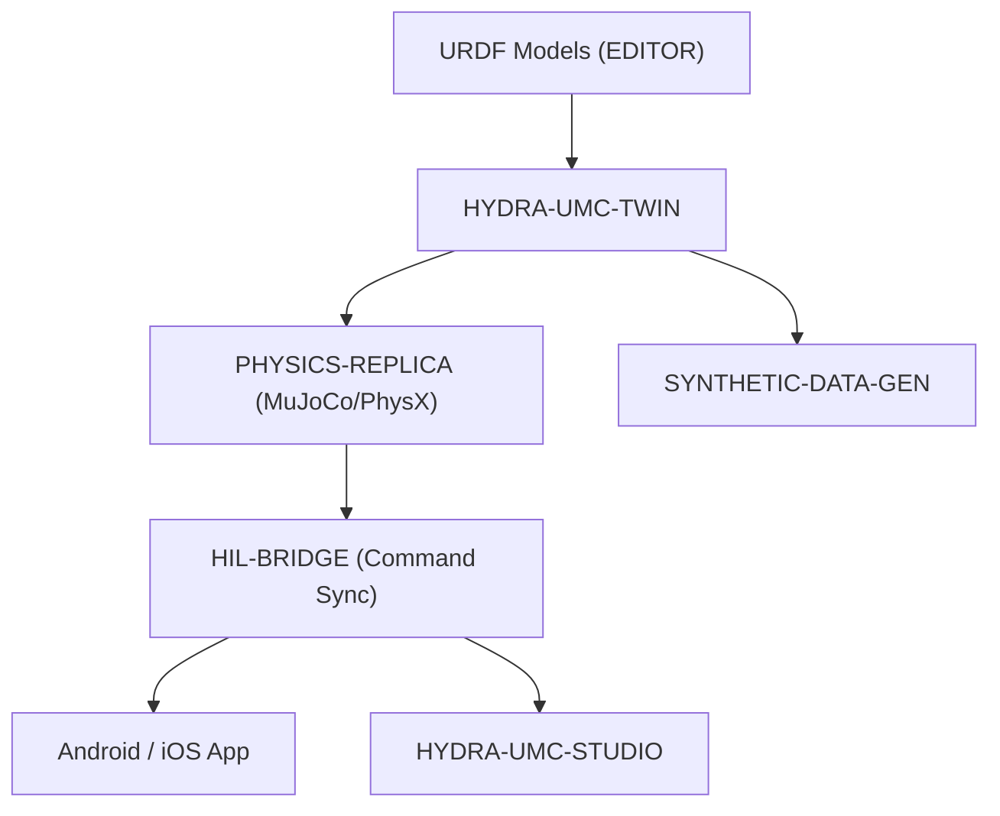

<p align="center">
  
</p>

# ♊ HYDRA-UMC-TWIN

<p align="center">🇺🇸 <b>English</b> | <a href="README_spa.md">🇪🇸 Español</a> | <a href="README_fra.md">🇫🇷 Français</a> | <a href="README_ita.md">🇮🇹 Italiano</a> | <a href="README_deu.md">🇩🇪 Deutsch</a> | <a href="README_zho.md">🇨🇳 简体中文</a> | <a href="README_jpn.md">🇯🇵 日本語</a></p>

### 🌐 Physics-Based Digital Twin & High-Fidelity Simulation Engine

<p align="left">
  
  
  
  
  
</p>

---

## 1. 🛠️ TECHNICAL OVERVIEW

**HYDRA-UMC-TWIN** is the virtual heart of the ecosystem. It provides a high-fidelity, physics-based replica of the entire micro-factory, allowing for safe testing, training, and real-time monitoring of robotic swarms.

Built using Rust and the Bevy engine, it directly consumes URDF models from the EDITOR and emulates real-world physical properties like inertia, friction, and motor torque to ensure that "if it works in the Twin, it works on the floor."

### Key Features:
* 🧩 **Family Readiness Check (v0):** the real `family-status` subcommand reads each of the 3 real children's own `hydra-umc.project.json` and reports presence/version/maturity/role - honest for an integration hub that runs no engine itself yet. See "Honesty check" below.
* 🔒 **Real v0 - State-Sync Contract:** `family-sync` gates each child on a real, testable contract - minimum maturity (`functional`) and a maximum compatible major version - before ever treating it as sync-ready, refusing an immature or incompatible-version child with a real reason instead of syncing against an unverified state shape.
* 🌐 **Full Factory Simulation (planned):** replicates robots, tools, and the environment in a unified 3D space - depends on the real Bevy engine integration.
* ⚡ **Hardware-in-the-Loop (HIL) (planned):** connect Apps and Studios to the simulator as if it were a real controller.
* 📊 **Wear Prediction (planned):** estimates component lifespan based on simulated mechanical stress.
* 🛡️ **Safety Validation (planned):** test complex trajectories and collision avoidance before physical execution.

**Honesty check - what actually runs today:** bare invocation still prints identity/version/role, but there are now two real subcommands. `family-status [--workspace PATH]` reads `HYDRA-UMC-PHYSICS-REPLICA`/`HYDRA-UMC-HIL-BRIDGE`/`HYDRA-UMC-SYNTHETIC-DATA-GEN`'s own real manifests from a local checkout and reports what it honestly finds. `family-sync [--workspace PATH]` goes one step further: it runs each present child through a real state-sync contract (minimum maturity `functional`, maximum compatible major version) and reports `READY`, `REJECTED (immature)`, `REJECTED (incompatible version)`, or `MISSING` per child. No Bevy app, no rendering, no physics tick loop, no URDF scene loading, and no actual network sync transport exists yet - see [`CHANGELOG.md`](CHANGELOG.md) for exactly what shipped, and the Roadmap below for what's still ahead.

---

## 2. 🔄 TWIN ARCHITECTURE



---

## 3. 🧱 ARCHITECTURE & DESIGN DECISIONS

* **Why this engine has no `hardware/`/`firmware/`/`os/` folders.** It is pure software with no board of its own, so source folders exist only when their implementation requires them.
* **Why `Cargo.toml` deliberately has no Bevy dependency yet.** Bevy is a heavy graphics engine - long compile times, needs a GPU/graphics toolchain that isn't always available. v0 only added `serde`/`serde_json` (for reading children's manifests) - real rendering work still waits for a real GPU/graphics toolchain to build against.
* **Why `docker-compose.yml` exists before its 3 children have Dockerfiles.** Deciding and documenting the integration contract (which service depends on which, what device/volume mounts each needs) now avoids that shape being invented ad hoc later, even though `docker compose up` can't fully succeed until each child publishes its own Dockerfile.
* **How this fits the rest of the ecosystem.** The integration parent of the Digital Twin & Simulation family - HYDRA-UMC-PHYSICS-REPLICA feeds it a real physics solver, HYDRA-UMC-HIL-BRIDGE lets real apps control it as if it were hardware, and HYDRA-UMC-SYNTHETIC-DATA-GEN renders training datasets through its own engine.
* **Why `family-status` reads each child's own manifest instead of a hand-maintained list.** `hydra-umc.project.json` is already the single source of truth the ecosystem's dashboard/updater trust - a second list here would drift the moment a child's real maturity changed and nobody remembered to update it.
* **Why a missing sibling checkout is a real, honest "not found" rather than a crash.** An integration hub genuinely cannot know whether a developer has all 3 children checked out locally - `manifest.rs` returns `None` for every real failure mode (missing repo, missing file, malformed JSON) so `family-status` can report it clearly instead of panicking.
* **Why `family-sync` gates on maturity AND a version ceiling, not just "is it there."** `family-status` already answers "is this child checked out and what does it claim" - but a checked-out, `scaffolding`-maturity child has no real state worth syncing yet, and a child that has bumped past this Twin's verified-compatible major version may have changed its own state shape in a way this Twin doesn't know about. Both are real reasons to refuse sync, distinct from "missing," so `contract.rs` checks and reports them separately rather than folding everything into one generic "not ready."
* **Why maturity is checked before version compatibility in `contract::assess()`.** An immature child's version number isn't a meaningful signal yet - checking maturity first means the reported rejection reason always names the most fundamental gate that actually failed, instead of a version mismatch masking a more basic "this child isn't real yet" problem.

---

## 📂 DIRECTORY STRUCTURE

Pure software engine with no hardware design of its own, so source folders
exist only when their implementation requires them; this project carries no
`hardware/`, `firmware/` or `os/` folders.

```text
HYDRA-UMC-TWIN/
├── src/
│   ├── manifest.rs       # Real, defensive reader for a sibling's own manifest
│   ├── family.rs         # Real family-readiness check + combined sync outcome
│   ├── contract.rs       # Real state-sync contract (maturity + version ceiling)
│   ├── server.rs         # Plain JSON/HTTP surface (tiny_http, blocking, no async runtime)
│   └── main.rs           # Entry point + real `family-status`/`family-sync` subcommands
├── docs/                # Documentation and physics tuning
├── build/               # Build notes/artifacts (cargo's own output lives in target/, gitignored)
├── images/              # Media and diagrams
├── systemd/
│   └── hydra-umc-twin.service # Local CM5 family-status/sync API systemd unit
├── tools/
│   ├── build_test.py    # Non-versioning build/compile check
│   └── ci_validate.py   # Manifest/CHANGELOG/docs validation used by CI
├── Cargo.toml           # Package metadata, dependencies (serde/serde_json), odometer version
├── bump_version.py      # Odometer-style version bump (used by build.sh/.bat)
├── build.sh / build.bat # Bumps version, `cargo test`, then `cargo build --release`
├── build-test.sh / build-test.bat # Non-versioning build check (no CHANGELOG/version bump)
├── run.sh / run.bat     # Runs the compiled release binary (forwards arguments)
└── docker-compose.yml   # Integration blueprint for the 3 children below
```

---

## 🏗️ BUILD AND RUN GUIDE

Requires the Rust toolchain (`cargo`/`rustc`, install via [rustup](https://rustup.rs)) and Python 3.10+ (only for `bump_version.py`).

```bash
# Linux / macOS
./build.sh   # odometer version bump, `cargo test` (29 tests), then `cargo build --release`
./run.sh     # runs target/release/hydra-umc-twin, prints name + version + role
```

```bat
:: Windows
build.bat
run.bat
```

`build.sh`/`build.bat` bump this project's own `Cargo.toml` version following the ecosystem's "odometer" rule (PATCH+1, carrying into MINOR past 9), run the real test suite, then build a release binary.

The real `family-status` subcommand checks the actual local checkout:

```bash
./run.sh family-status
./run.sh family-status --workspace /path/to/some/other/checkout

# Windows
run.bat family-status
```

```text
Digital Twin family status (workspace: /path/to/GitHub):
  HYDRA-UMC-PHYSICS-REPLICA: v0.0.2, maturity=functional, role=library
  HYDRA-UMC-HIL-BRIDGE: v0.0.1, maturity=scaffolding, role=service
  HYDRA-UMC-SYNTHETIC-DATA-GEN: v0.0.4, maturity=functional, role=tool

All 3 children present.
```

Defaults to this repo's own parent directory - the real sibling-checkout layout this ecosystem already uses. Exits `1` if any real child is missing.

The real `family-sync` subcommand goes further - it also checks the real state-sync contract (minimum maturity, maximum compatible major version) against each child that is present:

```bash
./run.sh family-sync --workspace /path/to/some/checkout
```

```text
Digital Twin family sync contract (workspace: /path/to/some/checkout):
  HYDRA-UMC-PHYSICS-REPLICA: READY (v0.0.3, maturity=functional)
  HYDRA-UMC-HIL-BRIDGE: REJECTED (incompatible version) - HYDRA-UMC-HIL-BRIDGE reports major version 1 - this Twin's sync contract is only verified up to major 0 (incompatible simulator version)
  HYDRA-UMC-SYNTHETIC-DATA-GEN: MISSING (not checked out)

Not every child is sync-ready - see the lines above.
```

Exits `0` only if every expected child is `READY`; `1` for any `MISSING`/`REJECTED` child.

**Important:** `Cargo.toml` deliberately has **no Bevy dependency yet**. Bevy is a heavy graphics engine (long compile times, needs a GPU/graphics toolchain that isn't always available); v0 only added `serde`/`serde_json` for reading manifests. The real `bevy` dependency (plus a physics backend and the gRPC/WebSocket client for HIL-BRIDGE) is added when real rendering/engine work starts.

### Integrating the 3 children (`docker-compose.yml`)

As the integration parent, `docker-compose.yml` documents how this engine composes its 3 children into one stack: **PHYSICS-REPLICA** (solver, called every physics tick), **HIL-BRIDGE** (real-vs-virtual command sync), and **SYNTHETIC-DATA-GEN** (offline batch dataset export). None of the 4 projects has a `Dockerfile` yet at skeleton stage, so `docker compose up` is not runnable today; the file is the confirmed topology/ports/dependency-graph reference for future Dockerfiles.

---

## 🚀 ROADMAP
* **Phase 1:** Digital Twin synchronization with real-time hardware telemetry and sub-10ms latency.
* **Phase 2:** Physics Replica integration with industrial-grade simulators (Isaac Sim) and deformable body support.
* **Phase 3:** Node Healing automated recovery patterns for decentralized failover and early sensor degradation detection.
* **Phase 4:** Photorealistic rendering for synthetic data generation and HIL Bridge support for full-scale vehicle-in-the-loop.

---

## 🔗 Related Projects

This project is part of the HYDRA-UMC robotics ecosystem by the same author (JuanenRac / Electro Hobby 3D). Worth knowing about, since a request might actually be about one of these rather than this repository.

**Child Projects** — each one plugs into this twin's own simulation/rendering engine
- **[HYDRA-UMC-PHYSICS-REPLICA](https://github.com/JuanenRac/HYDRA-UMC-PHYSICS-REPLICA)** — real forward kinematics and joint-limit validation over a real URDF subset.
- **[HYDRA-UMC-HIL-BRIDGE](https://github.com/JuanenRac/HYDRA-UMC-HIL-BRIDGE)** — real hardware-in-the-loop safety interlock routing commands between simulation and real hardware.
- **[HYDRA-UMC-SYNTHETIC-DATA-GEN](https://github.com/JuanenRac/HYDRA-UMC-SYNTHETIC-DATA-GEN)** — real procedural 2D scene generator with YOLO/COCO annotation export.

**Directly Related**
- **[HYDRA-UMC-EDITOR-URDF](https://github.com/JuanenRac/HYDRA-UMC-EDITOR-URDF)** — desktop graphical URDF creator/editor that pushes finished models into STUDIO's own catalog; the tool the URDF models this twin consumes are authored with.
- **[HYDRA-UMC-SUITE](https://github.com/JuanenRac/HYDRA-UMC-SUITE)** — desktop (PySide6) swarm command center for multiple servers at once, packaged as a standalone executable; controls this twin as if it were real hardware, via HIL-BRIDGE.
- **[HYDRA-UMC-ANDROID-CONTROL](https://github.com/JuanenRac/HYDRA-UMC-ANDROID-CONTROL)** — native Android control app with biometric login and a paired Wear OS companion; controls this twin as if it were real hardware, via HIL-BRIDGE.
- **[HYDRA-UMC-IOS-CONTROL](https://github.com/JuanenRac/HYDRA-UMC-IOS-CONTROL)** — iOS/iPadOS control app (Flutter) with real-time WebSocket sync; controls this twin as if it were real hardware, via HIL-BRIDGE.

**Also Part of the Ecosystem**

*Core Hardware & Platform*
- **[HYDRA-UMC](https://github.com/JuanenRac/HYDRA-UMC)** — the physical robot-arm motherboard: CM5 host + dual-core STM32H745, orchestrating up to 8 tool arms over CAN-OTA/SPI-OTA.
- **[HYDRA-UMC-OS](https://github.com/JuanenRac/HYDRA-UMC-OS)** — reproducible Raspberry Pi OS product layer for the CM5: read-only agent, validated config/profiles, WiFi first-contact provisioning.
- **[HYDRA-UMC-SDK](https://github.com/JuanenRac/HYDRA-UMC-SDK)** — the shared JSON-Schema contract and safety-gate boundary every bridge validates its commands against.

*Core Backend & Clients*
- **[HYDRA-UMC-SERVER](https://github.com/JuanenRac/HYDRA-UMC-SERVER)** — the real headless backend (REST/WebSocket) every control client actually talks to.
- **[HYDRA-UMC-STUDIO](https://github.com/JuanenRac/HYDRA-UMC-STUDIO)** — web control dashboard with real-time multi-robot 3D visualization.
- **[HYDRA-UMC-DSI](https://github.com/JuanenRac/HYDRA-UMC-DSI)** — native touch UI for the onboard 7" DSI touchscreen, embedded on the CM5 itself.
- **[HYDRA-UMC-BRIDGE-AMR](https://github.com/JuanenRac/HYDRA-UMC-BRIDGE-AMR)** — coordination boundary for AGV/AMR fleets via a real VDA 5050 MQTT publisher.
- **[HYDRA-UMC-BRIDGE-CNC](https://github.com/JuanenRac/HYDRA-UMC-BRIDGE-CNC)** — high-level CNC-cell coordinator with real GRBL status/control-byte access.
- **[HYDRA-UMC-BRIDGE-DROIDS](https://github.com/JuanenRac/HYDRA-UMC-BRIDGE-DROIDS)** — coordination boundary for legged/humanoid droids, with a real Boston Dynamics Spot command sender.
- **[HYDRA-UMC-BRIDGE-LASER](https://github.com/JuanenRac/HYDRA-UMC-BRIDGE-LASER)** — laser-cell safety coordinator reading 3 real key/enclosure/interlock GPIO safeguards.
- **[HYDRA-UMC-BRIDGE-OPENPNP](https://github.com/JuanenRac/HYDRA-UMC-BRIDGE-OPENPNP)** — safe high-level board-flow coordinator for OpenPnP pick-and-place.
- **[HYDRA-UMC-BRIDGE-PRINTER3D](https://github.com/JuanenRac/HYDRA-UMC-BRIDGE-PRINTER3D)** — safe coordination boundary for Moonraker/Klipper 3D printers, with real gated job commands.
- **[HYDRA-UMC-BRIDGE-ROS2](https://github.com/JuanenRac/HYDRA-UMC-BRIDGE-ROS2)** — safety coordinator with a real, lazily-imported rclpy ROS 2 transport.
- **[HYDRA-UMC-BRIDGE-UAV](https://github.com/JuanenRac/HYDRA-UMC-BRIDGE-UAV)** — coordination boundary for camera-equipped UAVs, with a real MAVLink command sender.

*URTC Tool Platform*
- **[URTC](https://github.com/JuanenRac/URTC)** — firmware for the physical Universal Robot Tool Controller PCB, 25+ tool profiles over CAN bus.
- **[URTC-FLASHER](https://github.com/JuanenRac/URTC-FLASHER)** — desktop GUI flashing tool for URTC boards, CAN-OTA plus full-chip SWD/JTAG.
- **[URTC-TESTER](https://github.com/JuanenRac/URTC-TESTER)** — desktop live CAN-bus diagnostic tool for URTC boards, one panel per tool profile.
- **[URTC-WEB-STUDIO](https://github.com/JuanenRac/URTC-WEB-STUDIO)** — browser-based alternative to URTC-TESTER via the Web Serial API, no local install needed.

*Vision AI Node (Hailo-8)*
- **[HYDRA-UMC-VISION-NODE](https://github.com/JuanenRac/HYDRA-UMC-VISION-NODE)** — integration hub for the Hailo-8 vision pipeline, with a real per-stage hardware-readiness check.
- **[HYDRA-UMC-DETECTION-HEF](https://github.com/JuanenRac/HYDRA-UMC-DETECTION-HEF)** — real compiled-model registry with Hailo-architecture/checksum safe-load verification.
- **[HYDRA-UMC-VISION-STREAMER](https://github.com/JuanenRac/HYDRA-UMC-VISION-STREAMER)** — real GStreamer pipeline + MediaMTX config generator with a real HailoRT integration boundary.
- **[HYDRA-UMC-VISUAL-SERVOING-API](https://github.com/JuanenRac/HYDRA-UMC-VISUAL-SERVOING-API)** — real Position-Based Visual Servoing correction law, safety-gated on upstream zone state.
- **[HYDRA-UMC-SAFETY-ZONES](https://github.com/JuanenRac/HYDRA-UMC-SAFETY-ZONES)** — real zone-breach checking and E-STOP requesting, with calibration-freshness enforcement.

*Cognitive AI Node (Hailo-10)*
- **[HYDRA-UMC-COGNITIVE-NODE](https://github.com/JuanenRac/HYDRA-UMC-COGNITIVE-NODE)** — integration hub for the Hailo-10 cognitive pipeline (LLM/VLA/voice orchestration).
- **[HYDRA-UMC-VLA-ENGINE](https://github.com/JuanenRac/HYDRA-UMC-VLA-ENGINE)** — real action-token encoding/decoding and trajectory generation for a Vision-Language-Action model.
- **[HYDRA-UMC-VOICE-UI](https://github.com/JuanenRac/HYDRA-UMC-VOICE-UI)** — real voice front-end (VAD + intent parser) with a bounded, confirmation-gated Watch relay.
- **[HYDRA-UMC-SEMANTIC-PLANNER](https://github.com/JuanenRac/HYDRA-UMC-SEMANTIC-PLANNER)** — real rule-based task decomposition and semantic error recovery over MCU error codes.
- **[HYDRA-UMC-DOCS-QA](https://github.com/JuanenRac/HYDRA-UMC-DOCS-QA)** — real stdlib-only TF-IDF document search over this ecosystem's own Markdown docs.

*Orchestration & Swarm*
- **[HYDRA-UMC-ORCHESTRATOR](https://github.com/JuanenRac/HYDRA-UMC-ORCHESTRATOR)** — integration hub with a real gRPC/Protobuf health-report contract and mission state machine.
- **[HYDRA-UMC-JOB-DISPATCHER](https://github.com/JuanenRac/HYDRA-UMC-JOB-DISPATCHER)** — real priority-based job queue with deduplication, over a real HTTP API.
- **[HYDRA-UMC-NODE-HEALING](https://github.com/JuanenRac/HYDRA-UMC-NODE-HEALING)** — real gRPC-based fleet health watchdog with retry/backoff and identity-mismatch detection.
- **[HYDRA-UMC-PATH-PLANNER-3D](https://github.com/JuanenRac/HYDRA-UMC-PATH-PLANNER-3D)** — real RRT-based 3D path planner with real obstacle/workspace collision validation.
- **[HYDRA-UMC-SWARM-SYNC](https://github.com/JuanenRac/HYDRA-UMC-SWARM-SYNC)** — real CRDT LWW-Element-Map state sync, property-tested for multi-cell convergence.

*Data & Analytics*
- **[HYDRA-UMC-DATALAKE](https://github.com/JuanenRac/HYDRA-UMC-DATALAKE)** — real sqlite3-backed time-series store with a real ingest/query HTTP API.
- **[HYDRA-UMC-ANOMALY-DETECTOR](https://github.com/JuanenRac/HYDRA-UMC-ANOMALY-DETECTOR)** — real FFT + statistical baseline anomaly detector with drift monitoring.
- **[HYDRA-UMC-PRODUCTION-REPORTS](https://github.com/JuanenRac/HYDRA-UMC-PRODUCTION-REPORTS)** — real OEE/availability calculation over DATALAKE history, with reproducible CSV export.
- **[HYDRA-UMC-TELEMETRY-COLLECTOR](https://github.com/JuanenRac/HYDRA-UMC-TELEMETRY-COLLECTOR)** — real CAN/WebSocket ingestion pipeline into DATALAKE, with sequence deduplication.

*Industrial Gateway*
- **[HYDRA-UMC-GATEWAY-INDUSTRIAL](https://github.com/JuanenRac/HYDRA-UMC-GATEWAY-INDUSTRIAL)** — integration hub relaying to industrial protocols, with a real command allowlist/backpressure layer.
- **[HYDRA-UMC-OPCUA-SERVER](https://github.com/JuanenRac/HYDRA-UMC-OPCUA-SERVER)** — real OPC-UA address space, verified with a real binary-protocol client session.
- **[HYDRA-UMC-MQTT-BROKER](https://github.com/JuanenRac/HYDRA-UMC-MQTT-BROKER)** — real MQTT broker with optional per-client authentication and topic ACLs.
- **[HYDRA-UMC-MTCONNECT-ADAPTER](https://github.com/JuanenRac/HYDRA-UMC-MTCONNECT-ADAPTER)** — real MTConnect `/probe` and `/current` XML endpoints with degraded-mode output.

*Complementary Tools & Ecosystem Operations*
- **[HYDRA-UMC-DASHBOARD-AI](https://github.com/JuanenRac/HYDRA-UMC-DASHBOARD-AI)** — Smart Summaries and Anomaly Highlighting panels over DATALAKE/ANOMALY-DETECTOR, with an honest statistical fallback.
- **[HYDRA-UMC-TOOL-CLI](https://github.com/JuanenRac/HYDRA-UMC-TOOL-CLI)** — fleet CLI with a real, stable exit-code contract, a genuine live client of HYDRA-UMC-SERVER's own API.
- **[HYDRA-UMC-WATCH](https://github.com/JuanenRac/HYDRA-UMC-WATCH)** — WearOS companion app with real haptic alerts and a paired-phone voice relay.
- **[URTC-SMART-RACK](https://github.com/JuanenRac/URTC-SMART-RACK)** — firmware for a board-mounting rack with real tool-ID decoding and Smart Idle pre-heating logic.
- **[URTC-VISION-TOOL](https://github.com/JuanenRac/URTC-VISION-TOOL)** — firmware plus a real Python vision companion for a thermal/RGB inspection tool head.
- **[HYDRA-UMC-UPDATER](https://github.com/JuanenRac/HYDRA-UMC-UPDATER)** — administrative desktop tool that discovers, clones and updates every repo in this ecosystem.


## 👤 AUTHOR
**JuanenRac** (Electro Hobby 3D)
📧 electrohobby3d@gmail.com
📺 [youtube.com/@electrohobby3d](https://youtube.com/@electrohobby3d)

## 📜 LICENSE
GPL-3.0 - See LICENSE for details.
