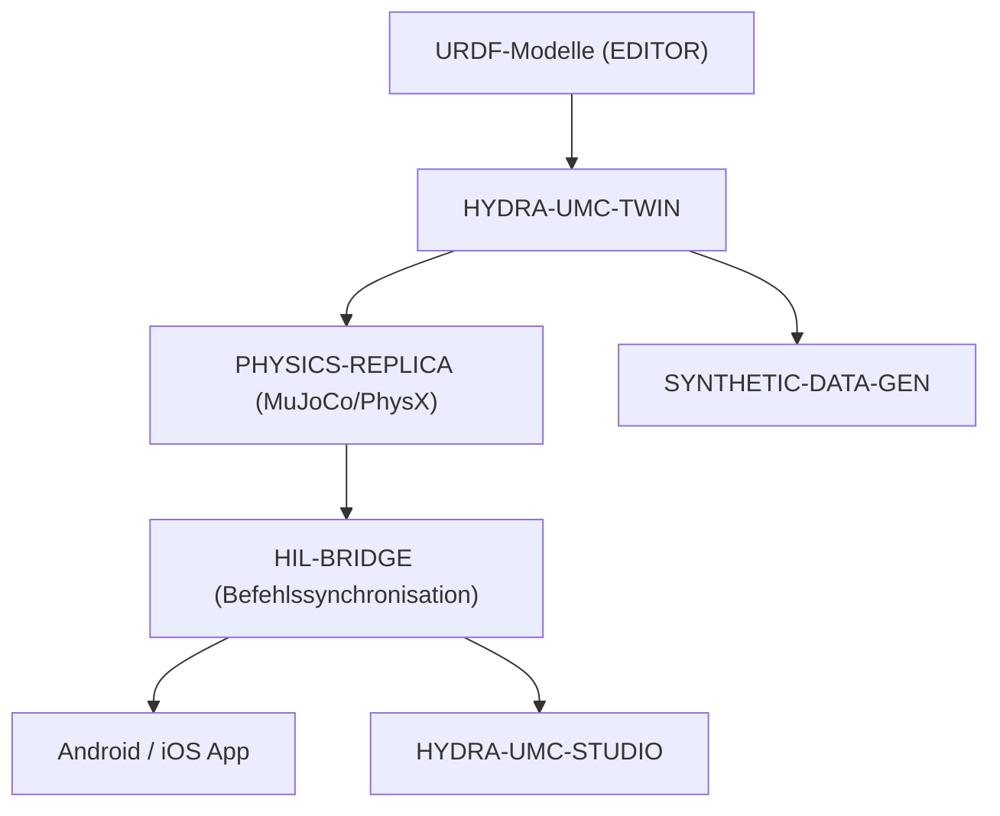

<p align="center">
  
</p>

# ♊ HYDRA-UMC-TWIN

<p align="center"><a href="README.md">🇺🇸 English</a> | <a href="README_spa.md">🇪🇸 Español</a> | <a href="README_fra.md">🇫🇷 Français</a> | <a href="README_ita.md">🇮🇹 Italiano</a> | 🇩🇪 <b>Deutsch</b> | <a href="README_zho.md">🇨🇳 简体中文</a> | <a href="README_jpn.md">🇯🇵 日本語</a></p>

### 🌐 Physikbasierter Digitaler Zwilling & High-Fidelity Simulations-Engine

<p align="left">
  
  
  
  
  
</p>

---

## 1. 🛠️ TECHNISCHER ÜBERBLICK

**HYDRA-UMC-TWIN** ist das virtuelle Herz des Ökosystems. Es bietet ein High-Fidelity, physikbasiertes Replikat der gesamten Micro-Factory und ermöglicht so sicheres Testen, Training und Echtzeit-Überwachung von Roboterschwärmen.

Entwickelt mit Rust und der Bevy-Engine, konsumiert es direkt URDF-Modelle aus dem EDITOR und emuliert reale physikalische Eigenschaften wie Trägheit, Reibung und Motordrehmoment, um sicherzustellen, dass "wenn es im Zwilling funktioniert, es auch in der Fabrik funktioniert".

### Hauptmerkmale:
* 🧩 **Familien-Bereitschaftscheck (v0):** der echte Subbefehl `family-status` liest die eigene `hydra-umc.project.json` jedes der 3 echten Kinder und meldet Vorhandensein/Version/Reife/Rolle - ehrlich für einen Integrations-Hub, der selbst noch keine Engine ausführt. Siehe "Ehrlichkeitscheck" unten.
* 🔒 **Echtes v0 - Zustands-Sync-Vertrag:** `family-sync` filtert jedes Kind nach einem echten, testbaren Vertrag - Mindestreife (`functional`) und eine maximal kompatible Hauptversion - bevor es überhaupt als sync-bereit behandelt wird, und weist ein unreifes oder versionsinkompatibles Kind mit einem echten Grund ab, statt gegen eine unverifizierte Zustandsform zu synchronisieren.
* 🌐 **Vollständige Fabriksimulation (geplant):** repliziert Roboter, Werkzeuge und die Umgebung in einem einheitlichen 3D-Raum - setzt voraus, dass zuerst eine echte Bevy-Engine-Integration existiert.
* ⚡ **Hardware-in-the-Loop (HIL) (geplant):** Verbinden Sie Apps und Studios mit dem Simulator, als wäre er ein echter Controller.
* 📊 **Verschleißvorhersage (geplant):** schätzt die Lebensdauer von Komponenten basierend auf simuliertem mechanischem Stress.
* 🛡️ **Sicherheitsvalidierung (geplant):** testet komplexe Trajektorien und Kollisionsvermeidung vor der physischen Ausführung.

**Ehrlichkeitscheck - was heute wirklich läuft:** Der argumentlose Aufruf gibt weiterhin Identität/Version/Rolle aus, es gibt jetzt aber zwei echte Subbefehle. `family-status [--workspace PFAD]` liest die echten eigenen Manifeste von `HYDRA-UMC-PHYSICS-REPLICA`/`HYDRA-UMC-HIL-BRIDGE`/`HYDRA-UMC-SYNTHETIC-DATA-GEN` aus einem lokalen Checkout und meldet ehrlich, was er findet. `family-sync [--workspace PFAD]` geht einen Schritt weiter: Es lässt jedes vorhandene Kind durch einen echten Zustands-Sync-Vertrag laufen (Mindestreife `functional`, maximal kompatible Hauptversion) und meldet pro Kind `READY`, `REJECTED (immature)`, `REJECTED (incompatible version)` oder `MISSING`. Es gibt noch keine Bevy-App, kein Rendering, keine Physik-Tick-Schleife, kein Laden von URDF-Szenen und keinen echten Netzwerk-Sync-Transport - siehe [`CHANGELOG.md`](CHANGELOG.md) für genau das, was geliefert wurde, und die Roadmap unten für das, was noch aussteht.

---

## 2. 🔄 TWIN-ARCHITEKTUR



---

## 3. 🧱 ARCHITEKTUR & DESIGNENTSCHEIDUNGEN

* **Warum diese Engine keine `hardware/`/`firmware/`/`os/`-Ordner hat.** Reine Software ohne eigene Platine; Quellordner werden nur aufgenommen, wenn ihre Implementierung sie erfordert.
* **Warum `Cargo.toml` bewusst noch keine Bevy-Abhängigkeit hat.** Bevy ist eine schwere Grafik-Engine - lange Kompilierzeiten, benötigt eine GPU-/Grafik-Toolchain, die nicht immer verfügbar ist. v0 hat nur `serde`/`serde_json` hinzugefügt (zum Lesen der Manifeste der Kinder) - die echte Rendering-Arbeit wartet weiterhin darauf, dass eine echte GPU-/Grafik-Toolchain existiert, gegen die kompiliert werden kann.
* **Warum `docker-compose.yml` existiert, bevor seine 3 Kinder ein Dockerfile haben.** Den Integrationsvertrag jetzt zu entscheiden und zu dokumentieren (welcher Dienst von welchem abhängt, welche Device-/Volume-Mounts jeder benötigt) verhindert, dass diese Form später ad hoc erfunden wird, auch wenn `docker compose up` erst vollständig gelingen kann, wenn jedes Kind sein eigenes Dockerfile veröffentlicht.
* **Wie sich das ins restliche Ökosystem einfügt.** Der Integrations-Elternteil der Digital-Twin-&-Simulation-Familie - HYDRA-UMC-PHYSICS-REPLICA liefert ihm einen echten Physik-Solver, HYDRA-UMC-HIL-BRIDGE lässt echte Apps ihn steuern, als wäre er Hardware, und HYDRA-UMC-SYNTHETIC-DATA-GEN rendert Trainingsdatensätze über seine eigene Engine.
* **Warum `family-status` das eigene Manifest jedes Kindes liest, statt eine handgepflegte Liste zu führen.** `hydra-umc.project.json` ist bereits die einzige Wahrheitsquelle, der Dashboard/Updater des Ökosystems vertrauen - eine zweite Liste hier würde in dem Moment auseinanderlaufen, in dem sich die echte Reife eines Kindes ändert und niemand daran denkt, sie zu aktualisieren.
* **Warum ein fehlender Geschwister-Checkout ein echtes, ehrliches "nicht gefunden" ist, statt eines Absturzes.** Ein Integrations-Hub kann wirklich nicht wissen, ob ein Entwickler alle 3 Kinder lokal ausgecheckt hat - `manifest.rs` gibt für jeden echten Fehlerfall (fehlendes Repo, fehlende Datei, fehlerhaftes JSON) `None` zurück, damit `family-status` es klar melden kann, statt in Panik zu geraten.
* **Warum `family-sync` sowohl nach Reife ALS AUCH nach einer Versionsobergrenze filtert, nicht nur nach "ist es da".** `family-status` beantwortet bereits "ist dieses Kind ausgecheckt und was behauptet es über sich selbst" - aber ein ausgechecktes Kind mit `scaffolding`-Reife hat noch keinen echten Zustand, der eine Synchronisation wert wäre, und ein Kind, das die von diesem Twin verifizierte maximale Hauptversion überschritten hat, könnte seine eigene Zustandsform auf eine Weise geändert haben, die dieser Twin noch nicht kennt. Beides sind echte Gründe, die Synchronisation zu verweigern, verschieden von "fehlend" - daher prüft und meldet `contract.rs` sie getrennt, statt alles in ein generisches "nicht bereit" zu vermengen.
* **Warum die Reife in `contract::assess()` vor der Versionskompatibilität geprüft wird.** Die Versionsnummer eines unreifen Kindes ist noch kein aussagekräftiges Signal - die Reife zuerst zu prüfen bedeutet, dass der gemeldete Ablehnungsgrund immer das grundlegendste Gate benennt, das tatsächlich fehlgeschlagen ist, statt dass eine Versionsinkompatibilität ein grundlegenderes Problem à la "dieses Kind ist noch nicht echt" verdeckt.

---

## 📂 VERZEICHNISSTRUKTUR

Reine Software-Engine ohne eigenes Hardware-Design - daher hat dieses
Projekt keine Ordner `hardware/`, `firmware/` oder `os/` (siehe die
Ordnerstruktur-Richtlinie).

```text
HYDRA-UMC-TWIN/
├── src/
│   ├── manifest.rs       # Echter, defensiver Reader für das eigene Manifest eines Geschwisters
│   ├── family.rs         # Echter Bereitschaftscheck + kombiniertes Sync-Ergebnis
│   ├── contract.rs       # Echter Zustands-Sync-Vertrag (Reife + Versionsobergrenze)
│   ├── server.rs         # Einfache JSON/HTTP-Oberfläche (tiny_http, blockierend, ohne Async-Runtime)
│   └── main.rs           # Einstiegspunkt + echte `family-status`/`family-sync`-Subbefehle
├── docs/                # Dokumentation und Physikanpassung
├── build/               # Build-Notizen/Artefakte (die eigentliche cargo-Ausgabe liegt in target/, per .gitignore ausgeschlossen)
├── images/              # Medien und Diagramme
├── systemd/
│   └── hydra-umc-twin.service # systemd-Unit der lokalen CM5-family-status/sync-API
├── tools/
│   ├── build_test.py    # Nicht-versionierender Build-Check
│   └── ci_validate.py   # Manifest/CHANGELOG/Docs-Validierung, von CI genutzt
├── Cargo.toml           # Paket-Metadaten, Abhängigkeiten (serde/serde_json), Kilometerzähler-Version
├── bump_version.py      # Kilometerzähler-artiger Versions-Bump (von build.sh/.bat verwendet)
├── build.sh / build.bat # Erhöht die Version, `cargo test`, dann `cargo build --release`
├── build-test.sh / build-test.bat # Nicht-versionierender Build-Check
├── run.sh / run.bat     # Führt die kompilierte Release-Binärdatei aus (leitet Argumente weiter)
└── docker-compose.yml   # Integrations-Blueprint für die 3 Kinder unten
```

---

## 🏗️ BUILD UND RUN

Erfordert die Rust-Toolchain (`cargo`/`rustc`, Installation via [rustup](https://rustup.rs)) und Python 3.10+ (nur für `bump_version.py`).

```bash
# Linux / macOS
./build.sh   # Kilometerzähler-Versions-Bump, `cargo test` (29 Tests), dann `cargo build --release`
./run.sh     # führt target/release/hydra-umc-twin aus, gibt Name + Version + Rolle aus
```

```bat
:: Windows
build.bat
run.bat
```

`build.sh`/`build.bat` erhöhen die Version der eigenen `Cargo.toml` dieses Projekts nach der "Kilometerzähler"-Regel des Ökosystems (PATCH+1, mit Übertrag auf MINOR nach 9), führen die echte Testsuite aus und bauen dann eine Release-Binärdatei.

Der echte Subbefehl `family-status` prüft den echten lokalen Checkout:

```bash
./run.sh family-status
./run.sh family-status --workspace /pfad/zu/einem/anderen/checkout

# Windows
run.bat family-status
```

```text
Digital Twin family status (workspace: /pfad/zu/GitHub):
  HYDRA-UMC-PHYSICS-REPLICA: v0.0.3, maturity=established, role=library
  HYDRA-UMC-HIL-BRIDGE: v0.0.5, maturity=established, role=service
  HYDRA-UMC-SYNTHETIC-DATA-GEN: v0.0.6, maturity=established, role=tool

All 3 children present.
```

Standardmäßig wird das eigene übergeordnete Verzeichnis dieses Repositorys verwendet - das echte Geschwister-Checkout-Layout, das dieses Ökosystem bereits nutzt. Beendet sich mit `1`, wenn ein echtes Kind fehlt.

Der echte Subbefehl `family-sync` geht weiter - er prüft auch den echten Zustands-Sync-Vertrag (Mindestreife, maximal kompatible Hauptversion) für jedes vorhandene Kind:

```bash
./run.sh family-sync --workspace /pfad/zu/einem/checkout
```

```text
Digital Twin family sync contract (workspace: /pfad/zu/einem/checkout):
  HYDRA-UMC-PHYSICS-REPLICA: READY (v0.0.3, maturity=functional)
  HYDRA-UMC-HIL-BRIDGE: REJECTED (incompatible version) - HYDRA-UMC-HIL-BRIDGE reports major version 1 - this Twin's sync contract is only verified up to major 0 (incompatible simulator version)
  HYDRA-UMC-SYNTHETIC-DATA-GEN: MISSING (not checked out)

Not every child is sync-ready - see the lines above.
```

Beendet sich nur dann mit `0`, wenn jedes erwartete Kind `READY` ist; mit `1` für jedes `MISSING`/`REJECTED`-Kind.

**Wichtig:** `Cargo.toml` enthält absichtlich **noch keine Bevy-Abhängigkeit**. Bevy ist eine schwere Grafik-Engine (lange Kompilierzeiten, benötigt eine GPU/Grafik-Toolchain, die nicht immer verfügbar ist); v0 hat nur `serde`/`serde_json` zum Lesen von Manifesten hinzugefügt. Die echte `bevy`-Abhängigkeit (plus ein Physik-Backend und der gRPC/WebSocket-Client für HIL-BRIDGE) wird hinzugefügt, wenn die echte Rendering-/Engine-Arbeit beginnt.

### Integration der 3 Kinder (`docker-compose.yml`)

Als Integrations-Elternteil dokumentiert `docker-compose.yml`, wie diese Engine ihre 3 Kinder zu einem Stack zusammensetzt: **PHYSICS-REPLICA** (Solver, bei jedem Physik-Tick aufgerufen), **HIL-BRIDGE** (Real-vs-Virtual-Befehlssynchronisation) und **SYNTHETIC-DATA-GEN** (Offline-Batch-Datensatzexport). Keines der 4 Projekte hat in dieser Skelett-Phase bereits ein `Dockerfile`, daher ist `docker compose up` heute nicht ausführbar; die Datei ist die bestätigte Referenz für Topologie, Ports und Abhängigkeiten künftiger Dockerfiles.

---

## 🚀 FAHRPLAN
* **Phase 1:** Digital-Twin-Synchronisation mit Echtzeit-Hardware-Telemetrie und Sub-10ms-Latenz.
* **Phase 2:** Physics Replica-Integration mit industriellen Simulatoren (Isaac Sim) und Unterstützung für verformbare Körper.
* **Phase 3:** Automatisierte Wiederherstellungsmuster von Node Healing für dezentrales Failover und frühzeitige Erkennung von Sensordegradation.
* **Phase 4:** Fotorealistisches Rendering für die Erzeugung synthetischer Daten und HIL-Bridge-Unterstützung für Full-Scale Vehicle-in-the-Loop.

---

## 🔗 Verwandte Projekte

Dieses Projekt ist Teil des HYDRA-UMC-Robotik-Ökosystems desselben Autors (JuanenRac / Electro Hobby 3D). Gut zu wissen, da eine Anfrage eigentlich eines dieser Projekte betreffen könnte statt dieses Repositorys.

**Untergeordnete Projekte** — jedes davon setzt an der eigenen Simulations-/Render-Engine dieses Zwillings an
- **[HYDRA-UMC-PHYSICS-REPLICA](https://github.com/JuanenRac/HYDRA-UMC-PHYSICS-REPLICA)** — echte Vorwärtskinematik und Gelenkgrenzenvalidierung über eine echte URDF-Teilmenge.
- **[HYDRA-UMC-HIL-BRIDGE](https://github.com/JuanenRac/HYDRA-UMC-HIL-BRIDGE)** — echte Hardware-in-the-Loop-Sicherheitsverriegelung, die Befehle zwischen Simulation und echter Hardware routet.
- **[HYDRA-UMC-SYNTHETIC-DATA-GEN](https://github.com/JuanenRac/HYDRA-UMC-SYNTHETIC-DATA-GEN)** — echter prozeduraler 2D-Szenengenerator mit YOLO/COCO-Annotationsexport.

**Direkt verwandt**
- **[HYDRA-UMC-EDITOR-URDF](https://github.com/JuanenRac/HYDRA-UMC-EDITOR-URDF)** — grafischer Desktop-URDF-Ersteller/-Editor, der fertige Modelle in STUDIOs eigenen Katalog überträgt; das Werkzeug, mit dem die von diesem Zwilling konsumierten URDF-Modelle erstellt werden.
- **[HYDRA-UMC-SUITE](https://github.com/JuanenRac/HYDRA-UMC-SUITE)** — Desktop-Schwarmleitstand (PySide6) für mehrere Server gleichzeitig, verpackt als eigenständige ausführbare Datei; steuert diesen Zwilling über HIL-BRIDGE, als wäre er echte Hardware.
- **[HYDRA-UMC-ANDROID-CONTROL](https://github.com/JuanenRac/HYDRA-UMC-ANDROID-CONTROL)** — native Android-Steuerungs-App mit biometrischem Login und einer gekoppelten Wear-OS-Begleit-App; steuert diesen Zwilling über HIL-BRIDGE, als wäre er echte Hardware.
- **[HYDRA-UMC-IOS-CONTROL](https://github.com/JuanenRac/HYDRA-UMC-IOS-CONTROL)** — iOS/iPadOS-Steuerungs-App (Flutter) mit Echtzeit-WebSocket-Synchronisierung; steuert diesen Zwilling über HIL-BRIDGE, als wäre er echte Hardware.

**Ebenfalls Teil des Ökosystems**

*Kern-Hardware & Plattform*
- **[HYDRA-UMC](https://github.com/JuanenRac/HYDRA-UMC)** — das physische Motherboard des Roboterarms: CM5-Host + Dual-Core-STM32H745, koordiniert bis zu 8 Werkzeugarme über CAN-OTA/SPI-OTA.
- **[HYDRA-UMC-OS](https://github.com/JuanenRac/HYDRA-UMC-OS)** — reproduzierbare Raspberry-Pi-OS-Produktschicht für den CM5: schreibgeschützter Agent, validierte Konfiguration/Profile, WiFi-Ersteinrichtung.
- **[HYDRA-UMC-SDK](https://github.com/JuanenRac/HYDRA-UMC-SDK)** — der gemeinsame JSON-Schema-Vertrag und die Sicherheitsschranke, gegen die jede Bridge ihre Befehle validiert.

*Kern-Backend & Clients*
- **[HYDRA-UMC-SERVER](https://github.com/JuanenRac/HYDRA-UMC-SERVER)** — das reale Headless-Backend (REST/WebSocket), mit dem jeder Steuerungsclient tatsächlich spricht.
- **[HYDRA-UMC-STUDIO](https://github.com/JuanenRac/HYDRA-UMC-STUDIO)** — Web-Steuerungs-Dashboard mit Echtzeit-3D-Visualisierung mehrerer Roboter.
- **[HYDRA-UMC-DSI](https://github.com/JuanenRac/HYDRA-UMC-DSI)** — native Touch-UI für das eingebaute 7"-DSI-Touchscreen, direkt auf dem CM5 eingebettet.
- **[HYDRA-UMC-BRIDGE-AMR](https://github.com/JuanenRac/HYDRA-UMC-BRIDGE-AMR)** — Koordinationsschranke für AGV-/AMR-Flotten über einen echten VDA-5050-MQTT-Publisher.
- **[HYDRA-UMC-BRIDGE-CNC](https://github.com/JuanenRac/HYDRA-UMC-BRIDGE-CNC)** — High-Level-Koordinator für CNC-Zellen mit echtem GRBL-Status-/Steuerbyte-Zugriff.
- **[HYDRA-UMC-BRIDGE-DROIDS](https://github.com/JuanenRac/HYDRA-UMC-BRIDGE-DROIDS)** — Koordinationsschranke für laufende/humanoide Droiden, mit einem echten Boston-Dynamics-Spot-Befehlssender.
- **[HYDRA-UMC-BRIDGE-LASER](https://github.com/JuanenRac/HYDRA-UMC-BRIDGE-LASER)** — Sicherheitskoordinator für Laserzellen, liest 3 echte Schlüssel-/Gehäuse-/Verriegelungs-GPIO-Sicherungen.
- **[HYDRA-UMC-BRIDGE-OPENPNP](https://github.com/JuanenRac/HYDRA-UMC-BRIDGE-OPENPNP)** — sicherer High-Level-Koordinator für den Leiterplattenfluss von OpenPnP Pick-and-Place.
- **[HYDRA-UMC-BRIDGE-PRINTER3D](https://github.com/JuanenRac/HYDRA-UMC-BRIDGE-PRINTER3D)** — sichere Koordinationsschranke für Moonraker/Klipper-3D-Drucker, mit echten gesicherten Job-Befehlen.
- **[HYDRA-UMC-BRIDGE-ROS2](https://github.com/JuanenRac/HYDRA-UMC-BRIDGE-ROS2)** — Sicherheitskoordinator mit einem echten, träge importierten rclpy-ROS-2-Transport.
- **[HYDRA-UMC-BRIDGE-UAV](https://github.com/JuanenRac/HYDRA-UMC-BRIDGE-UAV)** — Koordinationsschranke für kameraausgestattete UAVs, mit einem echten MAVLink-Befehlssender.

*URTC-Werkzeugplattform*
- **[URTC](https://github.com/JuanenRac/URTC)** — Firmware für die physische Universal-Robot-Tool-Controller-Platine, 25+ Werkzeugprofile über CAN-Bus.
- **[URTC-FLASHER](https://github.com/JuanenRac/URTC-FLASHER)** — Desktop-GUI-Flash-Tool für URTC-Platinen, CAN-OTA plus Full-Chip-SWD/JTAG.
- **[URTC-TESTER](https://github.com/JuanenRac/URTC-TESTER)** — Desktop-Live-CAN-Bus-Diagnosetool für URTC-Platinen, ein Panel pro Werkzeugprofil.
- **[URTC-WEB-STUDIO](https://github.com/JuanenRac/URTC-WEB-STUDIO)** — browserbasierte Alternative zu URTC-TESTER über die Web-Serial-API, ohne lokale Installation.

*Vision-KI-Knoten (Hailo-8)*
- **[HYDRA-UMC-VISION-NODE](https://github.com/JuanenRac/HYDRA-UMC-VISION-NODE)** — Integrationsknoten für die Hailo-8-Vision-Pipeline, mit einer echten stufenweisen Hardware-Bereitschaftsprüfung.
- **[HYDRA-UMC-DETECTION-HEF](https://github.com/JuanenRac/HYDRA-UMC-DETECTION-HEF)** — echte Registry für kompilierte Modelle mit Hailo-Architektur-/Prüfsummen-Safe-Load-Verifizierung.
- **[HYDRA-UMC-VISION-STREAMER](https://github.com/JuanenRac/HYDRA-UMC-VISION-STREAMER)** — echter GStreamer-Pipeline- + MediaMTX-Konfigurationsgenerator mit einer echten HailoRT-Integrationsschranke.
- **[HYDRA-UMC-VISUAL-SERVOING-API](https://github.com/JuanenRac/HYDRA-UMC-VISUAL-SERVOING-API)** — echtes Position-Based-Visual-Servoing-Korrekturgesetz, sicherheitsgesteuert nach vorgelagertem Zonenstatus.
- **[HYDRA-UMC-SAFETY-ZONES](https://github.com/JuanenRac/HYDRA-UMC-SAFETY-ZONES)** — echte Zonenverletzungsprüfung und E-STOP-Anforderung, mit erzwungener Kalibrierungsaktualität.

*Kognitiver KI-Knoten (Hailo-10)*
- **[HYDRA-UMC-COGNITIVE-NODE](https://github.com/JuanenRac/HYDRA-UMC-COGNITIVE-NODE)** — Integrationsknoten für die Hailo-10-Cognitive-Pipeline (LLM-/VLA-/Sprach-Orchestrierung).
- **[HYDRA-UMC-VLA-ENGINE](https://github.com/JuanenRac/HYDRA-UMC-VLA-ENGINE)** — echte Aktions-Token-Kodierung/-Dekodierung und Trajektoriengenerierung für ein Vision-Language-Action-Modell.
- **[HYDRA-UMC-VOICE-UI](https://github.com/JuanenRac/HYDRA-UMC-VOICE-UI)** — echtes Sprach-Frontend (VAD + Intent-Parser) mit einem begrenzten, bestätigungsgesicherten Watch-Relay.
- **[HYDRA-UMC-SEMANTIC-PLANNER](https://github.com/JuanenRac/HYDRA-UMC-SEMANTIC-PLANNER)** — echte regelbasierte Aufgabenzerlegung und semantische Fehlerbehebung über MCU-Fehlercodes.
- **[HYDRA-UMC-DOCS-QA](https://github.com/JuanenRac/HYDRA-UMC-DOCS-QA)** — echte, nur auf der Standardbibliothek basierende TF-IDF-Dokumentensuche über die eigenen Markdown-Dokumente dieses Ökosystems.

*Orchestrierung & Schwarm*
- **[HYDRA-UMC-ORCHESTRATOR](https://github.com/JuanenRac/HYDRA-UMC-ORCHESTRATOR)** — Integrationsknoten mit einem echten gRPC/Protobuf-Health-Report-Vertrag und einer Missions-Zustandsmaschine.
- **[HYDRA-UMC-JOB-DISPATCHER](https://github.com/JuanenRac/HYDRA-UMC-JOB-DISPATCHER)** — echte prioritätsbasierte Job-Queue mit Deduplizierung, über eine echte HTTP-API.
- **[HYDRA-UMC-NODE-HEALING](https://github.com/JuanenRac/HYDRA-UMC-NODE-HEALING)** — echter gRPC-basierter Flotten-Health-Watchdog mit Retry/Backoff und Identitäts-Mismatch-Erkennung.
- **[HYDRA-UMC-PATH-PLANNER-3D](https://github.com/JuanenRac/HYDRA-UMC-PATH-PLANNER-3D)** — echter RRT-basierter 3D-Pfadplaner mit echter Hindernis-/Arbeitsraum-Kollisionsvalidierung.
- **[HYDRA-UMC-SWARM-SYNC](https://github.com/JuanenRac/HYDRA-UMC-SWARM-SYNC)** — echte CRDT-LWW-Element-Map-Zustandssynchronisation, eigenschaftsgetestet auf Multi-Zellen-Konvergenz.

*Daten & Analytik*
- **[HYDRA-UMC-DATALAKE](https://github.com/JuanenRac/HYDRA-UMC-DATALAKE)** — echter sqlite3-gestützter Zeitreihenspeicher mit einer echten Ingest-/Abfrage-HTTP-API.
- **[HYDRA-UMC-ANOMALY-DETECTOR](https://github.com/JuanenRac/HYDRA-UMC-ANOMALY-DETECTOR)** — echter FFT- + statistischer Basislinien-Anomaliedetektor mit Drift-Überwachung.
- **[HYDRA-UMC-PRODUCTION-REPORTS](https://github.com/JuanenRac/HYDRA-UMC-PRODUCTION-REPORTS)** — echte OEE-/Verfügbarkeitsberechnung über den DATALAKE-Verlauf, mit reproduzierbarem CSV-Export.
- **[HYDRA-UMC-TELEMETRY-COLLECTOR](https://github.com/JuanenRac/HYDRA-UMC-TELEMETRY-COLLECTOR)** — echte CAN/WebSocket-Ingestion-Pipeline in DATALAKE, mit Sequenz-Deduplizierung.

*Industrie-Gateway*
- **[HYDRA-UMC-GATEWAY-INDUSTRIAL](https://github.com/JuanenRac/HYDRA-UMC-GATEWAY-INDUSTRIAL)** — Integrationsknoten, der zu Industrieprotokollen weiterleitet, mit einer echten Befehls-Allowlist-/Backpressure-Schicht.
- **[HYDRA-UMC-OPCUA-SERVER](https://github.com/JuanenRac/HYDRA-UMC-OPCUA-SERVER)** — echter OPC-UA-Adressraum, verifiziert mit einer echten Binärprotokoll-Client-Session.
- **[HYDRA-UMC-MQTT-BROKER](https://github.com/JuanenRac/HYDRA-UMC-MQTT-BROKER)** — echter MQTT-Broker mit optionaler Pro-Client-Authentifizierung und Topic-ACLs.
- **[HYDRA-UMC-MTCONNECT-ADAPTER](https://github.com/JuanenRac/HYDRA-UMC-MTCONNECT-ADAPTER)** — echte MTConnect-`/probe`- und `/current`-XML-Endpunkte mit Degraded-Mode-Ausgabe.

*Ergänzende Tools & Ökosystembetrieb*
- **[HYDRA-UMC-DASHBOARD-AI](https://github.com/JuanenRac/HYDRA-UMC-DASHBOARD-AI)** — Smart-Summaries- und Anomaly-Highlighting-Panels über DATALAKE/ANOMALY-DETECTOR, mit einem ehrlichen statistischen Fallback.
- **[HYDRA-UMC-TOOL-CLI](https://github.com/JuanenRac/HYDRA-UMC-TOOL-CLI)** — Flotten-CLI mit einem echten, stabilen Exit-Code-Vertrag, ein echter Live-Client der eigenen API von HYDRA-UMC-SERVER.
- **[HYDRA-UMC-WATCH](https://github.com/JuanenRac/HYDRA-UMC-WATCH)** — WearOS-Begleit-App mit echten haptischen Alarmen und einem Sprach-Relay zum gekoppelten Telefon.
- **[URTC-SMART-RACK](https://github.com/JuanenRac/URTC-SMART-RACK)** — Firmware für ein Platinenmontagegestell mit echter Werkzeug-ID-Dekodierung und Smart-Idle-Vorheizlogik.
- **[URTC-VISION-TOOL](https://github.com/JuanenRac/URTC-VISION-TOOL)** — Firmware plus ein echter Python-Vision-Begleiter für einen Thermal-/RGB-Inspektionswerkzeugkopf.
- **[HYDRA-UMC-UPDATER](https://github.com/JuanenRac/HYDRA-UMC-UPDATER)** — administratives Desktop-Tool, das jedes Repository in diesem Ökosystem entdeckt, klont und aktualisiert.


---

## 📚 Dokumentation & Community

- **[CONTRIBUTING.md](CONTRIBUTING.md)** — Technologie-Stack und Coding-Richtlinien für einen Pull Request.
- **[CODE_OF_CONDUCT.md](CODE_OF_CONDUCT.md)** — die in dieser Community erwarteten Verhaltensstandards.
- **[SECURITY.md](SECURITY.md)** — wie man eine Schwachstelle meldet, und die echten Sicherheitsschwerpunkte dieses Projekts.
- **[SUPPORT.md](SUPPORT.md)** — wo man Fragen stellt und Fehler meldet.
- **[LICENSE.md](LICENSE.md)** — die eigene Lizenz dieses Projekts.

## 👤 AUTOR
**JuanenRac** (Electro Hobby 3D)
📧 electrohobby3d@gmail.com
📺 [youtube.com/@electrohobby3d](https://youtube.com/@electrohobby3d)

## 📜 LIZENZ
GPL-3.0 - Siehe LICENSE für Details.
