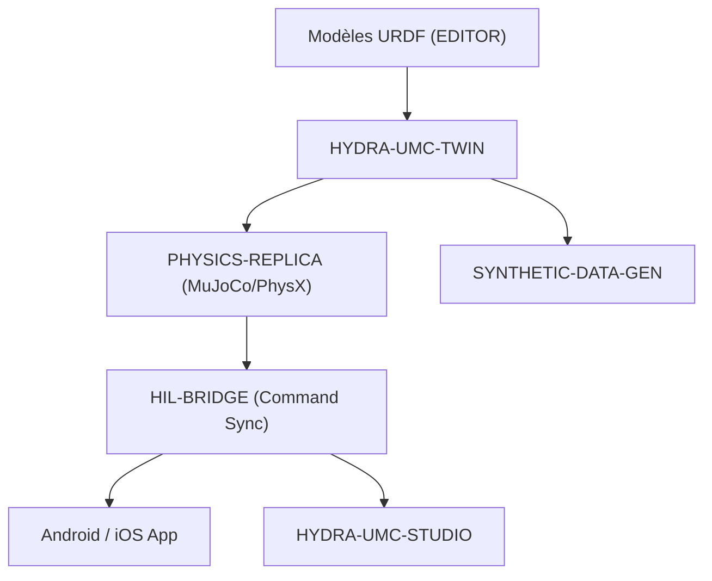

<p align="center">
  
</p>

# ♊ HYDRA-UMC-TWIN

<p align="center"><a href="README.md">🇺🇸 English</a> | <a href="README_spa.md">🇪🇸 Español</a> | 🇫🇷 <b>Français</b> | <a href="README_ita.md">🇮🇹 Italiano</a> | <a href="README_deu.md">🇩🇪 Deutsch</a> | <a href="README_zho.md">🇨🇳 简体中文</a> | <a href="README_jpn.md">🇯🇵 日本語</a></p>

### 🌐 Jumeau numérique basé sur la physique et moteur de simulation haute fidélité

<p align="left">
  
  
  
  
  
</p>

---

## 1. 🛠️ APERÇU TECHNIQUE

**HYDRA-UMC-TWIN** est le cœur virtuel de l'écosystème. Il fournit une réplique haute fidélité, basée sur la physique, de l'ensemble de la micro-usine, permettant des tests, un entraînement et une surveillance en temps réel en toute sécurité des essaims robotiques.

Construit avec Rust et le moteur Bevy, il consomme directement les modèles URDF de l'ÉDITEUR et émule les propriétés physiques du monde réel comme l'inertie, la friction et le couple moteur pour s'assurer que « si cela fonctionne dans le Jumeau, cela fonctionne sur le terrain ».

### Caractéristiques principales :
* 🧩 **Vérification de disponibilité de la famille (v0) :** le vrai sous-commande `family-status` lit le propre `hydra-umc.project.json` de chacun des 3 vrais enfants et signale présence/version/maturité/rôle - honnête pour un hub d'intégration qui ne fait tourner encore aucun moteur lui-même. Voir « Vérification d'honnêteté » ci-dessous.
* 🔒 **Réel v0 - Contrat de synchronisation d'état :** `family-sync` filtre chaque enfant selon un contrat réel et testable - maturité minimale (`functional`) et une version majeure maximale compatible - avant de le traiter comme prêt à synchroniser, refusant un enfant immature ou à version incompatible avec une vraie raison plutôt que de synchroniser contre une forme d'état non vérifiée.
* 🔌 **API JSON HTTP (v0) :** `serve [--addr ADDR] [--port PORT] [--workspace CHEMIN]` (par défaut `127.0.0.1:8111`) expose exactement la même logique family-status/family-sync via `GET /family-status`, `GET /family-sync`, `GET /stats` par un vrai serveur `tiny_http` bloquant - le même binaire que l'unité `systemd/hydra-umc-twin.service` exécute sur une CM5 déployée (loopback uniquement). Voir [`docs/CLI_REFERENCE.md`](docs/CLI_REFERENCE.md) pour le contrat complet.
* 🌐 **Simulation complète de l'usine (prévu) :** réplique les robots, les outils et l'environnement dans un espace 3D unifié - dépend qu'une véritable intégration du moteur Bevy existe d'abord.
* ⚡ **Hardware-in-the-Loop (HIL) (prévu) :** connectez les applications et les studios au simulateur comme s'il s'agissait d'un contrôleur réel.
* 📊 **Prédiction de l'usure (prévu) :** estime la durée de vie des composants en fonction des contraintes mécaniques simulées.
* 🛡️ **Validation de la sécurité (prévu) :** testez des trajectoires complexes et l'évitement de collision avant l'exécution physique.

**Vérification d'honnêteté - ce qui fonctionne réellement aujourd'hui :** l'appel sans argument affiche toujours identité/version/rôle, mais il existe désormais trois vrais sous-commandes. `family-status [--workspace CHEMIN]` lit les vrais manifestes propres de `HYDRA-UMC-PHYSICS-REPLICA`/`HYDRA-UMC-HIL-BRIDGE`/`HYDRA-UMC-SYNTHETIC-DATA-GEN` depuis un checkout local et signale honnêtement ce qu'il trouve. `family-sync [--workspace CHEMIN]` va plus loin : il fait passer chaque enfant présent par un vrai contrat de synchronisation d'état (maturité minimale `functional`, version majeure maximale compatible) et rapporte `READY`, `REJECTED (immature)`, `REJECTED (incompatible version)` ou `MISSING` par enfant. `serve` expose les deux via de vraies API HTTP JSON au lieu d'invocations CLI ponctuelles. Aucune application Bevy, aucun rendu, aucune boucle physique, aucun chargement de scène URDF, ni aucun vrai transport de synchronisation réseau n'existe encore - voir [`CHANGELOG.md`](CHANGELOG.md) pour ce qui a été livré exactement, [`docs/CLI_REFERENCE.md`](docs/CLI_REFERENCE.md) pour chaque commande/point de terminaison, et la Roadmap ci-dessous pour ce qui reste à venir.

---

## 2. 🔄 ARCHITECTURE DU JUMEAU



---

## 3. 🧱 ARCHITECTURE & DÉCISIONS DE CONCEPTION

* **Pourquoi ce moteur n'a pas de dossiers `hardware/`/`firmware/`/`os/`.** Logiciel pur sans carte propre; les dossiers source ne sont inclus que lorsque leur implémentation les requiert.
* **Pourquoi `Cargo.toml` n'a délibérément pas encore de dépendance Bevy.** Bevy est un moteur graphique lourd - temps de compilation longs, nécessite une chaîne d'outils GPU/graphique pas toujours disponible. v0 n'a ajouté que `serde`/`serde_json` (pour lire les manifestes des enfants) - le vrai travail de rendu attend toujours qu'une vraie chaîne d'outils GPU/graphique existe pour compiler contre.
* **Pourquoi `docker-compose.yml` existe avant que ses 3 enfants n'aient de Dockerfile.** Décider et documenter le contrat d'intégration (quel service dépend de lequel, quels montages device/volume chacun nécessite) maintenant évite que cette forme soit inventée à l'improviste plus tard, même si `docker compose up` ne peut pas pleinement réussir tant que chaque enfant n'a pas publié son propre Dockerfile.
* **Comment cela s'intègre dans le reste de l'écosystème.** Le parent d'intégration de la famille Jumeau Numérique et Simulation - HYDRA-UMC-PHYSICS-REPLICA lui apporte un vrai solveur physique, HYDRA-UMC-HIL-BRIDGE permet à de vraies applications de le contrôler comme s'il s'agissait de matériel, et HYDRA-UMC-SYNTHETIC-DATA-GEN rend des jeux de données d'entraînement via son propre moteur.
* **Pourquoi `family-status` lit le propre manifeste de chaque enfant plutôt qu'une liste tenue à la main.** `hydra-umc.project.json` est déjà la seule source de vérité en laquelle le dashboard/updater de l'écosystème ont confiance - une seconde liste ici se désynchroniserait dès qu'une vraie maturité d'un enfant changerait sans que personne ne pense à la mettre à jour.
* **Pourquoi un checkout frère absent est un vrai « introuvable » honnête plutôt qu'un plantage.** Un hub d'intégration ne peut réellement pas savoir si un développeur a bien les 3 enfants clonés localement - `manifest.rs` retourne `None` pour chaque vrai mode d'échec (dépôt absent, fichier absent, JSON malformé) afin que `family-status` puisse le signaler clairement plutôt que de paniquer.
* **Pourquoi `family-sync` filtre à la fois sur la maturité ET un plafond de version, pas seulement sur « est-il présent ».** `family-status` répond déjà à « cet enfant est-il cloné et que prétend-il de lui-même » - mais un enfant cloné de maturité `scaffolding` n'a pas encore de vrai état qui vaille la peine d'être synchronisé, et un enfant qui a dépassé la version majeure maximale vérifiée par ce Jumeau a pu changer sa propre forme d'état d'une manière que ce Jumeau ignore. Les deux sont de vraies raisons de refuser la synchronisation, distinctes de « absent », donc `contract.rs` les vérifie et les rapporte séparément plutôt que de tout fondre dans un « pas prêt » générique.
* **Pourquoi la maturité est vérifiée avant la compatibilité de version dans `contract::assess()`.** Le numéro de version d'un enfant immature n'est pas encore un signal significatif - vérifier la maturité en premier signifie que la raison de rejet rapportée nomme toujours la porte la plus fondamentale qui a réellement échoué, plutôt qu'une incompatibilité de version masquant un problème plus basique de « cet enfant n'est pas encore réel ».

---

## 📂 STRUCTURE DES RÉPERTOIRES

Moteur purement logiciel, sans conception matérielle propre - ce projet ne
comporte donc pas de dossiers `hardware/`, `firmware/` ni `os/` (voir la
politique de structure du dépôt).

```text
HYDRA-UMC-TWIN/
├── src/
│   ├── manifest.rs       # Lecteur réel et défensif du manifeste propre d'un frère
│   ├── family.rs         # Vraie vérification de disponibilité + résultat de sync combiné
│   ├── contract.rs       # Vrai contrat de sync d'état (maturité + plafond de version)
│   ├── server.rs         # Surface JSON/HTTP simple (tiny_http, bloquant, sans runtime async)
│   └── main.rs           # Point d'entrée + vrais sous-commandes `family-status`/`family-sync`
├── docs/                # Documentation et réglage physique
├── build/               # Notes/artefacts de build (la sortie réelle de cargo vit dans target/, ignoré par git)
├── images/              # Médias et diagrammes
├── systemd/
│   └── hydra-umc-twin.service # Unité systemd de l'API locale family-status/sync sur la CM5
├── tools/
│   ├── build_test.py    # Vérification de build sans versionnage
│   └── ci_validate.py   # Validation manifeste/CHANGELOG/docs utilisée par CI
├── Cargo.toml           # Métadonnées du paquet, dépendances (serde/serde_json), version compteur kilométrique
├── bump_version.py      # Incrément de version type compteur kilométrique (utilisé par build.sh/.bat)
├── build.sh / build.bat # Incrémente la version, `cargo test`, puis `cargo build --release`
├── build-test.sh / build-test.bat # Vérification de build sans versionnage
├── run.sh / run.bat     # Exécute le binaire release compilé (relaie les arguments)
└── docker-compose.yml   # Plan d'intégration des 3 enfants ci-dessous
```

---

## 🏗️ BUILD ET RUN

Nécessite la chaîne d'outils Rust (`cargo`/`rustc`, à installer via [rustup](https://rustup.rs)) et Python 3.10+ (uniquement pour `bump_version.py`).

```bash
# Linux / macOS
./build.sh   # incrément de version compteur kilométrique, `cargo test` (29 tests), puis `cargo build --release`
./run.sh     # exécute target/release/hydra-umc-twin, affiche nom + version + rôle
```

```bat
:: Windows
build.bat
run.bat
```

`build.sh`/`build.bat` incrémentent la version du propre `Cargo.toml` de ce projet selon la règle "compteur kilométrique" de l'écosystème (PATCH+1, avec retenue vers MINOR au-delà de 9), exécutent la vraie suite de tests, puis construisent un binaire release.

Le vrai sous-commande `family-status` vérifie le vrai checkout local :

```bash
./run.sh family-status
./run.sh family-status --workspace /chemin/vers/un/autre/checkout

# Windows
run.bat family-status
```

```text
Digital Twin family status (workspace: /chemin/vers/GitHub):
  HYDRA-UMC-PHYSICS-REPLICA: v0.0.3, maturity=established, role=library
  HYDRA-UMC-HIL-BRIDGE: v0.0.5, maturity=established, role=service
  HYDRA-UMC-SYNTHETIC-DATA-GEN: v0.0.6, maturity=established, role=tool

All 3 children present.
```

Par défaut, utilise le propre dossier parent de ce dépôt - la vraie disposition de checkout-frère que cet écosystème utilise déjà. Se termine avec `1` si un vrai enfant manque.

Le vrai sous-commande `family-sync` va plus loin - il vérifie aussi le vrai contrat de synchronisation d'état (maturité minimale, version majeure maximale compatible) pour chaque enfant présent :

```bash
./run.sh family-sync --workspace /chemin/vers/un/checkout
```

```text
Digital Twin family sync contract (workspace: /chemin/vers/un/checkout):
  HYDRA-UMC-PHYSICS-REPLICA: READY (v0.0.3, maturity=functional)
  HYDRA-UMC-HIL-BRIDGE: REJECTED (incompatible version) - HYDRA-UMC-HIL-BRIDGE reports major version 1 - this Twin's sync contract is only verified up to major 0 (incompatible simulator version)
  HYDRA-UMC-SYNTHETIC-DATA-GEN: MISSING (not checked out)

Not every child is sync-ready - see the lines above.
```

Se termine avec `0` seulement si chaque enfant attendu est `READY` ; `1` pour tout enfant `MISSING`/`REJECTED`.

**Important :** `Cargo.toml` n'a délibérément **pas encore la dépendance Bevy**. Bevy est un moteur graphique lourd (temps de compilation longs, nécessite une chaîne d'outils GPU/graphique pas toujours disponible) ; v0 n'a ajouté que `serde`/`serde_json` pour lire les manifestes. La vraie dépendance `bevy` (plus un backend physique et le client gRPC/WebSocket pour HIL-BRIDGE) sera ajoutée quand le vrai travail de rendu/moteur commencera.

### Intégration des 3 enfants (`docker-compose.yml`)

En tant que parent d'intégration, `docker-compose.yml` documente comment ce moteur compose ses 3 enfants en une seule stack : **PHYSICS-REPLICA** (solveur, appelé à chaque tick physique), **HIL-BRIDGE** (synchronisation des commandes réel vs virtuel) et **SYNTHETIC-DATA-GEN** (export de jeux de données par lot, hors ligne). Aucun des 4 projets n'a encore de `Dockerfile` à ce stade de squelette, donc `docker compose up` n'est pas exécutable aujourd'hui; le fichier est la référence confirmée de topologie, ports et dépendances des futurs Dockerfiles.

---

## 🚀 FEUILLE DE ROUTE
* **Phase 1 :** Synchronisation du jumeau numérique avec la télémétrie matérielle en temps réel et latence inférieure à 10 ms.
* **Phase 2 :** Intégration de Physics Replica avec des simulateurs de classe industrielle (Isaac Sim) et prise en charge des corps déformables.
* **Phase 3 :** Modèles de récupération automatisés de Node Healing pour un basculement décentralisé et détection précoce de la dégradation des capteurs.
* **Phase 4 :** Rendu photoréaliste pour la génération de données synthétiques et prise en charge de HIL Bridge pour le véhicule en boucle à grande échelle.

---

## 🔗 Projets Liés

Ce projet fait partie de l'écosystème robotique HYDRA-UMC du même auteur (JuanenRac / Electro Hobby 3D). Bon à savoir, car une demande pourrait en réalité concerner l'un de ceux-ci plutôt que ce dépôt.

**Projets Enfants** — chacun se branche sur le propre moteur de simulation/rendu de ce jumeau
- **[HYDRA-UMC-PHYSICS-REPLICA](https://github.com/JuanenRac/HYDRA-UMC-PHYSICS-REPLICA)** — vraie cinématique directe et validation des limites articulaires sur un vrai sous-ensemble URDF.
- **[HYDRA-UMC-HIL-BRIDGE](https://github.com/JuanenRac/HYDRA-UMC-HIL-BRIDGE)** — vrai verrouillage de sécurité hardware-in-the-loop routant les commandes entre simulation et matériel réel.
- **[HYDRA-UMC-SYNTHETIC-DATA-GEN](https://github.com/JuanenRac/HYDRA-UMC-SYNTHETIC-DATA-GEN)** — vrai générateur procédural de scènes 2D avec export d'annotations YOLO/COCO.

**Directement Liés**
- **[HYDRA-UMC-EDITOR-URDF](https://github.com/JuanenRac/HYDRA-UMC-EDITOR-URDF)** — créateur/éditeur graphique de bureau pour URDF qui envoie les modèles terminés vers le propre catalogue de STUDIO ; l'outil avec lequel sont créés les modèles URDF que consomme ce jumeau.
- **[HYDRA-UMC-SUITE](https://github.com/JuanenRac/HYDRA-UMC-SUITE)** — centre de commande d'essaim de bureau (PySide6) pour plusieurs serveurs à la fois, empaqueté en exécutable autonome ; contrôle ce jumeau comme s'il s'agissait de matériel réel, via HIL-BRIDGE.
- **[HYDRA-UMC-ANDROID-CONTROL](https://github.com/JuanenRac/HYDRA-UMC-ANDROID-CONTROL)** — application de contrôle Android native avec connexion biométrique et un compagnon Wear OS jumelé ; contrôle ce jumeau comme s'il s'agissait de matériel réel, via HIL-BRIDGE.
- **[HYDRA-UMC-IOS-CONTROL](https://github.com/JuanenRac/HYDRA-UMC-IOS-CONTROL)** — application de contrôle iOS/iPadOS (Flutter) avec synchronisation WebSocket en temps réel ; contrôle ce jumeau comme s'il s'agissait de matériel réel, via HIL-BRIDGE.

**Fait Également Partie de l'Écosystème**

*Matériel & Plateforme de Base*
- **[HYDRA-UMC](https://github.com/JuanenRac/HYDRA-UMC)** — la carte mère physique du bras robotique : hôte CM5 + coprocesseur STM32H745 double cœur, coordonnant jusqu'à 8 bras-outils via CAN-OTA/SPI-OTA.
- **[HYDRA-UMC-OS](https://github.com/JuanenRac/HYDRA-UMC-OS)** — couche produit reproductible sur Raspberry Pi OS pour le CM5 : agent en lecture seule, config/profils validés, provisionnement WiFi de premier contact.
- **[HYDRA-UMC-SDK](https://github.com/JuanenRac/HYDRA-UMC-SDK)** — le contrat JSON-Schema partagé et la barrière de sécurité contre laquelle chaque bridge valide ses commandes.

*Backend Central & Clients*
- **[HYDRA-UMC-SERVER](https://github.com/JuanenRac/HYDRA-UMC-SERVER)** — le vrai backend headless (REST/WebSocket) auquel parle réellement chaque client de contrôle.
- **[HYDRA-UMC-STUDIO](https://github.com/JuanenRac/HYDRA-UMC-STUDIO)** — tableau de bord de contrôle web avec visualisation 3D multi-robot en temps réel.
- **[HYDRA-UMC-DSI](https://github.com/JuanenRac/HYDRA-UMC-DSI)** — interface tactile native pour l'écran tactile DSI 7" embarqué, intégrée directement sur le CM5.
- **[HYDRA-UMC-BRIDGE-AMR](https://github.com/JuanenRac/HYDRA-UMC-BRIDGE-AMR)** — frontière de coordination pour les flottes AGV/AMR via un éditeur MQTT VDA 5050 réel.
- **[HYDRA-UMC-BRIDGE-CNC](https://github.com/JuanenRac/HYDRA-UMC-BRIDGE-CNC)** — coordinateur haut niveau pour cellules CNC avec accès réel au statut/octets de contrôle GRBL.
- **[HYDRA-UMC-BRIDGE-DROIDS](https://github.com/JuanenRac/HYDRA-UMC-BRIDGE-DROIDS)** — frontière de coordination pour droïdes à pattes/humanoïdes, avec un véritable émetteur de commandes Boston Dynamics Spot.
- **[HYDRA-UMC-BRIDGE-LASER](https://github.com/JuanenRac/HYDRA-UMC-BRIDGE-LASER)** — coordinateur de sécurité pour cellules laser lisant 3 vraies sécurités GPIO de clé/enceinte/verrouillage.
- **[HYDRA-UMC-BRIDGE-OPENPNP](https://github.com/JuanenRac/HYDRA-UMC-BRIDGE-OPENPNP)** — coordinateur haut niveau sûr pour le flux de cartes du pick-and-place OpenPnP.
- **[HYDRA-UMC-BRIDGE-PRINTER3D](https://github.com/JuanenRac/HYDRA-UMC-BRIDGE-PRINTER3D)** — frontière de coordination sûre pour imprimantes 3D Moonraker/Klipper, avec de vraies commandes de tâche contrôlées.
- **[HYDRA-UMC-BRIDGE-ROS2](https://github.com/JuanenRac/HYDRA-UMC-BRIDGE-ROS2)** — coordinateur de sécurité avec un vrai transport ROS 2 rclpy à importation paresseuse.
- **[HYDRA-UMC-BRIDGE-UAV](https://github.com/JuanenRac/HYDRA-UMC-BRIDGE-UAV)** — frontière de coordination pour UAV équipés de caméra, avec un véritable émetteur de commandes MAVLink.

*Plateforme d'Outils URTC*
- **[URTC](https://github.com/JuanenRac/URTC)** — firmware pour la carte physique Universal Robot Tool Controller, plus de 25 profils d'outil sur bus CAN.
- **[URTC-FLASHER](https://github.com/JuanenRac/URTC-FLASHER)** — outil de bureau à interface graphique pour flasher les cartes URTC, CAN-OTA plus SWD/JTAG puce complète.
- **[URTC-TESTER](https://github.com/JuanenRac/URTC-TESTER)** — outil de bureau de diagnostic CAN-bus en direct pour cartes URTC, un panneau par profil d'outil.
- **[URTC-WEB-STUDIO](https://github.com/JuanenRac/URTC-WEB-STUDIO)** — alternative basée navigateur à URTC-TESTER via la Web Serial API, sans installation locale.

*Nœud IA de Vision (Hailo-8)*
- **[HYDRA-UMC-VISION-NODE](https://github.com/JuanenRac/HYDRA-UMC-VISION-NODE)** — hub d'intégration pour le pipeline de vision Hailo-8, avec une vraie vérification de disponibilité matérielle par étape.
- **[HYDRA-UMC-DETECTION-HEF](https://github.com/JuanenRac/HYDRA-UMC-DETECTION-HEF)** — registre réel de modèles compilés avec vérification de chargement sécurisé par architecture Hailo/checksum.
- **[HYDRA-UMC-VISION-STREAMER](https://github.com/JuanenRac/HYDRA-UMC-VISION-STREAMER)** — générateur réel de pipeline GStreamer + config MediaMTX, avec une vraie frontière d'intégration HailoRT.
- **[HYDRA-UMC-VISUAL-SERVOING-API](https://github.com/JuanenRac/HYDRA-UMC-VISUAL-SERVOING-API)** — vraie loi de correction Position-Based Visual Servoing, verrouillée sur l'état de zone en amont.
- **[HYDRA-UMC-SAFETY-ZONES](https://github.com/JuanenRac/HYDRA-UMC-SAFETY-ZONES)** — vraie vérification de violation de zone et demande d'E-STOP, avec application de la fraîcheur de calibration.

*Nœud IA Cognitif (Hailo-10)*
- **[HYDRA-UMC-COGNITIVE-NODE](https://github.com/JuanenRac/HYDRA-UMC-COGNITIVE-NODE)** — hub d'intégration pour le pipeline cognitif Hailo-10 (orchestration LLM/VLA/voix).
- **[HYDRA-UMC-VLA-ENGINE](https://github.com/JuanenRac/HYDRA-UMC-VLA-ENGINE)** — vrai encodage/décodage de jetons d'action et génération de trajectoire pour un modèle Vision-Language-Action.
- **[HYDRA-UMC-VOICE-UI](https://github.com/JuanenRac/HYDRA-UMC-VOICE-UI)** — vrai front-end vocal (VAD + analyseur d'intention) avec un relais Watch borné et soumis à confirmation.
- **[HYDRA-UMC-SEMANTIC-PLANNER](https://github.com/JuanenRac/HYDRA-UMC-SEMANTIC-PLANNER)** — vraie décomposition de tâches basée sur des règles et récupération sémantique d'erreurs sur les codes d'erreur MCU.
- **[HYDRA-UMC-DOCS-QA](https://github.com/JuanenRac/HYDRA-UMC-DOCS-QA)** — vraie recherche documentaire TF-IDF (bibliothèque standard uniquement) sur les propres documents Markdown de cet écosystème.

*Orchestration & Essaim*
- **[HYDRA-UMC-ORCHESTRATOR](https://github.com/JuanenRac/HYDRA-UMC-ORCHESTRATOR)** — hub d'intégration avec un vrai contrat de rapport de santé gRPC/Protobuf et une machine à états de mission.
- **[HYDRA-UMC-JOB-DISPATCHER](https://github.com/JuanenRac/HYDRA-UMC-JOB-DISPATCHER)** — vraie file de tâches basée sur la priorité avec déduplication, via une vraie API HTTP.
- **[HYDRA-UMC-NODE-HEALING](https://github.com/JuanenRac/HYDRA-UMC-NODE-HEALING)** — vrai chien de garde de santé de flotte basé sur gRPC, avec retry/backoff et détection d'incohérence d'identité.
- **[HYDRA-UMC-PATH-PLANNER-3D](https://github.com/JuanenRac/HYDRA-UMC-PATH-PLANNER-3D)** — vrai planificateur de trajectoire 3D basé sur RRT, avec vraie validation des collisions obstacle/espace de travail.
- **[HYDRA-UMC-SWARM-SYNC](https://github.com/JuanenRac/HYDRA-UMC-SWARM-SYNC)** — vraie synchronisation d'état CRDT LWW-Element-Map, testée par propriétés pour la convergence multi-cellule.

*Données & Analytique*
- **[HYDRA-UMC-DATALAKE](https://github.com/JuanenRac/HYDRA-UMC-DATALAKE)** — vrai magasin de séries temporelles basé sur sqlite3, avec une vraie API HTTP d'ingestion/requête.
- **[HYDRA-UMC-ANOMALY-DETECTOR](https://github.com/JuanenRac/HYDRA-UMC-ANOMALY-DETECTOR)** — vrai détecteur d'anomalies FFT + ligne de base statistique, avec surveillance de dérive.
- **[HYDRA-UMC-PRODUCTION-REPORTS](https://github.com/JuanenRac/HYDRA-UMC-PRODUCTION-REPORTS)** — vrai calcul OEE/disponibilité sur l'historique de DATALAKE, avec export CSV reproductible.
- **[HYDRA-UMC-TELEMETRY-COLLECTOR](https://github.com/JuanenRac/HYDRA-UMC-TELEMETRY-COLLECTOR)** — vrai pipeline d'ingestion CAN/WebSocket vers DATALAKE, avec déduplication par séquence.

*Passerelle Industrielle*
- **[HYDRA-UMC-GATEWAY-INDUSTRIAL](https://github.com/JuanenRac/HYDRA-UMC-GATEWAY-INDUSTRIAL)** — hub d'intégration relayant vers les protocoles industriels, avec une vraie couche de liste blanche de commandes/contre-pression.
- **[HYDRA-UMC-OPCUA-SERVER](https://github.com/JuanenRac/HYDRA-UMC-OPCUA-SERVER)** — vrai espace d'adressage OPC-UA, vérifié avec une vraie session client du protocole binaire.
- **[HYDRA-UMC-MQTT-BROKER](https://github.com/JuanenRac/HYDRA-UMC-MQTT-BROKER)** — vrai broker MQTT avec authentification par client optionnelle et ACL de sujets.
- **[HYDRA-UMC-MTCONNECT-ADAPTER](https://github.com/JuanenRac/HYDRA-UMC-MTCONNECT-ADAPTER)** — vrais points de terminaison XML MTConnect `/probe` et `/current`, avec sortie en mode dégradé.

*Outils Complémentaires & Opérations de l'Écosystème*
- **[HYDRA-UMC-DASHBOARD-AI](https://github.com/JuanenRac/HYDRA-UMC-DASHBOARD-AI)** — panneaux Smart Summaries et Anomaly Highlighting sur DATALAKE/ANOMALY-DETECTOR, avec un repli statistique honnête.
- **[HYDRA-UMC-TOOL-CLI](https://github.com/JuanenRac/HYDRA-UMC-TOOL-CLI)** — CLI de flotte avec un vrai contrat de codes de sortie stable, un vrai client en direct de la propre API de HYDRA-UMC-SERVER.
- **[HYDRA-UMC-WATCH](https://github.com/JuanenRac/HYDRA-UMC-WATCH)** — application compagnon WearOS avec de vraies alertes haptiques et un relais vocal vers le téléphone jumelé.
- **[URTC-SMART-RACK](https://github.com/JuanenRac/URTC-SMART-RACK)** — firmware pour un rack de montage de cartes avec décodage réel d'ID d'outil et logique de préchauffage Smart Idle.
- **[URTC-VISION-TOOL](https://github.com/JuanenRac/URTC-VISION-TOOL)** — firmware plus un vrai compagnon de vision Python pour une tête d'outil d'inspection thermique/RGB.
- **[HYDRA-UMC-UPDATER](https://github.com/JuanenRac/HYDRA-UMC-UPDATER)** — outil administratif de bureau qui découvre, clone et met à jour chaque dépôt de cet écosystème.
- **[HYDRA-UMC-OS-REBUILDER](https://github.com/JuanenRac/HYDRA-UMC-OS-REBUILDER)** — outil de bureau Windows/Linux qui construit une image de la CM5 prête à graver, préchargée avec les versions les plus actuelles de l'écosystème, avec une configuration de premier démarrage Wi-Fi/utilisateur/SSH façon Raspberry Pi Imager.


---

## 📚 Documentation & Communauté

- **[docs/CLI_REFERENCE.md](docs/CLI_REFERENCE.md)** — chaque invocation de `family-status`/`family-sync`/`serve`, sortie réelle capturée depuis un binaire de release compilé, la table des codes de sortie, et le contrat HTTP JSON `GET /family-status`/`GET /family-sync`/`GET /stats`.
- **[CONTRIBUTING.md](CONTRIBUTING.md)** — pile technologique et lignes directrices de codage pour une pull request.
- **[CODE_OF_CONDUCT.md](CODE_OF_CONDUCT.md)** — les normes de comportement attendues dans cette communauté.
- **[SECURITY.md](SECURITY.md)** — comment signaler une vulnérabilité, et les véritables axes de sécurité de ce projet.
- **[SUPPORT.md](SUPPORT.md)** — où poser des questions et signaler des bugs.
- **[LICENSE.md](LICENSE.md)** — la licence propre de ce projet.

## 👤 AUTEUR
**JuanenRac** (Electro Hobby 3D)
📧 electrohobby3d@gmail.com
📺 [youtube.com/@electrohobby3d](https://youtube.com/@electrohobby3d)

## 📜 LICENCE
GPL-3.0 - Voir le fichier LICENSE pour plus de détails.
