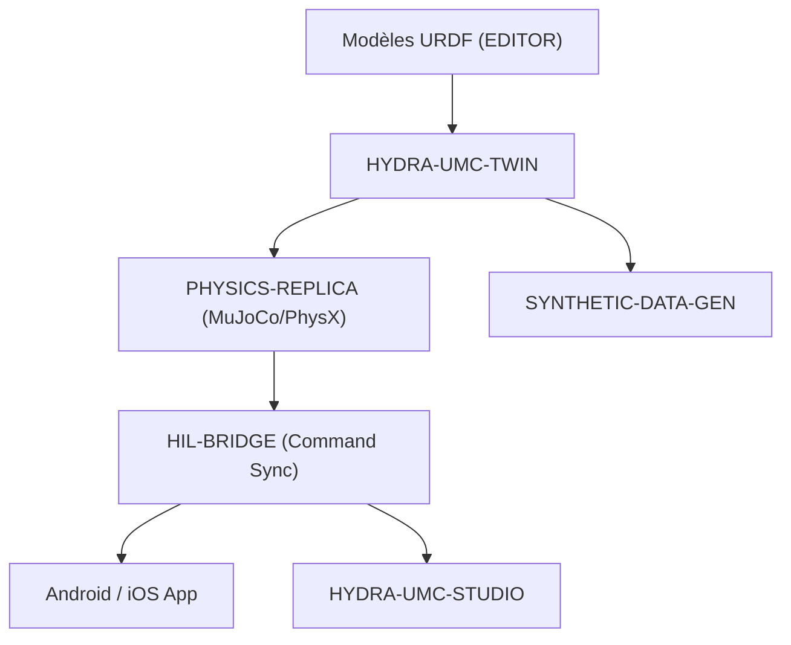

<p align="center">
  
</p>

# ♊ HYDRA-UMC-TWIN

<p align="center"><a href="README.md">🇺🇸 English</a> | <a href="README_spa.md">🇪🇸 Español</a> | 🇫🇷 <b>Français</b> | <a href="README_ita.md">🇮🇹 Italiano</a> | <a href="README_deu.md">🇩🇪 Deutsch</a> | <a href="README_zho.md">🇨🇳 简体中文</a> | <a href="README_jpn.md">🇯🇵 日本語</a></p>

### 🌐 Jumeau numérique basé sur la physique et moteur de simulation haute fidélité

<p align="left">
  
  
  
  
  
</p>

---

## 1. 🛠️ APERÇU TECHNIQUE

**HYDRA-UMC-TWIN** est le cœur virtuel de l'écosystème. Il fournit une réplique haute fidélité, basée sur la physique, de l'ensemble de la micro-usine, permettant des tests, un entraînement et une surveillance en temps réel en toute sécurité des essaims robotiques.

Construit avec Rust et le moteur Bevy, il consomme directement les modèles URDF de l'ÉDITEUR et émule les propriétés physiques du monde réel comme l'inertie, la friction et le couple moteur pour s'assurer que « si cela fonctionne dans le Jumeau, cela fonctionne sur le terrain ».

### Caractéristiques principales :
* 🧩 **Vérification de disponibilité de la famille (v0) :** le vrai sous-commande `family-status` lit le propre `hydra-umc.project.json` de chacun des 3 vrais enfants et signale présence/version/maturité/rôle - honnête pour un hub d'intégration qui ne fait tourner encore aucun moteur lui-même. Voir « Vérification d'honnêteté » ci-dessous.
* 🌐 **Simulation complète de l'usine (prévu) :** réplique les robots, les outils et l'environnement dans un espace 3D unifié - dépend qu'une véritable intégration du moteur Bevy existe d'abord.
* ⚡ **Hardware-in-the-Loop (HIL) (prévu) :** connectez les applications et les studios au simulateur comme s'il s'agissait d'un contrôleur réel.
* 📊 **Prédiction de l'usure (prévu) :** estime la durée de vie des composants en fonction des contraintes mécaniques simulées.
* 🛡️ **Validation de la sécurité (prévu) :** testez des trajectoires complexes et l'évitement de collision avant l'exécution physique.

**Vérification d'honnêteté - ce qui fonctionne réellement aujourd'hui :** l'appel sans argument affiche toujours identité/version/rôle, mais il existe désormais un vrai sous-commande `family-status [--workspace CHEMIN]` : il lit les vrais manifestes propres de `HYDRA-UMC-PHYSICS-REPLICA`/`HYDRA-UMC-HIL-BRIDGE`/`HYDRA-UMC-SYNTHETIC-DATA-GEN` depuis un checkout local et signale honnêtement ce qu'il trouve. Aucune application Bevy, aucun rendu, aucune boucle physique, aucun chargement de scène URDF n'existe encore - voir [`CHANGELOG.md`](CHANGELOG.md) pour ce qui a été livré exactement, et la Roadmap ci-dessous pour ce qui reste à venir.

---

## 2. 🔄 ARCHITECTURE DU JUMEAU



---

## 3. 🧱 ARCHITECTURE & DÉCISIONS DE CONCEPTION

* **Pourquoi ce moteur n'a pas de dossiers `hardware/`/`firmware/`/`os/`.** Logiciel pur sans carte propre; les dossiers source ne sont inclus que lorsque leur implémentation les requiert.
* **Pourquoi `Cargo.toml` n'a délibérément pas encore de dépendance Bevy.** Bevy est un moteur graphique lourd - temps de compilation longs, nécessite une chaîne d'outils GPU/graphique pas toujours disponible. v0 n'a ajouté que `serde`/`serde_json` (pour lire les manifestes des enfants) - le vrai travail de rendu attend toujours qu'une vraie chaîne d'outils GPU/graphique existe pour compiler contre.
* **Pourquoi `docker-compose.yml` existe avant que ses 3 enfants n'aient de Dockerfile.** Décider et documenter le contrat d'intégration (quel service dépend de lequel, quels montages device/volume chacun nécessite) maintenant évite que cette forme soit inventée à l'improviste plus tard, même si `docker compose up` ne peut pas pleinement réussir tant que chaque enfant n'a pas publié son propre Dockerfile.
* **Comment cela s'intègre dans le reste de l'écosystème.** Le parent d'intégration de la famille Digital Twin & Simulation - HYDRA-UMC-PHYSICS-REPLICA lui apporte un vrai solveur physique, HYDRA-UMC-HIL-BRIDGE permet à de vraies applications de le contrôler comme s'il s'agissait de matériel, et HYDRA-UMC-SYNTHETIC-DATA-GEN rend des jeux de données d'entraînement via son propre moteur.
* **Pourquoi `family-status` lit le propre manifeste de chaque enfant plutôt qu'une liste tenue à la main.** `hydra-umc.project.json` est déjà la seule source de vérité en laquelle le dashboard/updater de l'écosystème ont confiance - une seconde liste ici se désynchroniserait dès qu'une vraie maturité d'un enfant changerait sans que personne ne pense à la mettre à jour.
* **Pourquoi un checkout frère absent est un vrai « introuvable » honnête plutôt qu'un plantage.** Un hub d'intégration ne peut réellement pas savoir si un développeur a bien les 3 enfants clonés localement - `manifest.rs` retourne `None` pour chaque vrai mode d'échec (dépôt absent, fichier absent, JSON malformé) afin que `family-status` puisse le signaler clairement plutôt que de paniquer.

---

## 📂 STRUCTURE DES RÉPERTOIRES

Moteur purement logiciel, sans conception matérielle propre - ce projet ne
comporte donc pas de dossiers `hardware/`, `firmware/` ni `os/` (voir la
politique de structure du dépôt).

```text
HYDRA-UMC-TWIN/
├── src/
│   ├── manifest.rs       # Lecteur réel et défensif du manifeste propre d'un frère
│   ├── family.rs          # Vraie vérification de disponibilité de famille sur les 3 vrais enfants
│   └── main.rs              # Point d'entrée + vrai sous-commande `family-status`
├── docs/                # Documentation et réglage physique
├── build/               # Notes/artefacts de build (la sortie réelle de cargo vit dans target/, ignoré par git)
├── images/              # Médias et diagrammes
├── scripts/             # Scripts utilitaires
├── Cargo.toml           # Métadonnées du paquet, dépendances (serde/serde_json), version compteur kilométrique
├── bump_version.py      # Incrément de version type compteur kilométrique (utilisé par build.sh/.bat)
├── build.sh / build.bat # Incrémente la version, `cargo test`, puis `cargo build --release`
├── run.sh / run.bat     # Exécute le binaire release compilé (relaie les arguments)
└── docker-compose.yml   # Plan d'intégration des 3 enfants ci-dessous
```

---

## 🏗️ BUILD ET RUN

Nécessite la chaîne d'outils Rust (`cargo`/`rustc`, à installer via [rustup](https://rustup.rs)) et Python 3.10+ (uniquement pour `bump_version.py`).

```bash
# Linux / macOS
./build.sh   # incrément de version compteur kilométrique, `cargo test` (9 tests), puis `cargo build --release`
./run.sh     # exécute target/release/hydra-umc-twin, affiche nom + version + rôle
```

```bat
:: Windows
build.bat
run.bat
```

`build.sh`/`build.bat` incrémentent la version du propre `Cargo.toml` de ce projet selon la règle "compteur kilométrique" de l'écosystème (PATCH+1, avec retenue vers MINOR au-delà de 9), exécutent la vraie suite de tests, puis construisent un binaire release.

Le vrai sous-commande `family-status` vérifie le vrai checkout local :

```bash
./run.sh family-status
./run.sh family-status --workspace /chemin/vers/un/autre/checkout

# Windows
run.bat family-status
```

```text
Digital Twin family status (workspace: /chemin/vers/GitHub):
  HYDRA-UMC-PHYSICS-REPLICA: v0.0.2, maturity=functional, role=library
  HYDRA-UMC-HIL-BRIDGE: v0.0.1, maturity=scaffolding, role=service
  HYDRA-UMC-SYNTHETIC-DATA-GEN: v0.0.4, maturity=functional, role=tool

All 3 children present.
```

Par défaut, utilise le propre dossier parent de ce dépôt - la vraie disposition de checkout-frère que cet écosystème utilise déjà. Se termine avec `1` si un vrai enfant manque.

**Important :** `Cargo.toml` n'a délibérément **pas encore la dépendance Bevy**. Bevy est un moteur graphique lourd (temps de compilation longs, nécessite une chaîne d'outils GPU/graphique pas toujours disponible) ; v0 n'a ajouté que `serde`/`serde_json` pour lire les manifestes. La vraie dépendance `bevy` (plus un backend physique et le client gRPC/WebSocket pour HIL-BRIDGE) sera ajoutée quand le vrai travail de rendu/moteur commencera.

### Intégration des 3 enfants (`docker-compose.yml`)

En tant que parent d'intégration, `docker-compose.yml` documente comment ce moteur compose ses 3 enfants en une seule stack : **PHYSICS-REPLICA** (solveur, appelé à chaque tick physique), **HIL-BRIDGE** (synchronisation des commandes réel vs virtuel) et **SYNTHETIC-DATA-GEN** (export de jeux de données par lot, hors ligne). Aucun des 4 projets n'a encore de `Dockerfile` à ce stade de squelette, donc `docker compose up` n'est pas exécutable aujourd'hui; le fichier est la référence confirmée de topologie, ports et dépendances des futurs Dockerfiles.

---

## 🚀 ROADMAP
* **Phase 1 :** Synchronisation du jumeau numérique avec la télémétrie matérielle en temps réel et latence inférieure à 10 ms.
* **Phase 2 :** Intégration de Physics Replica avec des simulateurs de classe industrielle (Isaac Sim) et prise en charge des corps déformables.
* **Phase 3 :** Modèles de récupération automatisés de Node Healing pour un basculement décentralisé et détection précoce de la dégradation des capteurs.
* **Phase 4 :** Rendu photoréaliste pour la génération de données synthétiques et prise en charge de HIL Bridge pour le véhicule en boucle à grande échelle.

---

## 🔗 Projets Liés

Ce projet fait partie d'un écosystème robotique plus large du même auteur (JuanenRac / Electro Hobby 3D), couvrant firmware, logiciel de contrôle, nœuds IA et outillage de flotte. Bon à savoir, car une demande pourrait en réalité concerner l'un de ces projets plutôt que ce dépôt.

### Famille

**Parent :** aucun — ce projet est lui-même le parent d'intégration de la famille Digital Twin & Simulation.

**Enfants :**
- **[HYDRA-UMC-PHYSICS-REPLICA](https://github.com/JuanenRac/HYDRA-UMC-PHYSICS-REPLICA)** — la simulation de corps rigides/contacts qui alimente ce moteur de rendu.
- **[HYDRA-UMC-HIL-BRIDGE](https://github.com/JuanenRac/HYDRA-UMC-HIL-BRIDGE)** — le lien hardware-in-the-loop par lequel ce jumeau pilote des E/S réelles.
- **[HYDRA-UMC-SYNTHETIC-DATA-GEN](https://github.com/JuanenRac/HYDRA-UMC-SYNTHETIC-DATA-GEN)** — rend des jeux de données d'entraînement via le propre moteur de ce jumeau.

### Relation Directe (hors de la famille)

- **[HYDRA-UMC-EDITOR-URDF](https://github.com/JuanenRac/HYDRA-UMC-EDITOR-URDF)** — consomme les modèles URDF créés ici.
- **[HYDRA-UMC-SUITE](https://github.com/JuanenRac/HYDRA-UMC-SUITE)** — contrôle ce jumeau comme s'il s'agissait de matériel réel, via HIL-BRIDGE.
- **[HYDRA-UMC-ANDROID-CONTROL](https://github.com/JuanenRac/HYDRA-UMC-ANDROID-CONTROL)** — contrôle ce jumeau comme s'il s'agissait de matériel réel, via HIL-BRIDGE.
- **[HYDRA-UMC-IOS-CONTROL](https://github.com/JuanenRac/HYDRA-UMC-IOS-CONTROL)** — contrôle ce jumeau comme s'il s'agissait de matériel réel, via HIL-BRIDGE.

### Reste de l'Écosystème

**Plateforme HYDRA-UMC** — la cellule de micro-usine multi-robot
- **[HYDRA-UMC](https://github.com/JuanenRac/HYDRA-UMC)** — la carte mère CM5 + STM32H745 orchestrant jusqu'à 8 bras robotiques.
- **[HYDRA-UMC-SERVER](https://github.com/JuanenRac/HYDRA-UMC-SERVER)** — le backend Express/WebSocket auquel parle chaque client de contrôle.
- **[HYDRA-UMC-STUDIO](https://github.com/JuanenRac/HYDRA-UMC-STUDIO)** — tableau de bord de contrôle web, visualisation 3D multi-robot.
- **[HYDRA-UMC-ANDROID-CONTROL](https://github.com/JuanenRac/HYDRA-UMC-ANDROID-CONTROL)** — application de contrôle Android via Wi-Fi/Bluetooth.
- **[HYDRA-UMC-IOS-CONTROL](https://github.com/JuanenRac/HYDRA-UMC-IOS-CONTROL)** — application de contrôle iOS/iPadOS construite en Flutter.
- **[HYDRA-UMC-SUITE](https://github.com/JuanenRac/HYDRA-UMC-SUITE)** — centre de commande d'essaim de bureau (Python/PySide6).
- **[HYDRA-UMC-EDITOR-URDF](https://github.com/JuanenRac/HYDRA-UMC-EDITOR-URDF)** — éditeur de modèles URDF de bureau pour le catalogue de robots.
- **[HYDRA-UMC-DSI](https://github.com/JuanenRac/HYDRA-UMC-DSI)** — interface tactile native pour l'écran DSI embarqué.

**Plateforme URTC** — le contrôleur de tête d'outil que porte chaque bras HYDRA-UMC
- **[URTC](https://github.com/JuanenRac/URTC)** — contrôleur de tête d'outil sur bus CAN, 25 profils d'outil.
- **[URTC-FLASHER](https://github.com/JuanenRac/URTC-FLASHER)** — outil de bureau de flashage CAN-OTA + SWD/JTAG.
- **[URTC-TESTER](https://github.com/JuanenRac/URTC-TESTER)** — outil de bureau de diagnostic CAN en direct.
- **[URTC-WEB-STUDIO](https://github.com/JuanenRac/URTC-WEB-STUDIO)** — alternative basée navigateur via l'API Web Serial.

**🎥 Vision AI Node (Hailo-8)**
- [HYDRA-UMC-VISION-NODE](https://github.com/JuanenRac/HYDRA-UMC-VISION-NODE)
- [HYDRA-UMC-VISION-STREAMER](https://github.com/JuanenRac/HYDRA-UMC-VISION-STREAMER)
- [HYDRA-UMC-DETECTION-HEF](https://github.com/JuanenRac/HYDRA-UMC-DETECTION-HEF)
- [HYDRA-UMC-SAFETY-ZONES](https://github.com/JuanenRac/HYDRA-UMC-SAFETY-ZONES)
- [HYDRA-UMC-VISUAL-SERVOING-API](https://github.com/JuanenRac/HYDRA-UMC-VISUAL-SERVOING-API)

**🧠 Cognitive AI Node (Hailo-10)**
- [HYDRA-UMC-COGNITIVE-NODE](https://github.com/JuanenRac/HYDRA-UMC-COGNITIVE-NODE)
- [HYDRA-UMC-VLA-ENGINE](https://github.com/JuanenRac/HYDRA-UMC-VLA-ENGINE)
- [HYDRA-UMC-VOICE-UI](https://github.com/JuanenRac/HYDRA-UMC-VOICE-UI)
- [HYDRA-UMC-SEMANTIC-PLANNER](https://github.com/JuanenRac/HYDRA-UMC-SEMANTIC-PLANNER)
- [HYDRA-UMC-DOCS-QA](https://github.com/JuanenRac/HYDRA-UMC-DOCS-QA)

**🐝 Orchestration & Swarm**
- [HYDRA-UMC-ORCHESTRATOR](https://github.com/JuanenRac/HYDRA-UMC-ORCHESTRATOR)
- [HYDRA-UMC-SWARM-SYNC](https://github.com/JuanenRac/HYDRA-UMC-SWARM-SYNC)
- [HYDRA-UMC-PATH-PLANNER-3D](https://github.com/JuanenRac/HYDRA-UMC-PATH-PLANNER-3D)
- [HYDRA-UMC-JOB-DISPATCHER](https://github.com/JuanenRac/HYDRA-UMC-JOB-DISPATCHER)
- [HYDRA-UMC-NODE-HEALING](https://github.com/JuanenRac/HYDRA-UMC-NODE-HEALING)

**📊 Data & Analytics**
- [HYDRA-UMC-DATALAKE](https://github.com/JuanenRac/HYDRA-UMC-DATALAKE)
- [HYDRA-UMC-TELEMETRY-COLLECTOR](https://github.com/JuanenRac/HYDRA-UMC-TELEMETRY-COLLECTOR)
- [HYDRA-UMC-ANOMALY-DETECTOR](https://github.com/JuanenRac/HYDRA-UMC-ANOMALY-DETECTOR)
- [HYDRA-UMC-PRODUCTION-REPORTS](https://github.com/JuanenRac/HYDRA-UMC-PRODUCTION-REPORTS)

**🏭 Industrial Gateway**
- [HYDRA-UMC-GATEWAY-INDUSTRIAL](https://github.com/JuanenRac/HYDRA-UMC-GATEWAY-INDUSTRIAL)
- [HYDRA-UMC-OPCUA-SERVER](https://github.com/JuanenRac/HYDRA-UMC-OPCUA-SERVER)
- [HYDRA-UMC-MQTT-BROKER](https://github.com/JuanenRac/HYDRA-UMC-MQTT-BROKER)
- [HYDRA-UMC-MTCONNECT-ADAPTER](https://github.com/JuanenRac/HYDRA-UMC-MTCONNECT-ADAPTER)

**🛠️ Complementary Tools**
- [URTC-SMART-RACK](https://github.com/JuanenRac/URTC-SMART-RACK)
- [URTC-VISION-TOOL](https://github.com/JuanenRac/URTC-VISION-TOOL)
- [HYDRA-UMC-WATCH](https://github.com/JuanenRac/HYDRA-UMC-WATCH)
- [HYDRA-UMC-TOOL-CLI](https://github.com/JuanenRac/HYDRA-UMC-TOOL-CLI)
- [HYDRA-UMC-DASHBOARD-AI](https://github.com/JuanenRac/HYDRA-UMC-DASHBOARD-AI)


## 👤 AUTEUR
**JuanenRac** (Electro Hobby 3D)
📧 electrohobby3d@gmail.com

## 📜 LICENCE
GPL-3.0 - Voir le fichier LICENSE pour plus de détails.

## 🛠️ BUILD & RUN

Utilisez la vérification de compilation sans versionnement avant une compilation de publication :

| Action | Windows | Linux / macOS |
|---|---|---|
| Vérification de compilation (sans modifier la version ni le CHANGELOG) | `build-test.bat` | `./build-test.sh` |
| Exécution / développement (si disponible) | `run*.bat` ou `dev*.bat` | `./run*.sh` ou `./dev*.sh` |

`build-test.bat` et `build-test.sh` compilent ou valident la pile du projet sans incrémenter `hydra-umc.project.json` ni modifier `CHANGELOG.md`. Ils peuvent uniquement créer les sorties normales du compilateur. Les scripts existants `build*.bat`, `build*.sh`, `run*` et `dev*` conservent leur comportement spécifique de versionnement ou d'exécution ; utilisez-les lorsque ce comportement est requis.