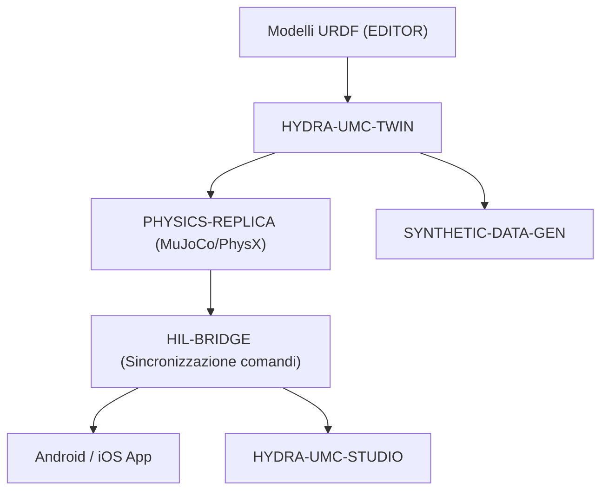

<p align="center">
  
</p>

# ♊ HYDRA-UMC-TWIN

<p align="center"><a href="README.md">🇺🇸 English</a> | <a href="README_spa.md">🇪🇸 Español</a> | <a href="README_fra.md">🇫🇷 Français</a> | 🇮🇹 <b>Italiano</b> | <a href="README_deu.md">🇩🇪 Deutsch</a> | <a href="README_zho.md">🇨🇳 简体中文</a> | <a href="README_jpn.md">🇯🇵 日本語</a></p>

### 🌐 Digital Twin basata sulla fisica e motore di simulazione ad alta fedeltà

<p align="left">
  
  
  
  
  
</p>

---

## 1. 🛠️ PANORAMICA TECNICA

**HYDRA-UMC-TWIN** è il cuore virtuale dell'ecosistema. Fornisce una replica ad alta fedeltà, basata sulla fisica, dell'intera micro-fabbrica, consentendo test sicuri, addestramento e monitoraggio in tempo reale degli sciami robotici.

Costruito utilizzando Rust e il motore Bevy, consuma direttamente i modelli URDF dall'EDITOR ed emula le proprietà fisiche del mondo reale come l'inerzia, l'attrito e la coppia del motore per garantire che «se funziona nel Twin, funziona in fabbrica».

### Caratteristiche principali:
* 🧩 **Controllo di disponibilità della famiglia (v0):** il vero sottocomando `family-status` legge il vero `hydra-umc.project.json` proprio di ciascuno dei 3 veri figli e riporta presenza/versione/maturità/ruolo - onesto per un hub di integrazione che ancora non esegue alcun motore da solo. Vedi "Verifica di onestà" sotto.
* 🔒 **Reale v0 - Contratto di sincronizzazione dello stato:** `family-sync` filtra ogni figlio secondo un contratto reale e testabile - maturità minima (`functional`) e una versione major massima compatibile - prima di trattarlo come pronto per la sincronizzazione, rifiutando un figlio immaturo o con versione incompatibile con una vera motivazione invece di sincronizzare contro una forma di stato non verificata.
* 🌐 **Simulazione completa della fabbrica (previsto):** replica robot, strumenti e l'ambiente in uno spazio 3D unificato - dipende dall'esistenza preventiva di una vera integrazione del motore Bevy.
* ⚡ **Hardware-in-the-loop (HIL) (previsto):** collega App e Studio al simulatore come se fosse un vero controller.
* 📊 **Previsione dell'usura (previsto):** stima la durata dei componenti in base allo stress meccanico simulato.
* 🛡️ **Validazione della sicurezza (previsto):** test di traiettorie complesse ed evitamento delle collisioni prima dell'esecuzione fisica.

**Verifica di onestà - cosa funziona davvero oggi:** l'invocazione senza argomenti continua a stampare identità/versione/ruolo, ma ora esistono due veri sottocomandi. `family-status [--workspace PERCORSO]` legge i veri manifesti propri di `HYDRA-UMC-PHYSICS-REPLICA`/`HYDRA-UMC-HIL-BRIDGE`/`HYDRA-UMC-SYNTHETIC-DATA-GEN` da un checkout locale e riporta onestamente ciò che trova. `family-sync [--workspace PERCORSO]` va oltre: fa passare ogni figlio presente attraverso un vero contratto di sincronizzazione dello stato (maturità minima `functional`, versione major massima compatibile) e riporta `READY`, `REJECTED (immature)`, `REJECTED (incompatible version)` o `MISSING` per figlio. Non esiste ancora nessuna app Bevy, nessun rendering, nessun ciclo fisico, nessun caricamento di scene URDF, né alcun vero trasporto di sincronizzazione di rete - vedi [`CHANGELOG.md`](CHANGELOG.md) per ciò che è stato consegnato esattamente, e la Roadmap sotto per ciò che resta da fare.

---

## 2. 🔄 ARCHITETTURA TWIN



---

## 3. 🧱 ARCHITETTURA E DECISIONI DI PROGETTAZIONE

* **Perché questo motore non ha cartelle `hardware/`/`firmware/`/`os/`.** Software puro senza scheda propria; le cartelle sorgente sono incluse solo quando richieste dall'implementazione.
* **Perché `Cargo.toml` deliberatamente non ha ancora una dipendenza Bevy.** Bevy è un motore grafico pesante - tempi di compilazione lunghi, richiede una toolchain GPU/grafica non sempre disponibile. v0 ha aggiunto solo `serde`/`serde_json` (per leggere i manifesti dei figli) - il vero lavoro di rendering attende ancora che esista una vera toolchain GPU/grafica contro cui compilare.
* **Perché `docker-compose.yml` esiste prima che i suoi 3 figli abbiano un Dockerfile.** Decidere e documentare ora il contratto di integrazione (quale servizio dipende da quale, quali mount di device/volume servono a ciascuno) evita che questa forma venga inventata più tardi in modo estemporaneo, anche se `docker compose up` non può avere pieno successo finché ogni figlio non pubblica il proprio Dockerfile.
* **Come si inserisce nel resto dell'ecosistema.** Il genitore di integrazione della famiglia Digital Twin & Simulation - HYDRA-UMC-PHYSICS-REPLICA gli fornisce un vero risolutore fisico, HYDRA-UMC-HIL-BRIDGE permette ad app reali di controllarlo come se fosse hardware, e HYDRA-UMC-SYNTHETIC-DATA-GEN renderizza dataset di addestramento tramite il suo stesso motore.
* **Perché `family-status` legge il manifesto proprio di ogni figlio invece di una lista mantenuta a mano.** `hydra-umc.project.json` è già l'unica fonte di verità di cui si fidano dashboard/updater dell'ecosistema - una seconda lista qui andrebbe fuori sincrono nel momento in cui la vera maturità di un figlio cambiasse e nessuno si ricordasse di aggiornarla.
* **Perché un checkout fratello assente è un vero "non trovato" onesto, non un crash.** Un hub di integrazione non può davvero sapere se uno sviluppatore ha tutti e 3 i figli clonati localmente - `manifest.rs` restituisce `None` per ogni vero modo di fallimento (repository assente, file assente, JSON malformato) così che `family-status` possa riportarlo chiaramente invece di andare in panico.
* **Perché `family-sync` filtra sia per maturità SIA per un tetto di versione, non solo per "è presente".** `family-status` risponde già a "questo figlio è clonato e cosa dichiara di sé" - ma un figlio clonato con maturità `scaffolding` non ha ancora uno stato reale che valga la pena sincronizzare, e un figlio che ha superato la versione major massima verificata da questo Twin potrebbe aver cambiato la propria forma di stato in un modo che questo Twin non conosce ancora. Entrambe sono ragioni reali per rifiutare la sincronizzazione, distinte da "assente", quindi `contract.rs` le controlla e le riporta separatamente invece di fondere tutto in un generico "non pronto".
* **Perché la maturità viene controllata prima della compatibilità di versione in `contract::assess()`.** Il numero di versione di un figlio immaturo non è ancora un segnale significativo - controllare prima la maturità significa che la motivazione di rifiuto riportata nomina sempre la porta più fondamentale che è effettivamente fallita, invece che un disallineamento di versione mascheri un problema più basilare del tipo "questo figlio non è ancora reale".

---

## 📂 STRUTTURA DELLE CARTELLE

Motore puramente software, senza progettazione hardware propria - per
questo il progetto non ha cartelle `hardware/`, `firmware/` né `os/`
(vedere la regola di potatura in
la politica di struttura del repository).

```text
HYDRA-UMC-TWIN/
├── src/
│   ├── manifest.rs       # Lettore reale e difensivo del manifesto proprio di un fratello
│   ├── family.rs         # Vero controllo di disponibilità + esito di sync combinato
│   ├── contract.rs       # Vero contratto di sync di stato (maturità + tetto di version)
│   └── main.rs           # Entry point + veri sottocomandi `family-status`/`family-sync`
├── docs/                # Documentazione e ottimizzazione fisica
├── build/               # Note/artefatti di build (l'output reale di cargo vive in target/, escluso da git)
├── images/              # Media e diagrammi
├── scripts/             # Script di utilità
├── tools/
│   ├── build_test.py    # Controllo build senza versionamento
│   └── ci_validate.py   # Validazione manifest/CHANGELOG/docs usata dalla CI
├── Cargo.toml           # Metadati del pacchetto, dipendenze (serde/serde_json), version contachilometri
├── bump_version.py      # Bump di version tipo contachilometri (usato da build.sh/.bat)
├── build.sh / build.bat # Bump della version, `cargo test`, poi `cargo build --release`
├── build-test.sh / build-test.bat # Controllo build senza versionamento
├── run.sh / run.bat     # Esegue il binario release compilato (inoltra gli argomenti)
└── docker-compose.yml   # Blueprint di integrazione dei 3 figli sotto
```

---

## 🏗️ BUILD E RUN

Richiede il toolchain Rust (`cargo`/`rustc`, installabile via [rustup](https://rustup.rs)) e Python 3.10+ (solo per `bump_version.py`).

```bash
# Linux / macOS
./build.sh   # bump di version contachilometri, `cargo test` (21 test), poi `cargo build --release`
./run.sh     # esegue target/release/hydra-umc-twin, stampa nome + version + ruolo
```

```bat
:: Windows
build.bat
run.bat
```

`build.sh`/`build.bat` incrementano la version del proprio `Cargo.toml` di questo progetto seguendo la regola "contachilometri" dell'ecosistema (PATCH+1, con riporto a MINOR superato 9), eseguono la vera suite di test, e poi costruiscono un binario release.

Il vero sottocomando `family-status` controlla il vero checkout locale:

```bash
./run.sh family-status
./run.sh family-status --workspace /percorso/verso/un/altro/checkout

# Windows
run.bat family-status
```

```text
Digital Twin family status (workspace: /percorso/verso/GitHub):
  HYDRA-UMC-PHYSICS-REPLICA: v0.0.2, maturity=functional, role=library
  HYDRA-UMC-HIL-BRIDGE: v0.0.1, maturity=scaffolding, role=service
  HYDRA-UMC-SYNTHETIC-DATA-GEN: v0.0.4, maturity=functional, role=tool

All 3 children present.
```

Per default usa la propria directory padre di questo repository - la vera disposizione checkout-fratello che questo ecosistema già usa. Esce con `1` se manca qualche vero figlio.

Il vero sottocomando `family-sync` va oltre - controlla anche il vero contratto di sincronizzazione dello stato (maturità minima, versione major massima compatibile) per ogni figlio presente:

```bash
./run.sh family-sync --workspace /percorso/verso/un/checkout
```

```text
Digital Twin family sync contract (workspace: /percorso/verso/un/checkout):
  HYDRA-UMC-PHYSICS-REPLICA: READY (v0.0.3, maturity=functional)
  HYDRA-UMC-HIL-BRIDGE: REJECTED (incompatible version) - HYDRA-UMC-HIL-BRIDGE reports major version 1 - this Twin's sync contract is only verified up to major 0 (incompatible simulator version)
  HYDRA-UMC-SYNTHETIC-DATA-GEN: MISSING (not checked out)

Not every child is sync-ready - see the lines above.
```

Esce con `0` solo se ogni figlio atteso è `READY`; `1` per qualsiasi figlio `MISSING`/`REJECTED`.

**Importante:** `Cargo.toml` deliberatamente **non ha ancora la dipendenza Bevy**. Bevy è un motore grafico pesante (tempi di compilazione lunghi, richiede un toolchain GPU/grafico non sempre disponibile); v0 ha aggiunto solo `serde`/`serde_json` per leggere i manifesti. La vera dipendenza `bevy` (più un backend fisico e il client gRPC/WebSocket per HIL-BRIDGE) verrà aggiunta quando inizierà il vero lavoro di rendering/motore.

### Integrazione dei 3 figli (`docker-compose.yml`)

Come padre di integrazione, `docker-compose.yml` documenta come questo motore compone i suoi 3 figli in un unico stack: **PHYSICS-REPLICA** (solver, chiamato a ogni tick fisico), **HIL-BRIDGE** (sincronizzazione comandi reale vs virtuale) e **SYNTHETIC-DATA-GEN** (esportazione dataset a lotti, offline). Nessuno dei 4 progetti ha ancora un `Dockerfile` in questa fase di scheletro, quindi `docker compose up` non è eseguibile oggi; il file è il riferimento confermato di topologia, porte e dipendenze dei Dockerfile futuri.

---

## 🚀 ROADMAP
* **Fase 1:** Sincronizzazione del Digital Twin con telemetria hardware in tempo real e latenza inferiore a 10 ms.
* **Fase 2:** Integrazione di Physics Replica con simulatori di livello industriale (Isaac Sim) e supporto per corpi deformabili.
* **Fase 3:** Modelli di ripristino automatizzati di Node Healing per failover decentralizzato e rilevamento precoce del degrado dei sensori.
* **Fase 4:** Rendering fotorealistico per la generazione di dati sintetici e supporto HIL Bridge per test vehicle-in-the-loop su scala reale.

---

## 🔗 Progetti Correlati

Questo progetto fa parte di un ecosistema robotico più ampio dello stesso autore (JuanenRac / Electro Hobby 3D), che copre firmware, software di controllo, nodi IA e strumenti di flotta. Utile saperlo, perché una richiesta potrebbe in realtà riguardare uno di questi progetti anziché questo repository.

### Famiglia

**Genitore:** nessuno — questo progetto è esso stesso il genitore di integrazione della famiglia Digital Twin & Simulation.

**Figli:**
- **[HYDRA-UMC-PHYSICS-REPLICA](https://github.com/JuanenRac/HYDRA-UMC-PHYSICS-REPLICA)** — la simulazione di corpi rigidi/contatti che alimenta questo motore di rendering.
- **[HYDRA-UMC-HIL-BRIDGE](https://github.com/JuanenRac/HYDRA-UMC-HIL-BRIDGE)** — il collegamento hardware-in-the-loop con cui questo gemello pilota I/O reali.
- **[HYDRA-UMC-SYNTHETIC-DATA-GEN](https://github.com/JuanenRac/HYDRA-UMC-SYNTHETIC-DATA-GEN)** — renderizza dataset di addestramento tramite il motore proprio di questo gemello.

### Relazione Diretta (fuori dalla famiglia)

- **[HYDRA-UMC-EDITOR-URDF](https://github.com/JuanenRac/HYDRA-UMC-EDITOR-URDF)** — consuma i modelli URDF creati qui.
- **[HYDRA-UMC-SUITE](https://github.com/JuanenRac/HYDRA-UMC-SUITE)** — controlla questo gemello come se fosse hardware reale, via HIL-BRIDGE.
- **[HYDRA-UMC-ANDROID-CONTROL](https://github.com/JuanenRac/HYDRA-UMC-ANDROID-CONTROL)** — controlla questo gemello come se fosse hardware reale, via HIL-BRIDGE.
- **[HYDRA-UMC-IOS-CONTROL](https://github.com/JuanenRac/HYDRA-UMC-IOS-CONTROL)** — controlla questo gemello come se fosse hardware reale, via HIL-BRIDGE.

### Resto dell'Ecosistema

**Piattaforma HYDRA-UMC** — la cella di micro-fabbrica multi-robot
- **[HYDRA-UMC](https://github.com/JuanenRac/HYDRA-UMC)** — la scheda madre CM5 + STM32H745 che orchestra fino a 8 bracci robotici.
- **[HYDRA-UMC-SERVER](https://github.com/JuanenRac/HYDRA-UMC-SERVER)** — il backend Express/WebSocket con cui parla ogni client di controllo.
- **[HYDRA-UMC-STUDIO](https://github.com/JuanenRac/HYDRA-UMC-STUDIO)** — dashboard di controllo web, visualizzazione 3D multi-robot.
- **[HYDRA-UMC-ANDROID-CONTROL](https://github.com/JuanenRac/HYDRA-UMC-ANDROID-CONTROL)** — app di controllo Android via Wi-Fi/Bluetooth.
- **[HYDRA-UMC-IOS-CONTROL](https://github.com/JuanenRac/HYDRA-UMC-IOS-CONTROL)** — app di controllo iOS/iPadOS costruita in Flutter.
- **[HYDRA-UMC-SUITE](https://github.com/JuanenRac/HYDRA-UMC-SUITE)** — centro di comando sciame desktop (Python/PySide6).
- **[HYDRA-UMC-EDITOR-URDF](https://github.com/JuanenRac/HYDRA-UMC-EDITOR-URDF)** — editor desktop di modelli URDF per il catalogo robot.
- **[HYDRA-UMC-DSI](https://github.com/JuanenRac/HYDRA-UMC-DSI)** — interfaccia touch nativa per lo schermo DSI a bordo.

**Piattaforma URTC** — il controller della testa utensile che ogni braccio HYDRA-UMC porta con sé
- **[URTC](https://github.com/JuanenRac/URTC)** — controller testa utensile su bus CAN, 25 profili utensile.
- **[URTC-FLASHER](https://github.com/JuanenRac/URTC-FLASHER)** — strumento desktop di flashing CAN-OTA + SWD/JTAG.
- **[URTC-TESTER](https://github.com/JuanenRac/URTC-TESTER)** — strumento desktop di diagnostica CAN live.
- **[URTC-WEB-STUDIO](https://github.com/JuanenRac/URTC-WEB-STUDIO)** — alternativa basata su browser via Web Serial API.

**🎥 Vision AI Node (Hailo-8)**
- [HYDRA-UMC-VISION-NODE](https://github.com/JuanenRac/HYDRA-UMC-VISION-NODE)
- [HYDRA-UMC-VISION-STREAMER](https://github.com/JuanenRac/HYDRA-UMC-VISION-STREAMER)
- [HYDRA-UMC-DETECTION-HEF](https://github.com/JuanenRac/HYDRA-UMC-DETECTION-HEF)
- [HYDRA-UMC-SAFETY-ZONES](https://github.com/JuanenRac/HYDRA-UMC-SAFETY-ZONES)
- [HYDRA-UMC-VISUAL-SERVOING-API](https://github.com/JuanenRac/HYDRA-UMC-VISUAL-SERVOING-API)

**🧠 Cognitive AI Node (Hailo-10)**
- [HYDRA-UMC-COGNITIVE-NODE](https://github.com/JuanenRac/HYDRA-UMC-COGNITIVE-NODE)
- [HYDRA-UMC-VLA-ENGINE](https://github.com/JuanenRac/HYDRA-UMC-VLA-ENGINE)
- [HYDRA-UMC-VOICE-UI](https://github.com/JuanenRac/HYDRA-UMC-VOICE-UI)
- [HYDRA-UMC-SEMANTIC-PLANNER](https://github.com/JuanenRac/HYDRA-UMC-SEMANTIC-PLANNER)
- [HYDRA-UMC-DOCS-QA](https://github.com/JuanenRac/HYDRA-UMC-DOCS-QA)

**🐝 Orchestration & Swarm**
- [HYDRA-UMC-ORCHESTRATOR](https://github.com/JuanenRac/HYDRA-UMC-ORCHESTRATOR)
- [HYDRA-UMC-SWARM-SYNC](https://github.com/JuanenRac/HYDRA-UMC-SWARM-SYNC)
- [HYDRA-UMC-PATH-PLANNER-3D](https://github.com/JuanenRac/HYDRA-UMC-PATH-PLANNER-3D)
- [HYDRA-UMC-JOB-DISPATCHER](https://github.com/JuanenRac/HYDRA-UMC-JOB-DISPATCHER)
- [HYDRA-UMC-NODE-HEALING](https://github.com/JuanenRac/HYDRA-UMC-NODE-HEALING)

**📊 Data & Analytics**
- [HYDRA-UMC-DATALAKE](https://github.com/JuanenRac/HYDRA-UMC-DATALAKE)
- [HYDRA-UMC-TELEMETRY-COLLECTOR](https://github.com/JuanenRac/HYDRA-UMC-TELEMETRY-COLLECTOR)
- [HYDRA-UMC-ANOMALY-DETECTOR](https://github.com/JuanenRac/HYDRA-UMC-ANOMALY-DETECTOR)
- [HYDRA-UMC-PRODUCTION-REPORTS](https://github.com/JuanenRac/HYDRA-UMC-PRODUCTION-REPORTS)

**🏭 Industrial Gateway**
- [HYDRA-UMC-GATEWAY-INDUSTRIAL](https://github.com/JuanenRac/HYDRA-UMC-GATEWAY-INDUSTRIAL)
- [HYDRA-UMC-OPCUA-SERVER](https://github.com/JuanenRac/HYDRA-UMC-OPCUA-SERVER)
- [HYDRA-UMC-MQTT-BROKER](https://github.com/JuanenRac/HYDRA-UMC-MQTT-BROKER)
- [HYDRA-UMC-MTCONNECT-ADAPTER](https://github.com/JuanenRac/HYDRA-UMC-MTCONNECT-ADAPTER)

**🛠️ Complementary Tools**
- [URTC-SMART-RACK](https://github.com/JuanenRac/URTC-SMART-RACK)
- [URTC-VISION-TOOL](https://github.com/JuanenRac/URTC-VISION-TOOL)
- [HYDRA-UMC-WATCH](https://github.com/JuanenRac/HYDRA-UMC-WATCH)
- [HYDRA-UMC-TOOL-CLI](https://github.com/JuanenRac/HYDRA-UMC-TOOL-CLI)
- [HYDRA-UMC-DASHBOARD-AI](https://github.com/JuanenRac/HYDRA-UMC-DASHBOARD-AI)


## 👤 AUTORE
**JuanenRac** (Electro Hobby 3D)
📧 electrohobby3d@gmail.com

## 📜 LICENZA
GPL-3.0 - Vedere LICENSE per i dettagli.

## 🛠️ BUILD & RUN

Usa il controllo di compilazione senza versionamento prima di una compilazione di rilascio:

| Azione | Windows | Linux / macOS |
|---|---|---|
| Controllo di compilazione (senza modificare versione o CHANGELOG) | `build-test.bat` | `./build-test.sh` |
| Esecuzione / sviluppo (se disponibile) | `run*.bat` o `dev*.bat` | `./run*.sh` o `./dev*.sh` |

`build-test.bat` e `build-test.sh` compilano o convalidano lo stack del progetto senza incrementare `hydra-umc.project.json` né modificare `CHANGELOG.md`. Possono creare solo i normali output del compilatore. Gli script esistenti `build*.bat`, `build*.sh`, `run*` e `dev*` mantengono il comportamento specifico di versione o esecuzione; usali quando tale comportamento è necessario.