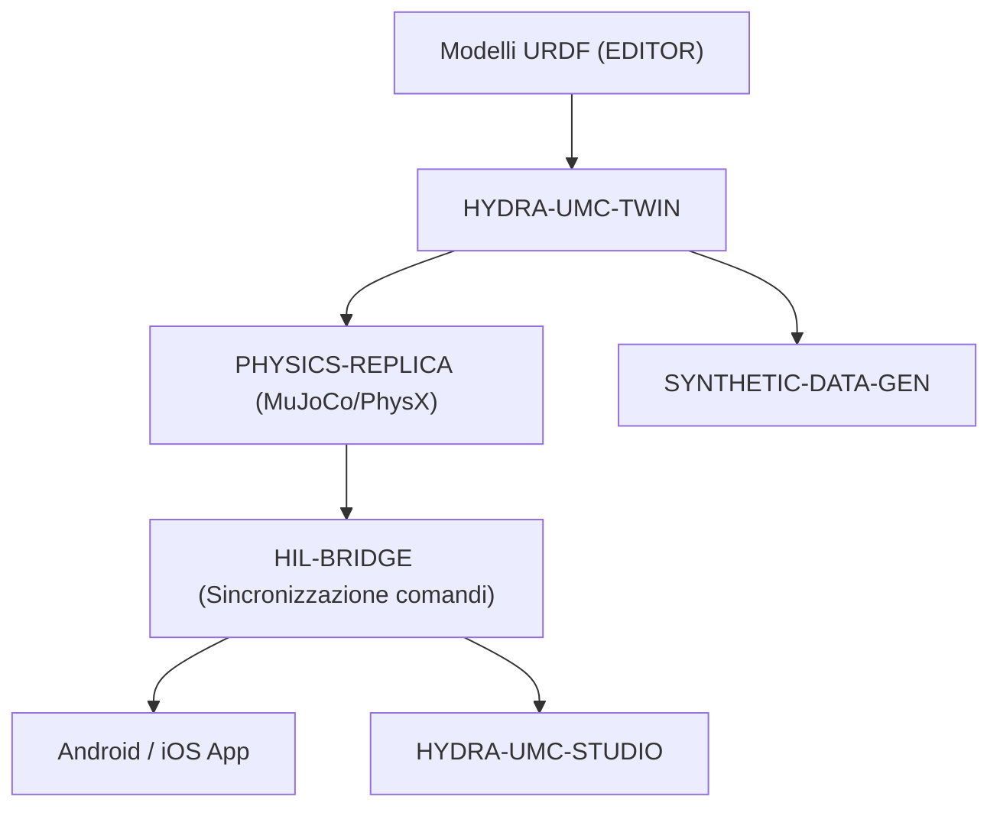

<p align="center">
  
</p>

# ♊ HYDRA-UMC-TWIN

<p align="center"><a href="README.md">🇺🇸 English</a> | <a href="README_spa.md">🇪🇸 Español</a> | <a href="README_fra.md">🇫🇷 Français</a> | 🇮🇹 <b>Italiano</b> | <a href="README_deu.md">🇩🇪 Deutsch</a> | <a href="README_zho.md">🇨🇳 简体中文</a> | <a href="README_jpn.md">🇯🇵 日本語</a></p>

### 🌐 Digital Twin basata sulla fisica e motore di simulazione ad alta fedeltà

<p align="left">
  
  
  
  
  
</p>

---

## 1. 🛠️ PANORAMICA TECNICA

**HYDRA-UMC-TWIN** è il cuore virtuale dell'ecosistema. Fornisce una replica ad alta fedeltà, basata sulla fisica, dell'intera micro-fabbrica, consentendo test sicuri, addestramento e monitoraggio in tempo reale degli sciami robotici.

Costruito utilizzando Rust e il motore Bevy, consuma direttamente i modelli URDF dall'EDITOR ed emula le proprietà fisiche del mondo reale come l'inerzia, l'attrito e la coppia del motore per garantire che «se funziona nel Twin, funziona in fabbrica».

### Caratteristiche principali:
* 🧩 **Controllo di disponibilità della famiglia (v0):** il vero sottocomando `family-status` legge il vero `hydra-umc.project.json` proprio di ciascuno dei 3 veri figli e riporta presenza/versione/maturità/ruolo - onesto per un hub di integrazione che ancora non esegue alcun motore da solo. Vedi "Verifica di onestà" sotto.
* 🔒 **Reale v0 - Contratto di sincronizzazione dello stato:** `family-sync` filtra ogni figlio secondo un contratto reale e testabile - maturità minima (`functional`) e una versione major massima compatibile - prima di trattarlo come pronto per la sincronizzazione, rifiutando un figlio immaturo o con versione incompatibile con una vera motivazione invece di sincronizzare contro una forma di stato non verificata.
* 🌐 **Simulazione completa della fabbrica (previsto):** replica robot, strumenti e l'ambiente in uno spazio 3D unificato - dipende dall'esistenza preventiva di una vera integrazione del motore Bevy.
* ⚡ **Hardware-in-the-loop (HIL) (previsto):** collega App e Studio al simulatore come se fosse un vero controller.
* 📊 **Previsione dell'usura (previsto):** stima la durata dei componenti in base allo stress meccanico simulato.
* 🛡️ **Validazione della sicurezza (previsto):** test di traiettorie complesse ed evitamento delle collisioni prima dell'esecuzione fisica.

**Verifica di onestà - cosa funziona davvero oggi:** l'invocazione senza argomenti continua a stampare identità/versione/ruolo, ma ora esistono due veri sottocomandi. `family-status [--workspace PERCORSO]` legge i veri manifesti propri di `HYDRA-UMC-PHYSICS-REPLICA`/`HYDRA-UMC-HIL-BRIDGE`/`HYDRA-UMC-SYNTHETIC-DATA-GEN` da un checkout locale e riporta onestamente ciò che trova. `family-sync [--workspace PERCORSO]` va oltre: fa passare ogni figlio presente attraverso un vero contratto di sincronizzazione dello stato (maturità minima `functional`, versione major massima compatibile) e riporta `READY`, `REJECTED (immature)`, `REJECTED (incompatible version)` o `MISSING` per figlio. Non esiste ancora nessuna app Bevy, nessun rendering, nessun ciclo fisico, nessun caricamento di scene URDF, né alcun vero trasporto di sincronizzazione di rete - vedi [`CHANGELOG.md`](CHANGELOG.md) per ciò che è stato consegnato esattamente, e la Roadmap sotto per ciò che resta da fare.

---

## 2. 🔄 ARCHITETTURA TWIN



---

## 3. 🧱 ARCHITETTURA E DECISIONI DI PROGETTAZIONE

* **Perché questo motore non ha cartelle `hardware/`/`firmware/`/`os/`.** Software puro senza scheda propria; le cartelle sorgente sono incluse solo quando richieste dall'implementazione.
* **Perché `Cargo.toml` deliberatamente non ha ancora una dipendenza Bevy.** Bevy è un motore grafico pesante - tempi di compilazione lunghi, richiede una toolchain GPU/grafica non sempre disponibile. v0 ha aggiunto solo `serde`/`serde_json` (per leggere i manifesti dei figli) - il vero lavoro di rendering attende ancora che esista una vera toolchain GPU/grafica contro cui compilare.
* **Perché `docker-compose.yml` esiste prima che i suoi 3 figli abbiano un Dockerfile.** Decidere e documentare ora il contratto di integrazione (quale servizio dipende da quale, quali mount di device/volume servono a ciascuno) evita che questa forma venga inventata più tardi in modo estemporaneo, anche se `docker compose up` non può avere pieno successo finché ogni figlio non pubblica il proprio Dockerfile.
* **Come si inserisce nel resto dell'ecosistema.** Il genitore di integrazione della famiglia Gemello Digitale e Simulazione - HYDRA-UMC-PHYSICS-REPLICA gli fornisce un vero risolutore fisico, HYDRA-UMC-HIL-BRIDGE permette ad app reali di controllarlo come se fosse hardware, e HYDRA-UMC-SYNTHETIC-DATA-GEN renderizza dataset di addestramento tramite il suo stesso motore.
* **Perché `family-status` legge il manifesto proprio di ogni figlio invece di una lista mantenuta a mano.** `hydra-umc.project.json` è già l'unica fonte di verità di cui si fidano dashboard/updater dell'ecosistema - una seconda lista qui andrebbe fuori sincrono nel momento in cui la vera maturità di un figlio cambiasse e nessuno si ricordasse di aggiornarla.
* **Perché un checkout fratello assente è un vero "non trovato" onesto, non un crash.** Un hub di integrazione non può davvero sapere se uno sviluppatore ha tutti e 3 i figli clonati localmente - `manifest.rs` restituisce `None` per ogni vero modo di fallimento (repository assente, file assente, JSON malformato) così che `family-status` possa riportarlo chiaramente invece di andare in panico.
* **Perché `family-sync` filtra sia per maturità SIA per un tetto di versione, non solo per "è presente".** `family-status` risponde già a "questo figlio è clonato e cosa dichiara di sé" - ma un figlio clonato con maturità `scaffolding` non ha ancora uno stato reale che valga la pena sincronizzare, e un figlio che ha superato la versione major massima verificata da questo Twin potrebbe aver cambiato la propria forma di stato in un modo che questo Twin non conosce ancora. Entrambe sono ragioni reali per rifiutare la sincronizzazione, distinte da "assente", quindi `contract.rs` le controlla e le riporta separatamente invece di fondere tutto in un generico "non pronto".
* **Perché la maturità viene controllata prima della compatibilità di versione in `contract::assess()`.** Il numero di versione di un figlio immaturo non è ancora un segnale significativo - controllare prima la maturità significa che la motivazione di rifiuto riportata nomina sempre la porta più fondamentale che è effettivamente fallita, invece che un disallineamento di versione mascheri un problema più basilare del tipo "questo figlio non è ancora reale".

---

## 📂 STRUTTURA DELLE CARTELLE

Motore puramente software, senza progettazione hardware propria - per
questo il progetto non ha cartelle `hardware/`, `firmware/` né `os/`
(vedere la regola di potatura in
la politica di struttura del repository).

```text
HYDRA-UMC-TWIN/
├── src/
│   ├── manifest.rs       # Lettore reale e difensivo del manifesto proprio di un fratello
│   ├── family.rs         # Vero controllo di disponibilità + esito di sync combinato
│   ├── contract.rs       # Vero contratto di sync di stato (maturità + tetto di version)
│   ├── server.rs         # Superficie JSON/HTTP semplice (tiny_http, bloccante, senza runtime async)
│   └── main.rs           # Entry point + veri sottocomandi `family-status`/`family-sync`
├── docs/                # Documentazione e ottimizzazione fisica
├── build/               # Note/artefatti di build (l'output reale di cargo vive in target/, escluso da git)
├── images/              # Media e diagrammi
├── systemd/
│   └── hydra-umc-twin.service # Unità systemd della API locale family-status/sync sulla CM5
├── tools/
│   ├── build_test.py    # Controllo build senza versionamento
│   └── ci_validate.py   # Validazione manifest/CHANGELOG/docs usata dalla CI
├── Cargo.toml           # Metadati del pacchetto, dipendenze (serde/serde_json), version contachilometri
├── bump_version.py      # Bump di version tipo contachilometri (usato da build.sh/.bat)
├── build.sh / build.bat # Bump della version, `cargo test`, poi `cargo build --release`
├── build-test.sh / build-test.bat # Controllo build senza versionamento
├── run.sh / run.bat     # Esegue il binario release compilato (inoltra gli argomenti)
└── docker-compose.yml   # Blueprint di integrazione dei 3 figli sotto
```

---

## 🏗️ BUILD E RUN

Richiede il toolchain Rust (`cargo`/`rustc`, installabile via [rustup](https://rustup.rs)) e Python 3.10+ (solo per `bump_version.py`).

```bash
# Linux / macOS
./build.sh   # bump di version contachilometri, `cargo test` (29 test), poi `cargo build --release`
./run.sh     # esegue target/release/hydra-umc-twin, stampa nome + version + ruolo
```

```bat
:: Windows
build.bat
run.bat
```

`build.sh`/`build.bat` incrementano la version del proprio `Cargo.toml` di questo progetto seguendo la regola "contachilometri" dell'ecosistema (PATCH+1, con riporto a MINOR superato 9), eseguono la vera suite di test, e poi costruiscono un binario release.

Il vero sottocomando `family-status` controlla il vero checkout locale:

```bash
./run.sh family-status
./run.sh family-status --workspace /percorso/verso/un/altro/checkout

# Windows
run.bat family-status
```

```text
Digital Twin family status (workspace: /percorso/verso/GitHub):
  HYDRA-UMC-PHYSICS-REPLICA: v0.0.2, maturity=functional, role=library
  HYDRA-UMC-HIL-BRIDGE: v0.0.1, maturity=scaffolding, role=service
  HYDRA-UMC-SYNTHETIC-DATA-GEN: v0.0.4, maturity=functional, role=tool

All 3 children present.
```

Per default usa la propria directory padre di questo repository - la vera disposizione checkout-fratello che questo ecosistema già usa. Esce con `1` se manca qualche vero figlio.

Il vero sottocomando `family-sync` va oltre - controlla anche il vero contratto di sincronizzazione dello stato (maturità minima, versione major massima compatibile) per ogni figlio presente:

```bash
./run.sh family-sync --workspace /percorso/verso/un/checkout
```

```text
Digital Twin family sync contract (workspace: /percorso/verso/un/checkout):
  HYDRA-UMC-PHYSICS-REPLICA: READY (v0.0.3, maturity=functional)
  HYDRA-UMC-HIL-BRIDGE: REJECTED (incompatible version) - HYDRA-UMC-HIL-BRIDGE reports major version 1 - this Twin's sync contract is only verified up to major 0 (incompatible simulator version)
  HYDRA-UMC-SYNTHETIC-DATA-GEN: MISSING (not checked out)

Not every child is sync-ready - see the lines above.
```

Esce con `0` solo se ogni figlio atteso è `READY`; `1` per qualsiasi figlio `MISSING`/`REJECTED`.

**Importante:** `Cargo.toml` deliberatamente **non ha ancora la dipendenza Bevy**. Bevy è un motore grafico pesante (tempi di compilazione lunghi, richiede un toolchain GPU/grafico non sempre disponibile); v0 ha aggiunto solo `serde`/`serde_json` per leggere i manifesti. La vera dipendenza `bevy` (più un backend fisico e il client gRPC/WebSocket per HIL-BRIDGE) verrà aggiunta quando inizierà il vero lavoro di rendering/motore.

### Integrazione dei 3 figli (`docker-compose.yml`)

Come padre di integrazione, `docker-compose.yml` documenta come questo motore compone i suoi 3 figli in un unico stack: **PHYSICS-REPLICA** (solver, chiamato a ogni tick fisico), **HIL-BRIDGE** (sincronizzazione comandi reale vs virtuale) e **SYNTHETIC-DATA-GEN** (esportazione dataset a lotti, offline). Nessuno dei 4 progetti ha ancora un `Dockerfile` in questa fase di scheletro, quindi `docker compose up` non è eseguibile oggi; il file è il riferimento confermato di topologia, porte e dipendenze dei Dockerfile futuri.

---

## 🚀 TABELLA DI MARCIA
* **Fase 1:** Sincronizzazione del Digital Twin con telemetria hardware in tempo real e latenza inferiore a 10 ms.
* **Fase 2:** Integrazione di Physics Replica con simulatori di livello industriale (Isaac Sim) e supporto per corpi deformabili.
* **Fase 3:** Modelli di ripristino automatizzati di Node Healing per failover decentralizzato e rilevamento precoce del degrado dei sensori.
* **Fase 4:** Rendering fotorealistico per la generazione di dati sintetici e supporto HIL Bridge per test vehicle-in-the-loop su scala reale.

---

## 🔗 Progetti Correlati

Questo progetto fa parte dell'ecosistema robotico HYDRA-UMC dello stesso autore (JuanenRac / Electro Hobby 3D). Vale la pena conoscerlo, poiché una richiesta potrebbe in realtà riguardare uno di questi invece di questo repository.

**Progetti Figli** — ciascuno si collega al motore di simulazione/rendering di questo gemello
- **[HYDRA-UMC-PHYSICS-REPLICA](https://github.com/JuanenRac/HYDRA-UMC-PHYSICS-REPLICA)** — vera cinematica diretta e validazione dei limiti articolari su un vero sottoinsieme URDF.
- **[HYDRA-UMC-HIL-BRIDGE](https://github.com/JuanenRac/HYDRA-UMC-HIL-BRIDGE)** — vero interblocco di sicurezza hardware-in-the-loop che instrada i comandi tra simulazione e hardware reale.
- **[HYDRA-UMC-SYNTHETIC-DATA-GEN](https://github.com/JuanenRac/HYDRA-UMC-SYNTHETIC-DATA-GEN)** — vero generatore procedurale di scene 2D con esportazione di annotazioni YOLO/COCO.

**Direttamente Correlati**
- **[HYDRA-UMC-EDITOR-URDF](https://github.com/JuanenRac/HYDRA-UMC-EDITOR-URDF)** — creatore/editor grafico desktop di URDF che invia i modelli finiti al catalogo di STUDIO; lo strumento con cui vengono creati i modelli URDF consumati da questo gemello.
- **[HYDRA-UMC-SUITE](https://github.com/JuanenRac/HYDRA-UMC-SUITE)** — centro di comando sciame desktop (PySide6) per più server contemporaneamente, pacchettizzato come eseguibile standalone; controlla questo gemello come se fosse hardware reale, tramite HIL-BRIDGE.
- **[HYDRA-UMC-ANDROID-CONTROL](https://github.com/JuanenRac/HYDRA-UMC-ANDROID-CONTROL)** — app di controllo nativa per Android con login biometrico e un companion Wear OS abbinato; controlla questo gemello come se fosse hardware reale, tramite HIL-BRIDGE.
- **[HYDRA-UMC-IOS-CONTROL](https://github.com/JuanenRac/HYDRA-UMC-IOS-CONTROL)** — app di controllo per iOS/iPadOS (Flutter) con sincronizzazione WebSocket in tempo reale; controlla questo gemello come se fosse hardware reale, tramite HIL-BRIDGE.

**Fa Anche Parte dell'Ecosistema**

*Hardware e Piattaforma di Base*
- **[HYDRA-UMC](https://github.com/JuanenRac/HYDRA-UMC)** — la scheda madre fisica del braccio robotico: host CM5 + coprocessore STM32H745 dual-core, che coordina fino a 8 bracci utensile via CAN-OTA/SPI-OTA.
- **[HYDRA-UMC-OS](https://github.com/JuanenRac/HYDRA-UMC-OS)** — livello prodotto riproducibile su Raspberry Pi OS per il CM5: agente in sola lettura, config/profili validati, provisioning WiFi al primo contatto.
- **[HYDRA-UMC-SDK](https://github.com/JuanenRac/HYDRA-UMC-SDK)** — il contratto JSON-Schema condiviso e la barriera di sicurezza contro cui ogni bridge valida i propri comandi.

*Backend Centrale e Client*
- **[HYDRA-UMC-SERVER](https://github.com/JuanenRac/HYDRA-UMC-SERVER)** — il vero backend headless (REST/WebSocket) con cui parla davvero ogni client di controllo.
- **[HYDRA-UMC-STUDIO](https://github.com/JuanenRac/HYDRA-UMC-STUDIO)** — dashboard di controllo web con visualizzazione 3D multi-robot in tempo reale.
- **[HYDRA-UMC-DSI](https://github.com/JuanenRac/HYDRA-UMC-DSI)** — interfaccia touch nativa per il touchscreen DSI da 7" a bordo, incorporata direttamente nel CM5.
- **[HYDRA-UMC-BRIDGE-AMR](https://github.com/JuanenRac/HYDRA-UMC-BRIDGE-AMR)** — barriera di coordinamento per flotte AGV/AMR tramite un publisher MQTT VDA 5050 reale.
- **[HYDRA-UMC-BRIDGE-CNC](https://github.com/JuanenRac/HYDRA-UMC-BRIDGE-CNC)** — coordinatore ad alto livello per celle CNC con accesso reale a stato/byte di controllo GRBL.
- **[HYDRA-UMC-BRIDGE-DROIDS](https://github.com/JuanenRac/HYDRA-UMC-BRIDGE-DROIDS)** — barriera di coordinamento per droidi con zampe/umanoidi, con un vero mittente di comandi per Boston Dynamics Spot.
- **[HYDRA-UMC-BRIDGE-LASER](https://github.com/JuanenRac/HYDRA-UMC-BRIDGE-LASER)** — coordinatore di sicurezza per celle laser che legge 3 salvaguardie GPIO reali di chiave/involucro/interblocco.
- **[HYDRA-UMC-BRIDGE-OPENPNP](https://github.com/JuanenRac/HYDRA-UMC-BRIDGE-OPENPNP)** — coordinatore ad alto livello sicuro per il flusso schede del pick-and-place OpenPnP.
- **[HYDRA-UMC-BRIDGE-PRINTER3D](https://github.com/JuanenRac/HYDRA-UMC-BRIDGE-PRINTER3D)** — barriera di coordinamento sicura per stampanti 3D Moonraker/Klipper, con comandi di lavoro reali e controllati.
- **[HYDRA-UMC-BRIDGE-ROS2](https://github.com/JuanenRac/HYDRA-UMC-BRIDGE-ROS2)** — coordinatore di sicurezza con un vero trasporto ROS 2 rclpy, importato in modo lazy.
- **[HYDRA-UMC-BRIDGE-UAV](https://github.com/JuanenRac/HYDRA-UMC-BRIDGE-UAV)** — barriera di coordinamento per UAV dotati di fotocamera, con un vero mittente di comandi MAVLink.

*Piattaforma Strumenti URTC*
- **[URTC](https://github.com/JuanenRac/URTC)** — firmware per la scheda fisica dell'Universal Robot Tool Controller, oltre 25 profili utensile su bus CAN.
- **[URTC-FLASHER](https://github.com/JuanenRac/URTC-FLASHER)** — strumento desktop con GUI per il flashing delle schede URTC, CAN-OTA più SWD/JTAG a chip intero.
- **[URTC-TESTER](https://github.com/JuanenRac/URTC-TESTER)** — strumento desktop di diagnostica CAN-bus dal vivo per schede URTC, un pannello per profilo utensile.
- **[URTC-WEB-STUDIO](https://github.com/JuanenRac/URTC-WEB-STUDIO)** — alternativa basata su browser a URTC-TESTER tramite la Web Serial API, senza installazione locale.

*Nodo IA Visione (Hailo-8)*
- **[HYDRA-UMC-VISION-NODE](https://github.com/JuanenRac/HYDRA-UMC-VISION-NODE)** — hub di integrazione per la pipeline di visione Hailo-8, con un vero controllo di prontezza hardware per fase.
- **[HYDRA-UMC-DETECTION-HEF](https://github.com/JuanenRac/HYDRA-UMC-DETECTION-HEF)** — registro reale di modelli compilati con verifica di caricamento sicuro per architettura Hailo/checksum.
- **[HYDRA-UMC-VISION-STREAMER](https://github.com/JuanenRac/HYDRA-UMC-VISION-STREAMER)** — generatore reale di pipeline GStreamer + config MediaMTX, con una vera barriera di integrazione HailoRT.
- **[HYDRA-UMC-VISUAL-SERVOING-API](https://github.com/JuanenRac/HYDRA-UMC-VISUAL-SERVOING-API)** — vera legge di correzione Position-Based Visual Servoing, con cancello di sicurezza sullo stato di zona a monte.
- **[HYDRA-UMC-SAFETY-ZONES](https://github.com/JuanenRac/HYDRA-UMC-SAFETY-ZONES)** — vero controllo di violazione zona e richiesta E-STOP, con imposizione della freschezza di calibrazione.

*Nodo IA Cognitivo (Hailo-10)*
- **[HYDRA-UMC-COGNITIVE-NODE](https://github.com/JuanenRac/HYDRA-UMC-COGNITIVE-NODE)** — hub di integrazione per la pipeline cognitiva Hailo-10 (orchestrazione LLM/VLA/voce).
- **[HYDRA-UMC-VLA-ENGINE](https://github.com/JuanenRac/HYDRA-UMC-VLA-ENGINE)** — vera codifica/decodifica di token d'azione e generazione di traiettoria per un modello Vision-Language-Action.
- **[HYDRA-UMC-VOICE-UI](https://github.com/JuanenRac/HYDRA-UMC-VOICE-UI)** — vero front-end vocale (VAD + parser di intenti) con un relay verso Watch limitato e soggetto a conferma.
- **[HYDRA-UMC-SEMANTIC-PLANNER](https://github.com/JuanenRac/HYDRA-UMC-SEMANTIC-PLANNER)** — vera scomposizione dei task basata su regole e recupero semantico degli errori sui codici errore MCU.
- **[HYDRA-UMC-DOCS-QA](https://github.com/JuanenRac/HYDRA-UMC-DOCS-QA)** — vera ricerca documentale TF-IDF (solo libreria standard) sui documenti Markdown di questo ecosistema.

*Orchestrazione e Sciame*
- **[HYDRA-UMC-ORCHESTRATOR](https://github.com/JuanenRac/HYDRA-UMC-ORCHESTRATOR)** — hub di integrazione con un vero contratto di health-report gRPC/Protobuf e una macchina a stati di missione.
- **[HYDRA-UMC-JOB-DISPATCHER](https://github.com/JuanenRac/HYDRA-UMC-JOB-DISPATCHER)** — vera coda di lavori basata su priorità con deduplicazione, su una vera API HTTP.
- **[HYDRA-UMC-NODE-HEALING](https://github.com/JuanenRac/HYDRA-UMC-NODE-HEALING)** — vero watchdog di salute della flotta basato su gRPC, con retry/backoff e rilevamento di discrepanza d'identità.
- **[HYDRA-UMC-PATH-PLANNER-3D](https://github.com/JuanenRac/HYDRA-UMC-PATH-PLANNER-3D)** — vero pianificatore di percorsi 3D basato su RRT, con vera validazione delle collisioni ostacolo/spazio di lavoro.
- **[HYDRA-UMC-SWARM-SYNC](https://github.com/JuanenRac/HYDRA-UMC-SWARM-SYNC)** — vera sincronizzazione di stato CRDT LWW-Element-Map, con property test per la convergenza multi-cella.

*Dati e Analisi*
- **[HYDRA-UMC-DATALAKE](https://github.com/JuanenRac/HYDRA-UMC-DATALAKE)** — vero archivio di serie temporali basato su sqlite3, con una vera API HTTP di ingestione/query.
- **[HYDRA-UMC-ANOMALY-DETECTOR](https://github.com/JuanenRac/HYDRA-UMC-ANOMALY-DETECTOR)** — vero rilevatore di anomalie FFT + baseline statistica, con monitoraggio della deriva.
- **[HYDRA-UMC-PRODUCTION-REPORTS](https://github.com/JuanenRac/HYDRA-UMC-PRODUCTION-REPORTS)** — vero calcolo OEE/disponibilità sullo storico di DATALAKE, con esportazione CSV riproducibile.
- **[HYDRA-UMC-TELEMETRY-COLLECTOR](https://github.com/JuanenRac/HYDRA-UMC-TELEMETRY-COLLECTOR)** — vera pipeline di ingestione CAN/WebSocket verso DATALAKE, con deduplicazione per sequenza.

*Gateway Industriale*
- **[HYDRA-UMC-GATEWAY-INDUSTRIAL](https://github.com/JuanenRac/HYDRA-UMC-GATEWAY-INDUSTRIAL)** — hub di integrazione che inoltra ai protocolli industriali, con un vero livello di allowlist dei comandi/backpressure.
- **[HYDRA-UMC-OPCUA-SERVER](https://github.com/JuanenRac/HYDRA-UMC-OPCUA-SERVER)** — vero spazio di indirizzi OPC-UA, verificato con una vera sessione client del protocollo binario.
- **[HYDRA-UMC-MQTT-BROKER](https://github.com/JuanenRac/HYDRA-UMC-MQTT-BROKER)** — vero broker MQTT con autenticazione opzionale per client e ACL sui topic.
- **[HYDRA-UMC-MTCONNECT-ADAPTER](https://github.com/JuanenRac/HYDRA-UMC-MTCONNECT-ADAPTER)** — veri endpoint XML `/probe` e `/current` di MTConnect, con output in modalità degradata.

*Strumenti Complementari e Operazioni dell'Ecosistema*
- **[HYDRA-UMC-DASHBOARD-AI](https://github.com/JuanenRac/HYDRA-UMC-DASHBOARD-AI)** — pannelli Smart Summaries e Anomaly Highlighting su DATALAKE/ANOMALY-DETECTOR, con un fallback statistico onesto.
- **[HYDRA-UMC-TOOL-CLI](https://github.com/JuanenRac/HYDRA-UMC-TOOL-CLI)** — CLI di flotta con un vero e stabile contratto di exit-code, un client live reale della stessa API di HYDRA-UMC-SERVER.
- **[HYDRA-UMC-WATCH](https://github.com/JuanenRac/HYDRA-UMC-WATCH)** — app companion WearOS con avvisi aptici reali e un relay vocale verso il telefono abbinato.
- **[URTC-SMART-RACK](https://github.com/JuanenRac/URTC-SMART-RACK)** — firmware per un rack di montaggio schede con decodifica reale dell'ID utensile e logica di preriscaldamento Smart Idle.
- **[URTC-VISION-TOOL](https://github.com/JuanenRac/URTC-VISION-TOOL)** — firmware più un vero companion di visione Python per una testa utensile di ispezione termica/RGB.
- **[HYDRA-UMC-UPDATER](https://github.com/JuanenRac/HYDRA-UMC-UPDATER)** — strumento amministrativo desktop che scopre, clona e aggiorna ogni repository di questo ecosistema.


## 👤 AUTORE
**JuanenRac** (Electro Hobby 3D)
📧 electrohobby3d@gmail.com
📺 [youtube.com/@electrohobby3d](https://youtube.com/@electrohobby3d)

## 📜 LICENZA
GPL-3.0 - Vedere LICENSE per i dettagli.
