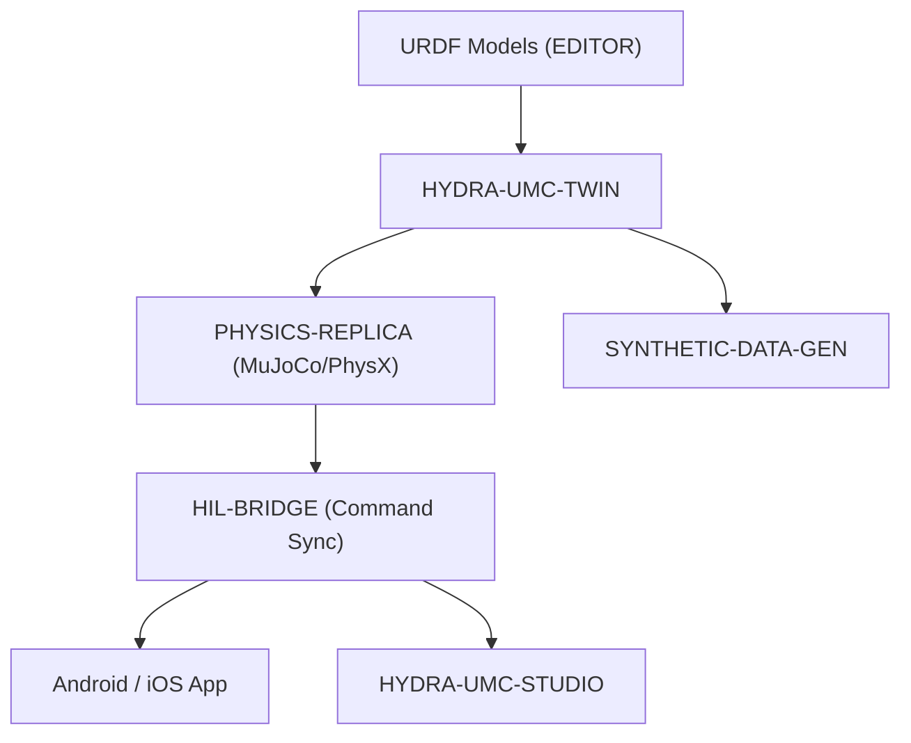

<p align="center">
  
</p>

# ♊ HYDRA-UMC-TWIN

<p align="center"><a href="README.md">🇺🇸 English</a> | <a href="README_spa.md">🇪🇸 Español</a> | <a href="README_fra.md">🇫🇷 Français</a> | <a href="README_ita.md">🇮🇹 Italiano</a> | <a href="README_deu.md">🇩🇪 Deutsch</a> | <a href="README_zho.md">🇨🇳 简体中文</a> | 🇯🇵 <b>日本語</b></p>

### 🌐 物理ベースのデジタルツインと高忠実度シミュレーションエンジン

<p align="left">
  
  
  
  
  
</p>

---

## 1. 🛠️ 技術概要

**HYDRA-UMC-TWIN** は、本エコシステムの仮想的な心臓部です。マイクロ
ファクトリー全体の高忠実度な物理ベースのレプリカを提供し、ロボット
スウォームの安全なテスト、トレーニング、リアルタイム監視を可能にします。

Rust と Bevy エンジンを用いて構築されており、EDITOR からの URDF モデル
を直接取り込み、慣性、摩擦、モータートルクといった実世界の物理特性を
エミュレートすることで、「ツイン上で動作すれば、現場でも動作する」こと
を保証します。

### 主な機能：
* 🧩 **ファミリーレディネスチェック（v0）：** 実際の `family-status` サブコマンドが 3 つの実際の子プロジェクトそれぞれの実際の `hydra-umc.project.json` を読み取り、存在/バージョン/成熟度/役割を報告します——自分自身はまだ何のエンジンも動かしていない統合ハブとして正直な機能です。下記「正直な現状確認」を参照してください。
* 🔒 **実装済み v0 —— 状態同期契約：** `family-sync` は、各子プロジェクトを同期可能とみなす前に、実際のテスト可能な契約——最低成熟度（`functional`）と互換性のある最大メジャーバージョン——でふるいにかけ、未成熟またはバージョン非互換の子プロジェクトを、検証されていない状態形状に対して同期する代わりに、実際の理由とともに拒否します。
* 🌐 **完全な工場シミュレーション（計画中）：** ロボット、工具、環境を統一された 3D 空間内で複製します——まず実際の Bevy エンジン統合が存在することが前提です。
* ⚡ **ハードウェア・イン・ザ・ループ（HIL）（計画中）：** アプリと Studio を、あたかも実際のコントローラーであるかのようにシミュレーターに接続します。
* 📊 **摩耗予測（計画中）：** シミュレートされた機械的応力に基づいてコンポーネントの寿命を推定します。
* 🛡️ **安全検証（計画中）：** 物理的な実行の前に、複雑な軌道と衝突回避をテストします。

**正直な現状確認 —— 今日実際に動くもの：** 引数なしの呼び出しは引き続き識別情報/バージョン/役割を表示しますが、今では実際のサブコマンドが 2 つあります。`family-status [--workspace パス]` はローカルチェックアウトから `HYDRA-UMC-PHYSICS-REPLICA`/`HYDRA-UMC-HIL-BRIDGE`/`HYDRA-UMC-SYNTHETIC-DATA-GEN` それぞれの実際のマニフェストを読み取り、見つけたものを正直に報告します。`family-sync [--workspace パス]` はさらに一歩進みます——存在する各子プロジェクトを実際の状態同期契約（最低成熟度 `functional`、互換性のある最大メジャーバージョン）にかけ、子プロジェクトごとに `READY`、`REJECTED (immature)`、`REJECTED (incompatible version)`、または `MISSING` を報告します。Bevy アプリ、レンダリング、物理ティックループ、URDF シーンの読み込み、そして実際のネットワーク同期トランスポートは、まだ何も存在しません——実際に出荷済みの内容は [`CHANGELOG.md`](CHANGELOG.md) を、まだ残っている作業は下記のロードマップを参照してください。

---

## 2. 🔄 ツインアーキテクチャ



---

## 3. 🧱 アーキテクチャと設計上の決定

* **本エンジンに `hardware/`/`firmware/`/`os/` フォルダがない理由。** 純粋なソフトウェアで独自の基板を持たず、ソースフォルダは実装に必要な場合だけ含めます。
* **`Cargo.toml` が今のところ意図的に Bevy 依存関係を持たない理由。** Bevy は重量級のグラフィックスエンジンです——コンパイル時間が長く、常に利用可能とは限らない GPU/グラフィックスツールチェーンを必要とします。v0 では `serde`/`serde_json`（子プロジェクトのマニフェストを読み取るため）だけを追加しました——実際のレンダリング作業は、実際にビルド可能な GPU/グラフィックスツールチェーンが存在するようになるまで、引き続き待たれます。
* **`docker-compose.yml` が 3 つの子プロジェクトがまだ Dockerfile を持たないうちから存在する理由。** 統合契約（どのサービスがどのサービスに依存するか、それぞれがどのデバイス/ボリュームマウントを必要とするか）を今のうちに決定し文書化しておくことで、各子プロジェクトが独自の Dockerfile を公開するまで `docker compose up` が完全には成功しないとしても、この形が後から場当たり的に考案されることを防ぎます。
* **エコシステムの他の部分との関係。** デジタルツインとシミュレーション ファミリーの統合親プロジェクトです——HYDRA-UMC-PHYSICS-REPLICA が実際の物理ソルバーを供給し、HYDRA-UMC-HIL-BRIDGE により実際のアプリがまるでハードウェアであるかのようにこれを制御でき、HYDRA-UMC-SYNTHETIC-DATA-GEN はこのエンジン自体を通じてトレーニングデータセットをレンダリングします。
* **`family-status` が手作業で管理するリストではなく、各子プロジェクト自身のマニフェストを読み取る理由。** `hydra-umc.project.json` は、エコシステム全体のダッシュボードとアップデーターがすでに信頼している唯一の真実の情報源です——ここに第 2 のリストを持つと、子プロジェクトの実際の成熟度が変わった瞬間、誰も更新を忘れずに済むとは限らず、すぐに食い違いが生じてしまいます。
* **兄弟プロジェクトのローカルチェックアウトが見つからない場合、クラッシュではなく実際の正直な「見つかりません」になる理由。** 統合ハブは、開発者が実際に 3 つの子プロジェクトすべてをローカルにチェックアウトしているかどうかを本当には知り得ません——`manifest.rs` は実際に起こりうるあらゆる失敗（リポジトリなし、マニフェストなし、不正な JSON）に対して `None` を返すため、`family-status` はパニックする代わりにそれを明確に報告します。
* **`family-sync` が「存在するかどうか」だけでなく、成熟度と両方をバージョン上限で選別する理由。** `family-status` はすでに「この子プロジェクトはチェックアウトされているか、そして自身について何を主張しているか」に答えています——しかし、チェックアウト済みで `scaffolding` 成熟度の子プロジェクトには、まだ同期する価値のある実際の状態がありません。また、この Twin が検証済みの最大メジャーバージョンを超えた子プロジェクトは、この Twin がまだ把握していない方法で自身の状態形状を変更している可能性があります。どちらも同期を拒否する実際の理由であり、「見つからない」とは別のものです。そのため `contract.rs` はこれらを別々にチェックして報告し、すべてを汎用的な「準備未完了」にまとめてしまうことはありません。
* **`contract::assess()` において、成熟度がバージョン互換性より先にチェックされる理由。** 未成熟な子プロジェクトのバージョン番号は、まだ意味のあるシグナルではありません——成熟度を先にチェックすることで、報告される却下理由は常に実際に失敗した最も根本的なゲートを指し示すことになり、バージョンの不一致が「この子プロジェクトはまだ本物ではない」というより基本的な問題を覆い隠すことはありません。

---

## 📂 リポジトリ構成

純粋なソフトウェアエンジンであり、独自のハードウェア設計を持たないため、
本プロジェクトは `hardware/`、`firmware/`、`os/` フォルダを携えていません
（リポジトリ構造ポリシーに従います）。

```text
HYDRA-UMC-TWIN/
├── src/
│   ├── manifest.rs       # 兄弟プロジェクト自身のマニフェストの実際の防御的リーダー
│   ├── family.rs         # 実際のレディネスチェック + 統合された同期結果
│   ├── contract.rs       # 実際の状態同期契約（成熟度 + バージョン上限）
│   ├── server.rs         # シンプルなJSON/HTTPサーフェス(tiny_http、ブロッキング、非同期ランタイムなし)
│   └── main.rs           # エントリポイント + 実際の `family-status`/`family-sync` サブコマンド
├── docs/                # ドキュメントと物理チューニング
├── build/               # ビルドノート/成果物（cargo 自身の出力は target/ にあり、gitignore 対象）
├── images/              # メディアと図表
├── systemd/
│   └── hydra-umc-twin.service # ローカルCM5 family-status/sync APIのsystemdユニット
├── tools/
│   ├── build_test.py    # バージョンを増やさないビルドチェック
│   └── ci_validate.py   # CI が使用するマニフェスト/CHANGELOG/ドキュメント検証
├── Cargo.toml           # パッケージメタデータ、依存関係（serde/serde_json）、オドメーターバージョン
├── bump_version.py      # オドメーター式バージョンインクリメント（build.sh/.bat が使用）
├── build.sh / build.bat # バージョンを増加させ、`cargo test`、その後 `cargo build --release` を実行
├── build-test.sh / build-test.bat # バージョンを増やさないビルドチェック
├── run.sh / run.bat     # コンパイル済みの release バイナリを実行（引数を転送）
└── docker-compose.yml   # 下記 3 つの子プロジェクトの統合ブループリント
```

---

## 🏗️ ビルドと実行

Rust ツールチェーン（`cargo`/`rustc`、[rustup](https://rustup.rs) 経由で
インストール）と Python 3.10+（`bump_version.py` のみに使用）が必要です。

```bash
# Linux / macOS
./build.sh   # オドメーター式バージョンインクリメント、`cargo test`（29 件のテスト）、その後 `cargo build --release`
./run.sh     # target/release/hydra-umc-twin を実行し、名前 + バージョン + 役割を表示
```

```bat
:: Windows
build.bat
run.bat
```

`build.sh`/`build.bat` は、エコシステムの「オドメーター」規則
（PATCH+1、9 を超えると MINOR に繰り上がる）に従って本プロジェクト
自身の `Cargo.toml` のバージョンを増加させ、実際のテストスイートを
実行し、その後 release バイナリをビルドします。

実際の `family-status` サブコマンドは、実際のローカルチェックアウトを
確認します：

```bash
./run.sh family-status
./run.sh family-status --workspace /path/to/some/other/checkout

# Windows
run.bat family-status
```

```text
Digital Twin family status (workspace: /path/to/GitHub):
  HYDRA-UMC-PHYSICS-REPLICA: v0.0.3, maturity=established, role=library
  HYDRA-UMC-HIL-BRIDGE: v0.0.5, maturity=established, role=service
  HYDRA-UMC-SYNTHETIC-DATA-GEN: v0.0.6, maturity=established, role=tool

All 3 children present.
```

デフォルトでは、本リポジトリ自身の親ディレクトリを使用します——これは
このエコシステムの実際のチェックアウトがすでに使用しているのと同じ
レイアウトです。実際の子プロジェクトが 1 つでも見つからない場合は `1`
で終了します。

実際の `family-sync` サブコマンドはさらに一歩進みます——存在する各子
プロジェクトに対して、実際の状態同期契約（最低成熟度、互換性のある
最大メジャーバージョン）もチェックします：

```bash
./run.sh family-sync --workspace /path/to/some/checkout
```

```text
Digital Twin family sync contract (workspace: /path/to/some/checkout):
  HYDRA-UMC-PHYSICS-REPLICA: READY (v0.0.3, maturity=functional)
  HYDRA-UMC-HIL-BRIDGE: REJECTED (incompatible version) - HYDRA-UMC-HIL-BRIDGE reports major version 1 - this Twin's sync contract is only verified up to major 0 (incompatible simulator version)
  HYDRA-UMC-SYNTHETIC-DATA-GEN: MISSING (not checked out)

Not every child is sync-ready - see the lines above.
```

期待されるすべての子プロジェクトが `READY` の場合にのみ終了コード `0`
で終了します。`MISSING`/`REJECTED` の子プロジェクトが 1 つでもあれば
`1` で終了します。

**重要：** `Cargo.toml` は今のところ意図的に**Bevy 依存関係を持ちません**。
Bevy は重量級のグラフィックスエンジンです（コンパイル時間が長く、常に
利用可能とは限らない GPU/グラフィックスツールチェーンを必要とします）。
v0 ではマニフェストを読み取るための `serde`/`serde_json` のみを追加
しました。実際の `bevy` 依存関係（および物理バックエンドと HIL-BRIDGE
向けの gRPC/WebSocket クライアント）は、実際のレンダリング/エンジン
作業が始まった際に追加されます。

### 3 つの子プロジェクトの統合（`docker-compose.yml`）

統合親プロジェクトとして、`docker-compose.yml` は本エンジンがその 3 つの
子プロジェクトを 1 つのスタックへとどのように構成するかを記録しています：
**PHYSICS-REPLICA**（ソルバー、物理ティックごとに呼び出される）、
**HIL-BRIDGE**（実際と仮想のコマンド同期）、**SYNTHETIC-DATA-GEN**
（オフラインのバッチデータセットエクスポート）。4 つのプロジェクトの
いずれもスケルトン段階ではまだ `Dockerfile` を持たないため、今日の時点
では `docker compose up` は実行できません——このファイルは、各プロジェクト
自身の `Dockerfile` が後で追加される際に参照される、確定済みのトポロジー/
ポート/依存グラフのリファレンスです。

---

## 🚀 ロードマップ
* **フェーズ 1：** リアルタイムハードウェアテレメトリとのデジタルツイン同期、サブ 10ms の遅延。
* **フェーズ 2：** 産業グレードのシミュレーター（Isaac Sim）との Physics Replica 統合、変形体サポート。
* **フェーズ 3：** 分散型フェイルオーバーと早期センサー劣化検知のためのノード自己修復自動化パターン。
* **フェーズ 4：** 合成データ生成のためのフォトリアリスティックレンダリング、フルスケール車両インザループ向けの HIL Bridge サポート。

---

## 🔗 関連プロジェクト

本プロジェクトは、同じ作者(JuanenRac / Electro Hobby 3D)による HYDRA-UMC ロボティクスエコシステムの一部です。リクエストが実はこの中のどれかについてのものである可能性があるため、知っておく価値があります。

**子プロジェクト** —— いずれも本ツインの自身のシミュレーション/レンダリングエンジンに接続します
- **[HYDRA-UMC-PHYSICS-REPLICA](https://github.com/JuanenRac/HYDRA-UMC-PHYSICS-REPLICA)** — 実際の URDF サブセットに対する、実際の順運動学と関節限界検証。
- **[HYDRA-UMC-HIL-BRIDGE](https://github.com/JuanenRac/HYDRA-UMC-HIL-BRIDGE)** — シミュレーションと実際のハードウェアの間でコマンドをルーティングする、実際のハードウェア・イン・ザ・ループ安全インターロック。
- **[HYDRA-UMC-SYNTHETIC-DATA-GEN](https://github.com/JuanenRac/HYDRA-UMC-SYNTHETIC-DATA-GEN)** — YOLO/COCO アノテーションのエクスポート機能を持つ、実際のプロシージャル 2D シーンジェネレーター。

**直接関連**
- **[HYDRA-UMC-EDITOR-URDF](https://github.com/JuanenRac/HYDRA-UMC-EDITOR-URDF)** — 完成したモデルを STUDIO 自身のカタログへ送信するデスクトップ用グラフィカル URDF 作成/編集ツール。本ツインが消費する URDF モデルを作成するためのツール。
- **[HYDRA-UMC-SUITE](https://github.com/JuanenRac/HYDRA-UMC-SUITE)** — 複数のサーバーを同時に扱えるデスクトップ(PySide6)スウォームコマンドセンター、スタンドアロン実行ファイルとしてパッケージ化。HIL-BRIDGE 経由で本ツインを実機のように制御する。
- **[HYDRA-UMC-ANDROID-CONTROL](https://github.com/JuanenRac/HYDRA-UMC-ANDROID-CONTROL)** — 生体認証ログインとペアリングされた Wear OS コンパニオンを備えたネイティブ Android 制御アプリ。HIL-BRIDGE 経由で本ツインを実機のように制御する。
- **[HYDRA-UMC-IOS-CONTROL](https://github.com/JuanenRac/HYDRA-UMC-IOS-CONTROL)** — リアルタイム WebSocket 同期を備えた iOS/iPadOS 制御アプリ(Flutter)。HIL-BRIDGE 経由で本ツインを実機のように制御する。

**エコシステムの他のプロジェクト**

*コアハードウェア&プラットフォーム*
- **[HYDRA-UMC](https://github.com/JuanenRac/HYDRA-UMC)** — 実際のロボットアームのマザーボード——CM5 ホスト + デュアルコア STM32H745、CAN-OTA/SPI-OTA 経由で最大 8 本のツールアームを統括。
- **[HYDRA-UMC-OS](https://github.com/JuanenRac/HYDRA-UMC-OS)** — CM5 向けの再現可能な Raspberry Pi OS プロダクト層——読み取り専用エージェント、検証済み設定/プロファイル、WiFi 初回接続プロビジョニング。
- **[HYDRA-UMC-SDK](https://github.com/JuanenRac/HYDRA-UMC-SDK)** — すべてのブリッジが自身のコマンドを検証する共有 JSON-Schema 契約と安全ゲートの境界。

*コアバックエンド&クライアント*
- **[HYDRA-UMC-SERVER](https://github.com/JuanenRac/HYDRA-UMC-SERVER)** — すべての制御クライアントが実際に通信する、本物のヘッドレスバックエンド(REST/WebSocket)。
- **[HYDRA-UMC-STUDIO](https://github.com/JuanenRac/HYDRA-UMC-STUDIO)** — リアルタイムのマルチロボット 3D 可視化を備えたウェブ制御ダッシュボード。
- **[HYDRA-UMC-DSI](https://github.com/JuanenRac/HYDRA-UMC-DSI)** — 本体搭載の 7 インチ DSI タッチスクリーン向けネイティブタッチ UI、CM5 自体に組み込み。
- **[HYDRA-UMC-BRIDGE-AMR](https://github.com/JuanenRac/HYDRA-UMC-BRIDGE-AMR)** — 実際の VDA 5050 MQTT パブリッシャーによる AGV/AMR フリートの調整境界。
- **[HYDRA-UMC-BRIDGE-CNC](https://github.com/JuanenRac/HYDRA-UMC-BRIDGE-CNC)** — 実際の GRBL ステータス/制御バイトへのアクセスを持つ、CNC セルの高レベルコーディネーター。
- **[HYDRA-UMC-BRIDGE-DROIDS](https://github.com/JuanenRac/HYDRA-UMC-BRIDGE-DROIDS)** — 実際の Boston Dynamics Spot コマンド送信機能を持つ、脚型/ヒューマノイドドロイドの調整境界。
- **[HYDRA-UMC-BRIDGE-LASER](https://github.com/JuanenRac/HYDRA-UMC-BRIDGE-LASER)** — 実際のキー/筐体/インターロック GPIO セーフガード 3 系統を読み取る、レーザーセルの安全コーディネーター。
- **[HYDRA-UMC-BRIDGE-OPENPNP](https://github.com/JuanenRac/HYDRA-UMC-BRIDGE-OPENPNP)** — OpenPnP ピックアンドプレースの基板フローを安全に統括する高レベルコーディネーター。
- **[HYDRA-UMC-BRIDGE-PRINTER3D](https://github.com/JuanenRac/HYDRA-UMC-BRIDGE-PRINTER3D)** — 実際にゲート制御されたジョブコマンドを持つ、Moonraker/Klipper 3D プリンター向けの安全な調整境界。
- **[HYDRA-UMC-BRIDGE-ROS2](https://github.com/JuanenRac/HYDRA-UMC-BRIDGE-ROS2)** — 実際の遅延インポート rclpy ROS 2 トランスポートを持つ安全コーディネーター。
- **[HYDRA-UMC-BRIDGE-UAV](https://github.com/JuanenRac/HYDRA-UMC-BRIDGE-UAV)** — 実際の MAVLink コマンド送信機能を持つ、カメラ搭載 UAV の調整境界。

*URTC ツールプラットフォーム*
- **[URTC](https://github.com/JuanenRac/URTC)** — 物理的な Universal Robot Tool Controller 基板向けファームウェア、CAN バス経由の 25 以上のツールプロファイル。
- **[URTC-FLASHER](https://github.com/JuanenRac/URTC-FLASHER)** — URTC 基板用のデスクトップ GUI 書き込みツール、CAN-OTA およびフルチップ SWD/JTAG。
- **[URTC-TESTER](https://github.com/JuanenRac/URTC-TESTER)** — URTC 基板向けのデスクトップ CAN バスライブ診断ツール、ツールプロファイルごとに 1 パネル。
- **[URTC-WEB-STUDIO](https://github.com/JuanenRac/URTC-WEB-STUDIO)** — Web Serial API を使ったブラウザベースの URTC-TESTER の代替、ローカルインストール不要。

*ビジョン AI ノード(Hailo-8)*
- **[HYDRA-UMC-VISION-NODE](https://github.com/JuanenRac/HYDRA-UMC-VISION-NODE)** — Hailo-8 ビジョンパイプラインの統合ハブ、段階ごとの実際のハードウェア準備状況チェック付き。
- **[HYDRA-UMC-DETECTION-HEF](https://github.com/JuanenRac/HYDRA-UMC-DETECTION-HEF)** — Hailo アーキテクチャ/チェックサムによる安全読み込み検証を備えた、実際のコンパイル済みモデルレジストリ。
- **[HYDRA-UMC-VISION-STREAMER](https://github.com/JuanenRac/HYDRA-UMC-VISION-STREAMER)** — 実際の HailoRT 統合境界を持つ、実際の GStreamer パイプライン + MediaMTX 設定生成器。
- **[HYDRA-UMC-VISUAL-SERVOING-API](https://github.com/JuanenRac/HYDRA-UMC-VISUAL-SERVOING-API)** — 上流のゾーン状態に応じて安全ゲート制御される、実際の Position-Based Visual Servoing 補正則。
- **[HYDRA-UMC-SAFETY-ZONES](https://github.com/JuanenRac/HYDRA-UMC-SAFETY-ZONES)** — キャリブレーションの鮮度を強制する、実際のゾーン侵入チェックと E-STOP 要求。

*コグニティブ AI ノード(Hailo-10)*
- **[HYDRA-UMC-COGNITIVE-NODE](https://github.com/JuanenRac/HYDRA-UMC-COGNITIVE-NODE)** — Hailo-10 コグニティブパイプライン(LLM/VLA/音声オーケストレーション)の統合ハブ。
- **[HYDRA-UMC-VLA-ENGINE](https://github.com/JuanenRac/HYDRA-UMC-VLA-ENGINE)** — Vision-Language-Action モデル向けの、実際のアクショントークンのエンコード/デコードと軌道生成。
- **[HYDRA-UMC-VOICE-UI](https://github.com/JuanenRac/HYDRA-UMC-VOICE-UI)** — 確認ゲート付きの限定的な Watch リレーを備えた、実際の音声フロントエンド(VAD + 意図解析)。
- **[HYDRA-UMC-SEMANTIC-PLANNER](https://github.com/JuanenRac/HYDRA-UMC-SEMANTIC-PLANNER)** — MCU エラーコードに対する、実際のルールベースのタスク分解と意味的エラー復旧。
- **[HYDRA-UMC-DOCS-QA](https://github.com/JuanenRac/HYDRA-UMC-DOCS-QA)** — このエコシステム自身の Markdown ドキュメントに対する、標準ライブラリのみの実際の TF-IDF 文書検索。

*オーケストレーション&スウォーム*
- **[HYDRA-UMC-ORCHESTRATOR](https://github.com/JuanenRac/HYDRA-UMC-ORCHESTRATOR)** — 実際の gRPC/Protobuf ヘルスレポート契約とミッションステートマシンを持つ統合ハブ。
- **[HYDRA-UMC-JOB-DISPATCHER](https://github.com/JuanenRac/HYDRA-UMC-JOB-DISPATCHER)** — 実際の HTTP API 上に構築された、優先度ベースの実際のジョブキュー(重複排除付き)。
- **[HYDRA-UMC-NODE-HEALING](https://github.com/JuanenRac/HYDRA-UMC-NODE-HEALING)** — リトライ/バックオフとアイデンティティ不一致検出を備えた、実際の gRPC ベースのフリートヘルスウォッチドッグ。
- **[HYDRA-UMC-PATH-PLANNER-3D](https://github.com/JuanenRac/HYDRA-UMC-PATH-PLANNER-3D)** — 実際の障害物/ワークスペース衝突検証を備えた、実際の RRT ベースの 3D 経路プランナー。
- **[HYDRA-UMC-SWARM-SYNC](https://github.com/JuanenRac/HYDRA-UMC-SWARM-SYNC)** — 複数セルの収束についてプロパティテストされた、実際の CRDT LWW-Element-Map 状態同期。

*データ&分析*
- **[HYDRA-UMC-DATALAKE](https://github.com/JuanenRac/HYDRA-UMC-DATALAKE)** — 実際の取り込み/クエリ HTTP API を備えた、実際の sqlite3 ベースの時系列ストア。
- **[HYDRA-UMC-ANOMALY-DETECTOR](https://github.com/JuanenRac/HYDRA-UMC-ANOMALY-DETECTOR)** — ドリフト監視を備えた、実際の FFT + 統計ベースラインによる異常検知器。
- **[HYDRA-UMC-PRODUCTION-REPORTS](https://github.com/JuanenRac/HYDRA-UMC-PRODUCTION-REPORTS)** — DATALAKE の履歴に対する実際の OEE/稼働率計算、再現可能な CSV エクスポート付き。
- **[HYDRA-UMC-TELEMETRY-COLLECTOR](https://github.com/JuanenRac/HYDRA-UMC-TELEMETRY-COLLECTOR)** — シーケンス重複排除機能を備えた、DATALAKE への実際の CAN/WebSocket 取り込みパイプライン。

*産業用ゲートウェイ*
- **[HYDRA-UMC-GATEWAY-INDUSTRIAL](https://github.com/JuanenRac/HYDRA-UMC-GATEWAY-INDUSTRIAL)** — 実際のコマンド許可リスト/バックプレッシャー層を持つ、産業用プロトコルへ中継する統合ハブ。
- **[HYDRA-UMC-OPCUA-SERVER](https://github.com/JuanenRac/HYDRA-UMC-OPCUA-SERVER)** — 実際のバイナリプロトコルクライアントセッションで検証された、実際の OPC-UA アドレス空間。
- **[HYDRA-UMC-MQTT-BROKER](https://github.com/JuanenRac/HYDRA-UMC-MQTT-BROKER)** — クライアント単位のオプション認証とトピック ACL を備えた、実際の MQTT ブローカー。
- **[HYDRA-UMC-MTCONNECT-ADAPTER](https://github.com/JuanenRac/HYDRA-UMC-MTCONNECT-ADAPTER)** — 縮退モード出力を備えた、実際の MTConnect `/probe` および `/current` XML エンドポイント。

*補完ツール&エコシステム運用*
- **[HYDRA-UMC-DASHBOARD-AI](https://github.com/JuanenRac/HYDRA-UMC-DASHBOARD-AI)** — 誠実な統計フォールバックを備えた、DATALAKE/ANOMALY-DETECTOR 上のスマートサマリーと異常ハイライトパネル。
- **[HYDRA-UMC-TOOL-CLI](https://github.com/JuanenRac/HYDRA-UMC-TOOL-CLI)** — 実際の安定した終了コード契約を持つフリート CLI、HYDRA-UMC-SERVER 自身の API の本物のライブクライアント。
- **[HYDRA-UMC-WATCH](https://github.com/JuanenRac/HYDRA-UMC-WATCH)** — 実際の触覚アラートとペアリングされたスマートフォンへの音声リレーを備えた WearOS コンパニオンアプリ。
- **[URTC-SMART-RACK](https://github.com/JuanenRac/URTC-SMART-RACK)** — 実際の工具 ID デコードと Smart Idle 予熱ロジックを備えた、基板搭載ラック用ファームウェア。
- **[URTC-VISION-TOOL](https://github.com/JuanenRac/URTC-VISION-TOOL)** — サーマル/RGB 検査ツールヘッド向けの、ファームウェアと実際の Python ビジョンコンパニオン。
- **[HYDRA-UMC-UPDATER](https://github.com/JuanenRac/HYDRA-UMC-UPDATER)** — このエコシステム内のすべてのリポジトリを検出・クローン・更新する、管理用デスクトップツール。


## 👤 作者
**JuanenRac** (Electro Hobby 3D)
📧 electrohobby3d@gmail.com
📺 [youtube.com/@electrohobby3d](https://youtube.com/@electrohobby3d)

## 📜 ライセンス
GPL-3.0 —— 詳細は LICENSE を参照してください。
