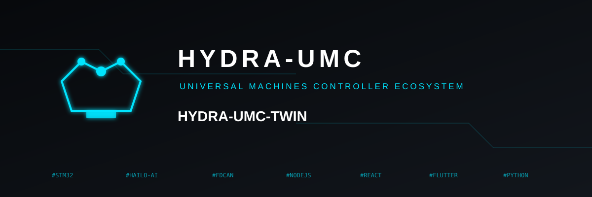
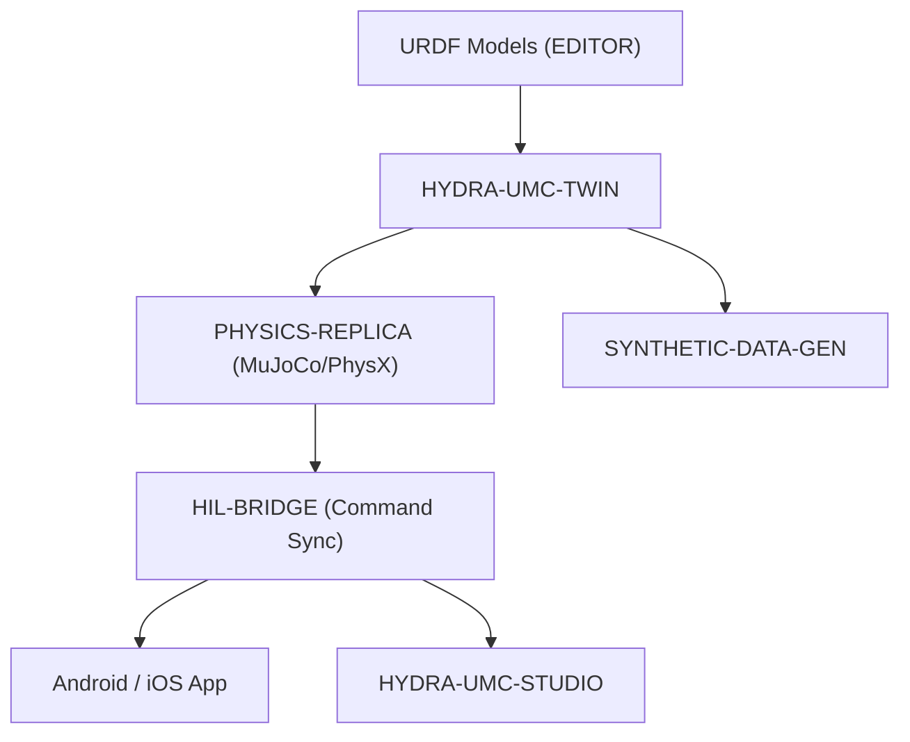

<p align="center">
  
</p>

# ♊ HYDRA-UMC-TWIN

<p align="center"><a href="README.md">🇺🇸 English</a> | <a href="README_spa.md">🇪🇸 Español</a> | <a href="README_fra.md">🇫🇷 Français</a> | <a href="README_ita.md">🇮🇹 Italiano</a> | <a href="README_deu.md">🇩🇪 Deutsch</a> | <a href="README_zho.md">🇨🇳 简体中文</a> | 🇯🇵 <b>日本語</b></p>

### 🌐 物理ベースのデジタルツインと高忠実度シミュレーションエンジン

<p align="left">
  
  
  
  
  
</p>

---

## 1. 🛠️ 技術概要

**HYDRA-UMC-TWIN** は、本エコシステムの仮想的な心臓部です。マイクロ
ファクトリー全体の高忠実度な物理ベースのレプリカを提供し、ロボット
スウォームの安全なテスト、トレーニング、リアルタイム監視を可能にします。

Rust と Bevy エンジンを用いて構築されており、EDITOR からの URDF モデル
を直接取り込み、慣性、摩擦、モータートルクといった実世界の物理特性を
エミュレートすることで、「ツイン上で動作すれば、現場でも動作する」こと
を保証します。

### 主な機能：
* 🧩 **ファミリーレディネスチェック（v0）：** 実際の `family-status` サブコマンドが 3 つの実際の子プロジェクトそれぞれの実際の `hydra-umc.project.json` を読み取り、存在/バージョン/成熟度/役割を報告します——自分自身はまだ何のエンジンも動かしていない統合ハブとして正直な機能です。下記「正直な現状確認」を参照してください。
* 🌐 **完全な工場シミュレーション（計画中）：** ロボット、工具、環境を統一された 3D 空間内で複製します——まず実際の Bevy エンジン統合が存在することが前提です。
* ⚡ **ハードウェア・イン・ザ・ループ（HIL）（計画中）：** アプリと Studio を、あたかも実際のコントローラーであるかのようにシミュレーターに接続します。
* 📊 **摩耗予測（計画中）：** シミュレートされた機械的応力に基づいてコンポーネントの寿命を推定します。
* 🛡️ **安全検証（計画中）：** 物理的な実行の前に、複雑な軌道と衝突回避をテストします。

**正直な現状確認 —— 今日実際に動くもの：** 引数なしの呼び出しは引き続き識別情報/バージョン/役割を表示しますが、今では実際の `family-status [--workspace パス]` サブコマンドもあります：ローカルチェックアウトから `HYDRA-UMC-PHYSICS-REPLICA`/`HYDRA-UMC-HIL-BRIDGE`/`HYDRA-UMC-SYNTHETIC-DATA-GEN` それぞれの実際のマニフェストを読み取り、見つけたものを正直に報告します。Bevy アプリ、レンダリング、物理ティックループ、URDF シーンの読み込みはまだ何も存在しません——実際に出荷済みの内容は [`CHANGELOG.md`](CHANGELOG.md) を、まだ残っている作業は下記のロードマップを参照してください。

---

## 2. 🔄 ツインアーキテクチャ



---

## 3. 🧱 アーキテクチャと設計上の決定

* **本エンジンに `hardware/`/`firmware/`/`os/` フォルダがない理由。** 純粋なソフトウェアであり、独自の基板を持たないため、これらのフォルダは空のまま残すのではなく意図的に省略されています（`SONNET/5.PLAN_EJECUCION_32_PROYECTOS_NUEVOS.txt` 内のフォルダ省略ルールを参照。これは私的な計画文書です）。
* **`Cargo.toml` が今のところ意図的に Bevy 依存関係を持たない理由。** Bevy は重量級のグラフィックスエンジンです——コンパイル時間が長く、常に利用可能とは限らない GPU/グラフィックスツールチェーンを必要とします。v0 では `serde`/`serde_json`（子プロジェクトのマニフェストを読み取るため）だけを追加しました——実際のレンダリング作業は、実際にビルド可能な GPU/グラフィックスツールチェーンが存在するようになるまで、引き続き待たれます。
* **`docker-compose.yml` が 3 つの子プロジェクトがまだ Dockerfile を持たないうちから存在する理由。** 統合契約（どのサービスがどのサービスに依存するか、それぞれがどのデバイス/ボリュームマウントを必要とするか）を今のうちに決定し文書化しておくことで、各子プロジェクトが独自の Dockerfile を公開するまで `docker compose up` が完全には成功しないとしても、この形が後から場当たり的に考案されることを防ぎます。
* **エコシステムの他の部分との関係。** Digital Twin & Simulation ファミリーの統合親プロジェクトです——HYDRA-UMC-PHYSICS-REPLICA が実際の物理ソルバーを供給し、HYDRA-UMC-HIL-BRIDGE により実際のアプリがまるでハードウェアであるかのようにこれを制御でき、HYDRA-UMC-SYNTHETIC-DATA-GEN はこのエンジン自体を通じてトレーニングデータセットをレンダリングします。
* **`family-status` が手作業で管理するリストではなく、各子プロジェクト自身のマニフェストを読み取る理由。** `hydra-umc.project.json` は、エコシステム全体のダッシュボードとアップデーターがすでに信頼している唯一の真実の情報源です——ここに第 2 のリストを持つと、子プロジェクトの実際の成熟度が変わった瞬間、誰も更新を忘れずに済むとは限らず、すぐに食い違いが生じてしまいます。
* **兄弟プロジェクトのローカルチェックアウトが見つからない場合、クラッシュではなく実際の正直な「見つかりません」になる理由。** 統合ハブは、開発者が実際に 3 つの子プロジェクトすべてをローカルにチェックアウトしているかどうかを本当には知り得ません——`manifest.rs` は実際に起こりうるあらゆる失敗（リポジトリなし、マニフェストなし、不正な JSON）に対して `None` を返すため、`family-status` はパニックする代わりにそれを明確に報告します。

---

## 📂 リポジトリ構成

純粋なソフトウェアエンジンであり、独自のハードウェア設計を持たないため、
本プロジェクトは `hardware/`、`firmware/`、`os/` フォルダを携えていません
（`SONNET/5.PLAN_EJECUCION_32_PROYECTOS_NUEVOS.txt` 内のフォルダ省略
ルールを参照）。

```text
HYDRA-UMC-TWIN/
├── src/
│   ├── manifest.rs       # 兄弟プロジェクト自身のマニフェストの実際の防御的リーダー
│   ├── family.rs          # 3 つの実際の子プロジェクトに対する実際のファミリーレディネスチェック
│   └── main.rs              # エントリポイント + 実際の `family-status` サブコマンド
├── docs/                # ドキュメントと物理チューニング
├── build/               # ビルドノート/成果物（cargo 自身の出力は target/ にあり、gitignore 対象）
├── images/              # メディアと図表
├── scripts/             # ユーティリティスクリプト
├── Cargo.toml           # パッケージメタデータ、依存関係（serde/serde_json）、オドメーターバージョン
├── bump_version.py      # オドメーター式バージョンインクリメント（build.sh/.bat が使用）
├── build.sh / build.bat # バージョンを増加させ、`cargo test`、その後 `cargo build --release` を実行
├── run.sh / run.bat     # コンパイル済みの release バイナリを実行（引数を転送）
└── docker-compose.yml   # 下記 3 つの子プロジェクトの統合ブループリント
```

---

## 🏗️ ビルドと実行

Rust ツールチェーン（`cargo`/`rustc`、[rustup](https://rustup.rs) 経由で
インストール）と Python 3.10+（`bump_version.py` のみに使用）が必要です。

```bash
# Linux / macOS
./build.sh   # オドメーター式バージョンインクリメント、`cargo test`（9 件のテスト）、その後 `cargo build --release`
./run.sh     # target/release/hydra-umc-twin を実行し、名前 + バージョン + 役割を表示
```

```bat
:: Windows
build.bat
run.bat
```

`build.sh`/`build.bat` は、エコシステムの「オドメーター」規則
（PATCH+1、9 を超えると MINOR に繰り上がる）に従って本プロジェクト
自身の `Cargo.toml` のバージョンを増加させ、実際のテストスイートを
実行し、その後 release バイナリをビルドします。

実際の `family-status` サブコマンドは、実際のローカルチェックアウトを
確認します：

```bash
./run.sh family-status
./run.sh family-status --workspace /path/to/some/other/checkout

# Windows
run.bat family-status
```

```text
Digital Twin family status (workspace: /path/to/GitHub):
  HYDRA-UMC-PHYSICS-REPLICA: v0.0.2, maturity=functional, role=library
  HYDRA-UMC-HIL-BRIDGE: v0.0.1, maturity=scaffolding, role=service
  HYDRA-UMC-SYNTHETIC-DATA-GEN: v0.0.4, maturity=functional, role=tool

All 3 children present.
```

デフォルトでは、本リポジトリ自身の親ディレクトリを使用します——これは
このエコシステムの実際のチェックアウトがすでに使用しているのと同じ
レイアウトです。実際の子プロジェクトが 1 つでも見つからない場合は `1`
で終了します。

**重要：** `Cargo.toml` は今のところ意図的に**Bevy 依存関係を持ちません**。
Bevy は重量級のグラフィックスエンジンです（コンパイル時間が長く、常に
利用可能とは限らない GPU/グラフィックスツールチェーンを必要とします）。
v0 ではマニフェストを読み取るための `serde`/`serde_json` のみを追加
しました。実際の `bevy` 依存関係（および物理バックエンドと HIL-BRIDGE
向けの gRPC/WebSocket クライアント）は、実際のレンダリング/エンジン
作業が始まった際に追加されます。

### 3 つの子プロジェクトの統合（`docker-compose.yml`）

統合親プロジェクトとして、`docker-compose.yml` は本エンジンがその 3 つの
子プロジェクトを 1 つのスタックへとどのように構成するかを記録しています：
**PHYSICS-REPLICA**（ソルバー、物理ティックごとに呼び出される）、
**HIL-BRIDGE**（実際と仮想のコマンド同期）、**SYNTHETIC-DATA-GEN**
（オフラインのバッチデータセットエクスポート）。4 つのプロジェクトの
いずれもスケルトン段階ではまだ `Dockerfile` を持たないため、今日の時点
では `docker compose up` は実行できません——このファイルは、各プロジェクト
自身の `Dockerfile` が後で追加される際に参照される、確定済みのトポロジー/
ポート/依存グラフのリファレンスです（各プロジェクト自身の
`SONNET/<project>/mejoras_futuras.txt` でそれぞれ追跡されています）。

---

## 🚀 ロードマップ
* **フェーズ 1：** リアルタイムハードウェアテレメトリとのデジタルツイン同期、サブ 10ms の遅延。
* **フェーズ 2：** 産業グレードのシミュレーター（Isaac Sim）との Physics Replica 統合、変形体サポート。
* **フェーズ 3：** 分散型フェイルオーバーと早期センサー劣化検知のためのノード自己修復自動化パターン。
* **フェーズ 4：** 合成データ生成のためのフォトリアリスティックレンダリング、フルスケール車両インザループ向けの HIL Bridge サポート。

---

## 🔗 関連プロジェクト

本プロジェクトは、同一著者（JuanenRac / Electro Hobby 3D）による、
ファームウェア、制御ソフトウェア、AI ノード、フリート管理ツールにまたがる、
より大きなロボティクスエコシステムの一部です。ご要望が実際にはこれらの
プロジェクトのいずれかに関するものであり、本リポジトリのものではない
可能性もあるため、知っておく価値があります。

### プロジェクトファミリー

**親プロジェクト：** なし —— 本プロジェクト自体が Digital Twin & Simulation ファミリーの統合親プロジェクトです。

**子プロジェクト：**
- **[HYDRA-UMC-PHYSICS-REPLICA](https://github.com/JuanenRac/HYDRA-UMC-PHYSICS-REPLICA)** — 本レンダラーに入力を供給する剛体/接触シミュレーション。
- **[HYDRA-UMC-HIL-BRIDGE](https://github.com/JuanenRac/HYDRA-UMC-HIL-BRIDGE)** — 本ツインが実際の I/O を駆動するために使用するハードウェア・イン・ザ・ループリンク。
- **[HYDRA-UMC-SYNTHETIC-DATA-GEN](https://github.com/JuanenRac/HYDRA-UMC-SYNTHETIC-DATA-GEN)** — 本ツイン自身のエンジンを通じてトレーニングデータセットをレンダリングします。

### 直接関連（ファミリー外）

- **[HYDRA-UMC-EDITOR-URDF](https://github.com/JuanenRac/HYDRA-UMC-EDITOR-URDF)** — ここで作成された URDF モデルを消費します。
- **[HYDRA-UMC-SUITE](https://github.com/JuanenRac/HYDRA-UMC-SUITE)** — HIL-BRIDGE を通じて、本ツインをあたかも実際のハードウェアであるかのように制御します。
- **[HYDRA-UMC-ANDROID-CONTROL](https://github.com/JuanenRac/HYDRA-UMC-ANDROID-CONTROL)** — HIL-BRIDGE を通じて、本ツインをあたかも実際のハードウェアであるかのように制御します。
- **[HYDRA-UMC-IOS-CONTROL](https://github.com/JuanenRac/HYDRA-UMC-IOS-CONTROL)** — HIL-BRIDGE を通じて、本ツインをあたかも実際のハードウェアであるかのように制御します。

### エコシステムのその他のプロジェクト

**HYDRA-UMC プラットフォーム** — マルチロボット・マイクロファクトリーセル
- **[HYDRA-UMC](https://github.com/JuanenRac/HYDRA-UMC)** — 最大 8 台のロボットアームを統括する CM5 + STM32H745 マザーボード。
- **[HYDRA-UMC-SERVER](https://github.com/JuanenRac/HYDRA-UMC-SERVER)** — すべての制御クライアントが接続する Express/WebSocket バックエンド。
- **[HYDRA-UMC-STUDIO](https://github.com/JuanenRac/HYDRA-UMC-STUDIO)** — Web ベースの制御ダッシュボード、マルチロボット 3D 可視化。
- **[HYDRA-UMC-ANDROID-CONTROL](https://github.com/JuanenRac/HYDRA-UMC-ANDROID-CONTROL)** — Wi-Fi/Bluetooth 経由の Android 制御アプリ。
- **[HYDRA-UMC-IOS-CONTROL](https://github.com/JuanenRac/HYDRA-UMC-IOS-CONTROL)** — Flutter で構築された iOS/iPadOS 制御アプリ。
- **[HYDRA-UMC-SUITE](https://github.com/JuanenRac/HYDRA-UMC-SUITE)** — デスクトップ版群制御コマンドセンター（Python/PySide6）。
- **[HYDRA-UMC-EDITOR-URDF](https://github.com/JuanenRac/HYDRA-UMC-EDITOR-URDF)** — ロボットカタログ向けのデスクトップ版 URDF モデルエディター。
- **[HYDRA-UMC-DSI](https://github.com/JuanenRac/HYDRA-UMC-DSI)** — 機載 DSI タッチスクリーン用のネイティブタッチ UI。

**URTC プラットフォーム** — すべての HYDRA-UMC ロボットアームが搭載するツールヘッドコントローラー
- **[URTC](https://github.com/JuanenRac/URTC)** — CAN バスツールヘッドコントローラー、25 種類のツールプロファイル。
- **[URTC-FLASHER](https://github.com/JuanenRac/URTC-FLASHER)** — デスクトップ版 CAN-OTA + SWD/JTAG フラッシュツール。
- **[URTC-TESTER](https://github.com/JuanenRac/URTC-TESTER)** — デスクトップ版ライブ CAN バス診断ツール。
- **[URTC-WEB-STUDIO](https://github.com/JuanenRac/URTC-WEB-STUDIO)** — Web Serial API によるブラウザベースの代替版。

**🎥 ビジョン AI ノード（Hailo-8）**
- [HYDRA-UMC-VISION-NODE](https://github.com/JuanenRac/HYDRA-UMC-VISION-NODE)
- [HYDRA-UMC-VISION-STREAMER](https://github.com/JuanenRac/HYDRA-UMC-VISION-STREAMER)
- [HYDRA-UMC-DETECTION-HEF](https://github.com/JuanenRac/HYDRA-UMC-DETECTION-HEF)
- [HYDRA-UMC-SAFETY-ZONES](https://github.com/JuanenRac/HYDRA-UMC-SAFETY-ZONES)
- [HYDRA-UMC-VISUAL-SERVOING-API](https://github.com/JuanenRac/HYDRA-UMC-VISUAL-SERVOING-API)

**🧠 認知 AI ノード（Hailo-10）**
- [HYDRA-UMC-COGNITIVE-NODE](https://github.com/JuanenRac/HYDRA-UMC-COGNITIVE-NODE)
- [HYDRA-UMC-VLA-ENGINE](https://github.com/JuanenRac/HYDRA-UMC-VLA-ENGINE)
- [HYDRA-UMC-VOICE-UI](https://github.com/JuanenRac/HYDRA-UMC-VOICE-UI)
- [HYDRA-UMC-SEMANTIC-PLANNER](https://github.com/JuanenRac/HYDRA-UMC-SEMANTIC-PLANNER)
- [HYDRA-UMC-DOCS-QA](https://github.com/JuanenRac/HYDRA-UMC-DOCS-QA)

**🐝 オーケストレーションと群制御**
- [HYDRA-UMC-ORCHESTRATOR](https://github.com/JuanenRac/HYDRA-UMC-ORCHESTRATOR)
- [HYDRA-UMC-SWARM-SYNC](https://github.com/JuanenRac/HYDRA-UMC-SWARM-SYNC)
- [HYDRA-UMC-PATH-PLANNER-3D](https://github.com/JuanenRac/HYDRA-UMC-PATH-PLANNER-3D)
- [HYDRA-UMC-JOB-DISPATCHER](https://github.com/JuanenRac/HYDRA-UMC-JOB-DISPATCHER)
- [HYDRA-UMC-NODE-HEALING](https://github.com/JuanenRac/HYDRA-UMC-NODE-HEALING)

**📊 データと分析**
- [HYDRA-UMC-DATALAKE](https://github.com/JuanenRac/HYDRA-UMC-DATALAKE)
- [HYDRA-UMC-TELEMETRY-COLLECTOR](https://github.com/JuanenRac/HYDRA-UMC-TELEMETRY-COLLECTOR)
- [HYDRA-UMC-ANOMALY-DETECTOR](https://github.com/JuanenRac/HYDRA-UMC-ANOMALY-DETECTOR)
- [HYDRA-UMC-PRODUCTION-REPORTS](https://github.com/JuanenRac/HYDRA-UMC-PRODUCTION-REPORTS)

**🏭 産業用ゲートウェイ**
- [HYDRA-UMC-GATEWAY-INDUSTRIAL](https://github.com/JuanenRac/HYDRA-UMC-GATEWAY-INDUSTRIAL)
- [HYDRA-UMC-OPCUA-SERVER](https://github.com/JuanenRac/HYDRA-UMC-OPCUA-SERVER)
- [HYDRA-UMC-MQTT-BROKER](https://github.com/JuanenRac/HYDRA-UMC-MQTT-BROKER)
- [HYDRA-UMC-MTCONNECT-ADAPTER](https://github.com/JuanenRac/HYDRA-UMC-MTCONNECT-ADAPTER)

**🛠️ 補完ツール**
- [URTC-SMART-RACK](https://github.com/JuanenRac/URTC-SMART-RACK)
- [URTC-VISION-TOOL](https://github.com/JuanenRac/URTC-VISION-TOOL)
- [HYDRA-UMC-WATCH](https://github.com/JuanenRac/HYDRA-UMC-WATCH)
- [HYDRA-UMC-TOOL-CLI](https://github.com/JuanenRac/HYDRA-UMC-TOOL-CLI)
- [HYDRA-UMC-DASHBOARD-AI](https://github.com/JuanenRac/HYDRA-UMC-DASHBOARD-AI)


## 👤 作者
**JuanenRac**（Electro Hobby 3D）
📧 electrohobby3d@gmail.com

## 📜 ライセンス
GPL-3.0 —— 詳細は LICENSE を参照してください。

## 関連プロジェクト

> Canonical public ecosystem relationship map.

**Direct integrations:**
[HYDRA-UMC-OS](https://github.com/JuanenRac/HYDRA-UMC-OS) · [HYDRA-UMC-SDK](https://github.com/JuanenRac/HYDRA-UMC-SDK) · [HYDRA-UMC-SERVER](https://github.com/JuanenRac/HYDRA-UMC-SERVER) · [URTC](https://github.com/JuanenRac/URTC) · [HYDRA-UMC-PHYSICS-REPLICA](https://github.com/JuanenRac/HYDRA-UMC-PHYSICS-REPLICA) · [HYDRA-UMC-HIL-BRIDGE](https://github.com/JuanenRac/HYDRA-UMC-HIL-BRIDGE) · [HYDRA-UMC-EDITOR-URDF](https://github.com/JuanenRac/HYDRA-UMC-EDITOR-URDF)

**Platform and contracts:**
[HYDRA-UMC-OS](https://github.com/JuanenRac/HYDRA-UMC-OS) · [HYDRA-UMC-SDK](https://github.com/JuanenRac/HYDRA-UMC-SDK)

**Rest of the ecosystem:**
All remaining public repositories are grouped by the seven ecosystem layers in the [JuanenRac ecosystem dashboard](https://juanenrac.github.io/JuanenRac/).
