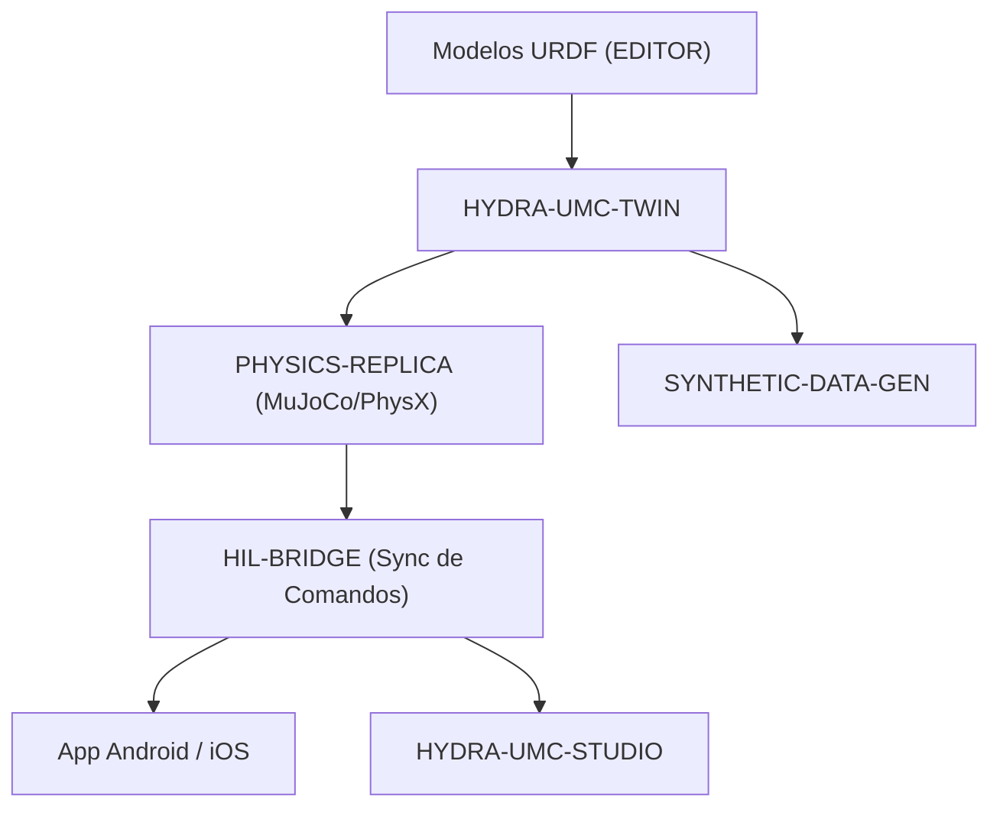

<p align="center">
  
</p>

# ♊ HYDRA-UMC-TWIN

<p align="center"><a href="README.md">🇺🇸 English</a> | 🇪🇸 <b>Español</b> | <a href="README_fra.md">🇫🇷 Français</a> | <a href="README_ita.md">🇮🇹 Italiano</a> | <a href="README_deu.md">🇩🇪 Deutsch</a> | <a href="README_zho.md">🇨🇳 简体中文</a> | <a href="README_jpn.md">🇯🇵 日本語</a></p>

### 🌐 Gemelo Digital Basado en Física y Motor de Simulación de Alta Fidelidad

<p align="left">
  
  
  
  
  
</p>

---

## 1. 🛠️ VISIÓN GENERAL TÉCNICA

**HYDRA-UMC-TWIN** es el corazón virtual del ecosistema. Proporciona una réplica de alta fidelidad basada en física de toda la micro-fábrica, permitiendo pruebas seguras, entrenamiento y monitorización en tiempo real de los enjambres robóticos.

Construido usando Rust y el motor Bevy, consume directamente modelos URDF del EDITOR y emula propiedades físicas del mundo real como inercia, fricción y torque de motores para asegurar que "si funciona en el Twin, funciona en la planta".

### Características Clave:
* 🧩 **Chequeo de Disponibilidad de Familia (v0):** el subcomando real `family-status` lee el propio `hydra-umc.project.json` de cada uno de los 3 hijos reales y reporta presencia/versión/madurez/rol - honesto para un hub de integración que todavía no ejecuta ningún motor por sí mismo. Ver "Comprobación de honestidad" abajo.
* 🌐 **Simulación Completa de Fábrica (planeado):** replica robots, herramientas y el entorno en un espacio 3D unificado - depende de la integración real del motor Bevy.
* ⚡ **Hardware-in-the-Loop (HIL) (planeado):** conecta Apps y Studios al simulador como si fuera un controlador real.
* 📊 **Predicción de Desgaste (planeado):** estima la vida útil de los componentes basada en el estrés mecánico simulado.
* 🛡️ **Validación de Seguridad (planeado):** prueba trayectorias complejas y evitación de colisiones antes de la ejecución física.

**Comprobación de honestidad - qué funciona hoy de verdad:** la invocación sin argumentos sigue imprimiendo identidad/versión/rol, pero ahora existe un subcomando real `family-status [--workspace RUTA]`: lee los manifiestos reales propios de `HYDRA-UMC-PHYSICS-REPLICA`/`HYDRA-UMC-HIL-BRIDGE`/`HYDRA-UMC-SYNTHETIC-DATA-GEN` desde un checkout local y reporta con honestidad lo que encuentra. Todavía no existe ninguna app Bevy, ningún renderizado, ningún bucle de física, ni carga de escenas URDF - ver [`CHANGELOG.md`](CHANGELOG.md) para lo entregado exactamente, y la Hoja de Ruta abajo para lo que sigue por delante.

---

## 2. 🔄 ARQUITECTURA DEL GEMELO



---

## 3. 🧱 ARQUITECTURA Y DECISIONES DE DISEÑO

* **Por qué este motor no tiene carpetas `hardware/`/`firmware/`/`os/`.** Software puro - sin placa propia, así que esas carpetas se podaron en vez de dejarlas vacías (ver la regla de poda de carpetas en `SONNET/5.PLAN_EJECUCION_32_PROYECTOS_NUEVOS.txt`, un documento de planificación privado).
* **Por qué `Cargo.toml` deliberadamente no tiene aún dependencia de Bevy.** Bevy es un motor gráfico pesado - tiempos de compilación largos, necesita una GPU/toolchain gráfico que no siempre está disponible. v0 solo añadió `serde`/`serde_json` (para leer los manifiestos de los hijos) - el trabajo real de renderizado sigue esperando a que exista un toolchain de GPU/gráficos real contra el cual compilar.
* **Por qué `docker-compose.yml` existe antes de que sus 3 hijos tengan Dockerfile.** Decidir y documentar el contrato de integración (qué servicio depende de cuál, qué montajes de dispositivo/volumen necesita cada uno) ahora evita que esa forma se invente de manera improvisada más tarde, aunque `docker compose up` no pueda tener éxito completo hasta que cada hijo publique su propio Dockerfile.
* **Cómo encaja en el resto del ecosistema.** El padre de integración de la familia Digital Twin & Simulation - HYDRA-UMC-PHYSICS-REPLICA le aporta un solucionador de física real, HYDRA-UMC-HIL-BRIDGE permite que apps reales lo controlen como si fuera hardware, y HYDRA-UMC-SYNTHETIC-DATA-GEN renderiza datasets de entrenamiento a través de su propio motor.
* **Por qué `family-status` lee el manifiesto propio de cada hijo en vez de una lista mantenida a mano.** `hydra-umc.project.json` ya es la única fuente de verdad en la que confían el dashboard/updater del ecosistema - una segunda lista aquí se desincronizaría en cuanto la madurez real de un hijo cambiara y nadie recordara actualizarla.
* **Por qué un checkout hermano ausente es un "no encontrado" real y honesto, en vez de un crash.** Un hub de integración genuinamente no puede saber si un desarrollador tiene los 3 hijos clonados localmente - `manifest.rs` devuelve `None` ante cualquier fallo real (repo ausente, fichero ausente, JSON malformado) para que `family-status` pueda reportarlo con claridad en vez de entrar en pánico.

---

## 📂 ESTRUCTURA DE DIRECTORIOS

Motor puramente software, sin diseño de hardware propio - por eso este
proyecto no lleva carpetas `hardware/`, `firmware/` ni `os/` (ver la regla
de poda en `SONNET/5.PLAN_EJECUCION_32_PROYECTOS_NUEVOS.txt`).

```text
HYDRA-UMC-TWIN/
├── src/
│   ├── manifest.rs       # Lector real y defensivo del manifiesto propio de un hermano
│   ├── family.rs          # Chequeo real de disponibilidad de familia sobre los 3 hijos reales
│   └── main.rs              # Entry point + subcomando real `family-status`
├── docs/                # Documentación y ajuste de física
├── build/               # Notas/artefactos de build (la salida real de cargo vive en target/, en .gitignore)
├── images/              # Medios y diagramas
├── scripts/             # Scripts de utilidad
├── Cargo.toml           # Metadatos del paquete, dependencias (serde/serde_json), version cuentakilometros
├── bump_version.py      # Bump de version tipo cuentakilometros (usado por build.sh/.bat)
├── build.sh / build.bat # Bump de version, `cargo test`, luego `cargo build --release`
├── run.sh / run.bat     # Ejecuta el binario release compilado (reenvía argumentos)
└── docker-compose.yml   # Blueprint de integración de los 3 hijos de abajo
```

---

## 🏗️ BUILD Y RUN

Requiere el toolchain de Rust (`cargo`/`rustc`, instalar vía [rustup](https://rustup.rs)) y Python 3.10+ (solo para `bump_version.py`).

```bash
# Linux / macOS
./build.sh   # bump de version cuentakilometros, `cargo test` (9 tests), luego `cargo build --release`
./run.sh     # ejecuta target/release/hydra-umc-twin, imprime nombre + version + rol
```

```bat
:: Windows
build.bat
run.bat
```

`build.sh`/`build.bat` incrementan la version del propio `Cargo.toml` de este proyecto siguiendo la regla "cuentakilometros" del ecosistema (PATCH+1, con acarreo a MINOR al pasar de 9), ejecutan la suite de tests real, y luego construyen un binario release.

El subcomando real `family-status` comprueba el checkout local real:

```bash
./run.sh family-status
./run.sh family-status --workspace /ruta/a/otro/checkout

# Windows
run.bat family-status
```

```text
Digital Twin family status (workspace: /ruta/a/GitHub):
  HYDRA-UMC-PHYSICS-REPLICA: v0.0.2, maturity=functional, role=library
  HYDRA-UMC-HIL-BRIDGE: v0.0.1, maturity=scaffolding, role=service
  HYDRA-UMC-SYNTHETIC-DATA-GEN: v0.0.4, maturity=functional, role=tool

All 3 children present.
```

Por defecto usa el propio directorio padre de este repositorio - la disposición real de checkout-hermano que ya usa este ecosistema. Sale con `1` si falta algún hijo real.

**Importante:** `Cargo.toml` deliberadamente **no lleva todavía la dependencia de Bevy**. Bevy es un motor gráfico pesado (compilación larga, necesita un toolchain de GPU/gráficos no siempre disponible); v0 solo añadió `serde`/`serde_json` para leer manifiestos. La dependencia real de `bevy` (más un backend de física y el cliente gRPC/WebSocket para HIL-BRIDGE) se añade cuando empiece el trabajo real de renderizado/motor.

### Integración de los 3 hijos (`docker-compose.yml`)

Como padre de integración, `docker-compose.yml` documenta cómo este motor compone sus 3 hijos en un mismo stack: **PHYSICS-REPLICA** (solver, llamado en cada tick de física), **HIL-BRIDGE** (sincronización de comandos real vs virtual) y **SYNTHETIC-DATA-GEN** (exportación de datasets por lote, offline). Ninguno de los 4 proyectos tiene todavía `Dockerfile` en esta etapa de esqueleto, así que `docker compose up` no es ejecutable hoy - el archivo es la referencia confirmada de topología/puertos/grafo de dependencias contra la que se añadirá el `Dockerfile` real de cada proyecto más adelante (seguido por proyecto en su propio `SONNET/<proyecto>/mejoras_futuras.txt`).

---

## 🚀 HOJA DE RUTA
* **Fase 1:** Sincronización de Digital Twin con telemetría de hardware en tiempo real y latencia sub-10ms.
* **Fase 2:** Integración de Physics Replica con simuladores de grado industrial (Isaac Sim) y soporte para cuerpos deformables.
* **Fase 3:** Patrones de recuperación automatizados de Node Healing para failover descentralizado y detección temprana de degradación de sensores.
* **Fase 4:** Renderizado fotorrealista para generación de datos sintéticos y soporte de HIL Bridge para pruebas de vehículo en el bucle a escala completa.

---

## 🔗 Proyectos Relacionados

Este proyecto forma parte de un ecosistema de robótica más amplio del mismo autor (JuanenRac / Electro Hobby 3D), que abarca firmware, software de control, nodos de IA y herramientas de flota. Vale la pena conocerlo, ya que una petición podría en realidad ser sobre uno de estos proyectos en vez de sobre este repositorio.

### Familia

**Padre:** ninguno — este proyecto es en sí mismo el padre de integración de la familia Digital Twin & Simulation.

**Hijos:**
- **[HYDRA-UMC-PHYSICS-REPLICA](https://github.com/JuanenRac/HYDRA-UMC-PHYSICS-REPLICA)** — la simulación de cuerpo rígido/contactos que alimenta a este renderizador.
- **[HYDRA-UMC-HIL-BRIDGE](https://github.com/JuanenRac/HYDRA-UMC-HIL-BRIDGE)** — el enlace hardware-in-the-loop por el que este gemelo mueve E/S real.
- **[HYDRA-UMC-SYNTHETIC-DATA-GEN](https://github.com/JuanenRac/HYDRA-UMC-SYNTHETIC-DATA-GEN)** — renderiza datasets de entrenamiento a través del propio motor de este gemelo.

### Relación Directa (fuera de la familia)

- **[HYDRA-UMC-EDITOR-URDF](https://github.com/JuanenRac/HYDRA-UMC-EDITOR-URDF)** — consume los modelos URDF creados aquí.
- **[HYDRA-UMC-SUITE](https://github.com/JuanenRac/HYDRA-UMC-SUITE)** — controla este gemelo como si fuera hardware real, vía HIL-BRIDGE.
- **[HYDRA-UMC-ANDROID-CONTROL](https://github.com/JuanenRac/HYDRA-UMC-ANDROID-CONTROL)** — controla este gemelo como si fuera hardware real, vía HIL-BRIDGE.
- **[HYDRA-UMC-IOS-CONTROL](https://github.com/JuanenRac/HYDRA-UMC-IOS-CONTROL)** — controla este gemelo como si fuera hardware real, vía HIL-BRIDGE.

### Resto del Ecosistema

**Plataforma HYDRA-UMC** — la célula de micro-fábrica multi-robot
- **[HYDRA-UMC](https://github.com/JuanenRac/HYDRA-UMC)** — la placa base CM5 + STM32H745 que orquesta hasta 8 brazos robóticos.
- **[HYDRA-UMC-SERVER](https://github.com/JuanenRac/HYDRA-UMC-SERVER)** — el backend Express/WebSocket con el que habla cada cliente de control.
- **[HYDRA-UMC-STUDIO](https://github.com/JuanenRac/HYDRA-UMC-STUDIO)** — panel de control web, visualización 3D multi-robot.
- **[HYDRA-UMC-ANDROID-CONTROL](https://github.com/JuanenRac/HYDRA-UMC-ANDROID-CONTROL)** — app de control Android por Wi-Fi/Bluetooth.
- **[HYDRA-UMC-IOS-CONTROL](https://github.com/JuanenRac/HYDRA-UMC-IOS-CONTROL)** — app de control iOS/iPadOS construida en Flutter.
- **[HYDRA-UMC-SUITE](https://github.com/JuanenRac/HYDRA-UMC-SUITE)** — centro de mando de enjambre de escritorio (Python/PySide6).
- **[HYDRA-UMC-EDITOR-URDF](https://github.com/JuanenRac/HYDRA-UMC-EDITOR-URDF)** — editor de modelos URDF de escritorio para el catálogo de robots.
- **[HYDRA-UMC-DSI](https://github.com/JuanenRac/HYDRA-UMC-DSI)** — interfaz táctil nativa para la pantalla DSI integrada.

**Plataforma URTC** — el controlador de cabezal de herramienta que lleva cada brazo HYDRA-UMC
- **[URTC](https://github.com/JuanenRac/URTC)** — controlador de cabezal de herramienta CAN, 25 perfiles de herramienta.
- **[URTC-FLASHER](https://github.com/JuanenRac/URTC-FLASHER)** — herramienta de escritorio de flasheo CAN-OTA + SWD/JTAG.
- **[URTC-TESTER](https://github.com/JuanenRac/URTC-TESTER)** — herramienta de escritorio de diagnóstico CAN en vivo.
- **[URTC-WEB-STUDIO](https://github.com/JuanenRac/URTC-WEB-STUDIO)** — alternativa basada en navegador vía Web Serial API.

**🎥 Vision AI Node (Hailo-8)**
- [HYDRA-UMC-VISION-NODE](https://github.com/JuanenRac/HYDRA-UMC-VISION-NODE)
- [HYDRA-UMC-VISION-STREAMER](https://github.com/JuanenRac/HYDRA-UMC-VISION-STREAMER)
- [HYDRA-UMC-DETECTION-HEF](https://github.com/JuanenRac/HYDRA-UMC-DETECTION-HEF)
- [HYDRA-UMC-SAFETY-ZONES](https://github.com/JuanenRac/HYDRA-UMC-SAFETY-ZONES)
- [HYDRA-UMC-VISUAL-SERVOING-API](https://github.com/JuanenRac/HYDRA-UMC-VISUAL-SERVOING-API)

**🧠 Cognitive AI Node (Hailo-10)**
- [HYDRA-UMC-COGNITIVE-NODE](https://github.com/JuanenRac/HYDRA-UMC-COGNITIVE-NODE)
- [HYDRA-UMC-VLA-ENGINE](https://github.com/JuanenRac/HYDRA-UMC-VLA-ENGINE)
- [HYDRA-UMC-VOICE-UI](https://github.com/JuanenRac/HYDRA-UMC-VOICE-UI)
- [HYDRA-UMC-SEMANTIC-PLANNER](https://github.com/JuanenRac/HYDRA-UMC-SEMANTIC-PLANNER)
- [HYDRA-UMC-DOCS-QA](https://github.com/JuanenRac/HYDRA-UMC-DOCS-QA)

**🐝 Orchestration & Swarm**
- [HYDRA-UMC-ORCHESTRATOR](https://github.com/JuanenRac/HYDRA-UMC-ORCHESTRATOR)
- [HYDRA-UMC-SWARM-SYNC](https://github.com/JuanenRac/HYDRA-UMC-SWARM-SYNC)
- [HYDRA-UMC-PATH-PLANNER-3D](https://github.com/JuanenRac/HYDRA-UMC-PATH-PLANNER-3D)
- [HYDRA-UMC-JOB-DISPATCHER](https://github.com/JuanenRac/HYDRA-UMC-JOB-DISPATCHER)
- [HYDRA-UMC-NODE-HEALING](https://github.com/JuanenRac/HYDRA-UMC-NODE-HEALING)

**📊 Data & Analytics**
- [HYDRA-UMC-DATALAKE](https://github.com/JuanenRac/HYDRA-UMC-DATALAKE)
- [HYDRA-UMC-TELEMETRY-COLLECTOR](https://github.com/JuanenRac/HYDRA-UMC-TELEMETRY-COLLECTOR)
- [HYDRA-UMC-ANOMALY-DETECTOR](https://github.com/JuanenRac/HYDRA-UMC-ANOMALY-DETECTOR)
- [HYDRA-UMC-PRODUCTION-REPORTS](https://github.com/JuanenRac/HYDRA-UMC-PRODUCTION-REPORTS)

**🏭 Industrial Gateway**
- [HYDRA-UMC-GATEWAY-INDUSTRIAL](https://github.com/JuanenRac/HYDRA-UMC-GATEWAY-INDUSTRIAL)
- [HYDRA-UMC-OPCUA-SERVER](https://github.com/JuanenRac/HYDRA-UMC-OPCUA-SERVER)
- [HYDRA-UMC-MQTT-BROKER](https://github.com/JuanenRac/HYDRA-UMC-MQTT-BROKER)
- [HYDRA-UMC-MTCONNECT-ADAPTER](https://github.com/JuanenRac/HYDRA-UMC-MTCONNECT-ADAPTER)

**🛠️ Complementary Tools**
- [URTC-SMART-RACK](https://github.com/JuanenRac/URTC-SMART-RACK)
- [URTC-VISION-TOOL](https://github.com/JuanenRac/URTC-VISION-TOOL)
- [HYDRA-UMC-WATCH](https://github.com/JuanenRac/HYDRA-UMC-WATCH)
- [HYDRA-UMC-TOOL-CLI](https://github.com/JuanenRac/HYDRA-UMC-TOOL-CLI)
- [HYDRA-UMC-DASHBOARD-AI](https://github.com/JuanenRac/HYDRA-UMC-DASHBOARD-AI)


## 👤 AUTOR
**JuanenRac** (Electro Hobby 3D)
📧 electrohobby3d@gmail.com

## 📜 LICENCIA
GPL-3.0 - Ver archivo LICENSE para más detalles.

## Proyectos relacionados

> Canonical public ecosystem relationship map.

**Direct integrations:**
[HYDRA-UMC-OS](https://github.com/JuanenRac/HYDRA-UMC-OS) · [HYDRA-UMC-SDK](https://github.com/JuanenRac/HYDRA-UMC-SDK) · [HYDRA-UMC-SERVER](https://github.com/JuanenRac/HYDRA-UMC-SERVER) · [URTC](https://github.com/JuanenRac/URTC) · [HYDRA-UMC-PHYSICS-REPLICA](https://github.com/JuanenRac/HYDRA-UMC-PHYSICS-REPLICA) · [HYDRA-UMC-HIL-BRIDGE](https://github.com/JuanenRac/HYDRA-UMC-HIL-BRIDGE) · [HYDRA-UMC-EDITOR-URDF](https://github.com/JuanenRac/HYDRA-UMC-EDITOR-URDF)

**Platform and contracts:**
[HYDRA-UMC-OS](https://github.com/JuanenRac/HYDRA-UMC-OS) · [HYDRA-UMC-SDK](https://github.com/JuanenRac/HYDRA-UMC-SDK)

**Rest of the ecosystem:**
All remaining public repositories are grouped by the seven ecosystem layers in the [JuanenRac ecosystem dashboard](https://juanenrac.github.io/JuanenRac/).
