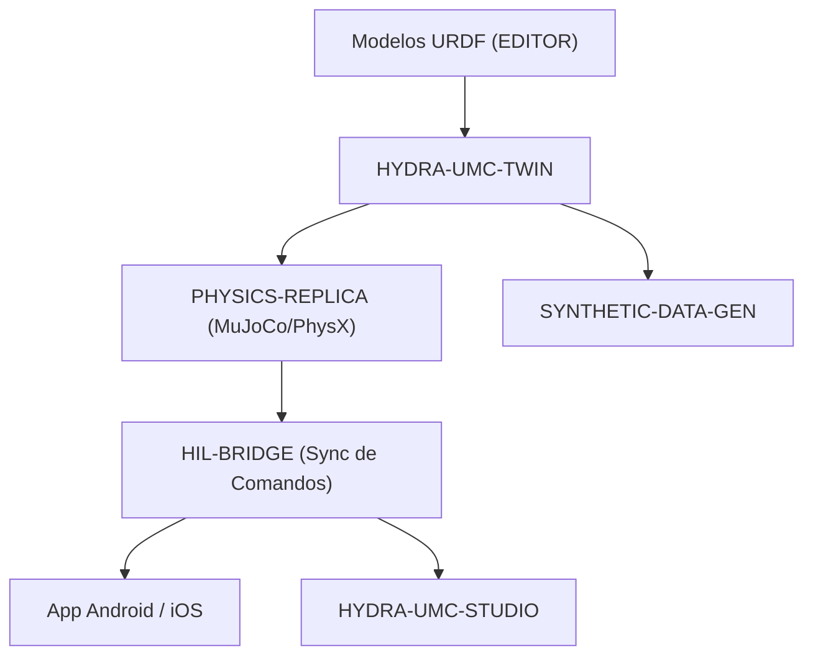

<p align="center">
  
</p>

# ♊ HYDRA-UMC-TWIN

<p align="center"><a href="README.md">🇺🇸 English</a> | 🇪🇸 <b>Español</b> | <a href="README_fra.md">🇫🇷 Français</a> | <a href="README_ita.md">🇮🇹 Italiano</a> | <a href="README_deu.md">🇩🇪 Deutsch</a> | <a href="README_zho.md">🇨🇳 简体中文</a> | <a href="README_jpn.md">🇯🇵 日本語</a></p>

### 🌐 Gemelo Digital Basado en Física y Motor de Simulación de Alta Fidelidad

<p align="left">
  
  
  
  
  
</p>

---

## 1. 🛠️ VISIÓN GENERAL TÉCNICA

**HYDRA-UMC-TWIN** es el corazón virtual del ecosistema. Proporciona una réplica de alta fidelidad basada en física de toda la micro-fábrica, permitiendo pruebas seguras, entrenamiento y monitorización en tiempo real de los enjambres robóticos.

Construido usando Rust y el motor Bevy, consume directamente modelos URDF del EDITOR y emula propiedades físicas del mundo real como inercia, fricción y torque de motores para asegurar que "si funciona en el Twin, funciona en la planta".

### Características Clave:
* 🧩 **Chequeo de Disponibilidad de Familia (v0):** el subcomando real `family-status` lee el propio `hydra-umc.project.json` de cada uno de los 3 hijos reales y reporta presencia/versión/madurez/rol - honesto para un hub de integración que todavía no ejecuta ningún motor por sí mismo. Ver "Comprobación de honestidad" abajo.
* 🔒 **Real v0 - Contrato de Sincronización de Estado:** `family-sync` filtra cada hijo contra un contrato real y testeable - madurez mínima (`functional`) y una versión mayor máxima compatible - antes de tratarlo como listo para sincronizar, rechazando un hijo inmaduro o con versión incompatible con una razón real en vez de sincronizar contra una forma de estado no verificada.
* 🔌 **API JSON por HTTP (v0):** `serve [--addr ADDR] [--port PORT] [--workspace RUTA]` (por defecto `127.0.0.1:8111`) expone la misma lógica de family-status/family-sync vía `GET /family-status`, `GET /family-sync`, `GET /stats` a través de un servidor `tiny_http` real y bloqueante - el mismo binario que ejecuta la unidad `systemd/hydra-umc-twin.service` en una CM5 desplegada (solo loopback). Ver [`docs/CLI_REFERENCE.md`](docs/CLI_REFERENCE.md) para el contrato completo.
* 🌐 **Simulación Completa de Fábrica (planeado):** replica robots, herramientas y el entorno en un espacio 3D unificado - depende de la integración real del motor Bevy.
* ⚡ **Hardware-in-the-Loop (HIL) (planeado):** conecta Apps y Studios al simulador como si fuera un controlador real.
* 📊 **Predicción de Desgaste (planeado):** estima la vida útil de los componentes basada en el estrés mecánico simulado.
* 🛡️ **Validación de Seguridad (planeado):** prueba trayectorias complejas y evitación de colisiones antes de la ejecución física.

**Comprobación de honestidad - qué funciona hoy de verdad:** la invocación sin argumentos sigue imprimiendo identidad/versión/rol, pero ahora hay tres subcomandos reales. `family-status [--workspace RUTA]` lee los manifiestos reales propios de `HYDRA-UMC-PHYSICS-REPLICA`/`HYDRA-UMC-HIL-BRIDGE`/`HYDRA-UMC-SYNTHETIC-DATA-GEN` desde un checkout local y reporta con honestidad lo que encuentra. `family-sync [--workspace RUTA]` va un paso más allá: hace pasar a cada hijo presente por un contrato real de sincronización de estado (madurez mínima `functional`, versión mayor máxima compatible) y reporta `READY`, `REJECTED (immature)`, `REJECTED (incompatible version)` o `MISSING` por hijo. `serve` expone ambos por HTTP JSON real en vez de invocaciones CLI puntuales. Todavía no existe ninguna app Bevy, ningún renderizado, ningún bucle de física, ni carga de escenas URDF, ni ningún transporte de sincronización de red real - ver [`CHANGELOG.md`](CHANGELOG.md) para lo entregado exactamente, [`docs/CLI_REFERENCE.md`](docs/CLI_REFERENCE.md) para cada comando/endpoint, y la Hoja de Ruta abajo para lo que sigue por delante.

---

## 2. 🔄 ARQUITECTURA DEL GEMELO



---

## 3. 🧱 ARQUITECTURA Y DECISIONES DE DISEÑO

* **Por qué este motor no tiene carpetas `hardware/`/`firmware/`/`os/`.** Es software puro sin placa propia; las carpetas de código solo existen cuando su implementación las requiere.
* **Por qué `Cargo.toml` deliberadamente no tiene aún dependencia de Bevy.** Bevy es un motor gráfico pesado - tiempos de compilación largos, necesita una GPU/toolchain gráfico que no siempre está disponible. v0 solo añadió `serde`/`serde_json` (para leer los manifiestos de los hijos) - el trabajo real de renderizado sigue esperando a que exista un toolchain de GPU/gráficos real contra el cual compilar.
* **Por qué `docker-compose.yml` existe antes de que sus 3 hijos tengan Dockerfile.** Decidir y documentar el contrato de integración (qué servicio depende de cuál, qué montajes de dispositivo/volumen necesita cada uno) ahora evita que esa forma se invente de manera improvisada más tarde, aunque `docker compose up` no pueda tener éxito completo hasta que cada hijo publique su propio Dockerfile.
* **Cómo encaja en el resto del ecosistema.** El padre de integración de la familia Gemelo Digital y Simulación - HYDRA-UMC-PHYSICS-REPLICA le aporta un solucionador de física real, HYDRA-UMC-HIL-BRIDGE permite que apps reales lo controlen como si fuera hardware, y HYDRA-UMC-SYNTHETIC-DATA-GEN renderiza datasets de entrenamiento a través de su propio motor.
* **Por qué `family-status` lee el manifiesto propio de cada hijo en vez de una lista mantenida a mano.** `hydra-umc.project.json` ya es la única fuente de verdad en la que confían el dashboard/updater del ecosistema - una segunda lista aquí se desincronizaría en cuanto la madurez real de un hijo cambiara y nadie recordara actualizarla.
* **Por qué un checkout hermano ausente es un "no encontrado" real y honesto, en vez de un crash.** Un hub de integración genuinamente no puede saber si un desarrollador tiene los 3 hijos clonados localmente - `manifest.rs` devuelve `None` ante cualquier fallo real (repo ausente, fichero ausente, JSON malformado) para que `family-status` pueda reportarlo con claridad en vez de entrar en pánico.
* **Por qué `family-sync` filtra por madurez Y por un techo de versión, no solo por "está ahí".** `family-status` ya responde "¿este hijo está clonado y qué dice de sí mismo?" - pero un hijo clonado con madurez `scaffolding` todavía no tiene estado real que merezca la pena sincronizar, y un hijo que ha superado la versión mayor máxima verificada por este Twin puede haber cambiado su propia forma de estado de un modo que este Twin todavía no conoce. Ambas son razones reales para rechazar la sincronización, distintas de "ausente", así que `contract.rs` las comprueba y reporta por separado en vez de mezclarlo todo en un "no listo" genérico.
* **Por qué la madurez se comprueba antes que la compatibilidad de versión en `contract::assess()`.** El número de versión de un hijo inmaduro todavía no es una señal significativa - comprobar la madurez primero significa que la razón de rechazo reportada siempre nombra la puerta más fundamental que realmente falló, en vez de que un desajuste de versión enmascare un problema más básico de "este hijo todavía no es real".

---

## 📂 ESTRUCTURA DE DIRECTORIOS

Motor puramente software, sin diseño de hardware propio; las carpetas de
código solo se incluyen cuando su implementación las requiere, por lo que
este proyecto no lleva `hardware/`, `firmware/` ni `os/`.

```text
HYDRA-UMC-TWIN/
├── src/
│   ├── manifest.rs       # Lector real y defensivo del manifiesto propio de un hermano
│   ├── family.rs         # Chequeo real de disponibilidad + resultado de sync combinado
│   ├── contract.rs       # Contrato real de sync de estado (madurez + techo de version)
│   ├── server.rs         # Superficie JSON/HTTP plana (tiny_http, bloqueante, sin runtime async)
│   └── main.rs           # Entry point + subcomandos reales `family-status`/`family-sync`
├── docs/                # Documentación y ajuste de física
├── build/               # Notas/artefactos de build (la salida real de cargo vive en target/, en .gitignore)
├── images/              # Medios y diagramas
├── systemd/
│   └── hydra-umc-twin.service # Unidad systemd de la API local de family-status/sync en la CM5
├── tools/
│   ├── build_test.py    # Comprobación de compilación sin versionado
│   └── ci_validate.py   # Validación de manifiesto/CHANGELOG/docs usada por CI
├── Cargo.toml           # Metadatos del paquete, dependencias (serde/serde_json), version cuentakilometros
├── bump_version.py      # Bump de version tipo cuentakilometros (usado por build.sh/.bat)
├── build.sh / build.bat # Bump de version, `cargo test`, luego `cargo build --release`
├── build-test.sh / build-test.bat # Comprobación de compilación sin versionado
├── run.sh / run.bat     # Ejecuta el binario release compilado (reenvía argumentos)
└── docker-compose.yml   # Blueprint de integración de los 3 hijos de abajo
```

---

## 🏗️ BUILD Y RUN

Requiere el toolchain de Rust (`cargo`/`rustc`, instalar vía [rustup](https://rustup.rs)) y Python 3.10+ (solo para `bump_version.py`).

```bash
# Linux / macOS
./build.sh   # bump de version cuentakilometros, `cargo test` (29 tests), luego `cargo build --release`
./run.sh     # ejecuta target/release/hydra-umc-twin, imprime nombre + version + rol
```

```bat
:: Windows
build.bat
run.bat
```

`build.sh`/`build.bat` incrementan la version del propio `Cargo.toml` de este proyecto siguiendo la regla "cuentakilometros" del ecosistema (PATCH+1, con acarreo a MINOR al pasar de 9), ejecutan la suite de tests real, y luego construyen un binario release.

El subcomando real `family-status` comprueba el checkout local real:

```bash
./run.sh family-status
./run.sh family-status --workspace /ruta/a/otro/checkout

# Windows
run.bat family-status
```

```text
Digital Twin family status (workspace: /ruta/a/GitHub):
  HYDRA-UMC-PHYSICS-REPLICA: v0.0.3, maturity=established, role=library
  HYDRA-UMC-HIL-BRIDGE: v0.0.5, maturity=established, role=service
  HYDRA-UMC-SYNTHETIC-DATA-GEN: v0.0.6, maturity=established, role=tool

All 3 children present.
```

Por defecto usa el propio directorio padre de este repositorio - la disposición real de checkout-hermano que ya usa este ecosistema. Sale con `1` si falta algún hijo real.

El subcomando real `family-sync` va más allá - también comprueba el contrato real de sincronización de estado (madurez mínima, versión mayor máxima compatible) contra cada hijo presente:

```bash
./run.sh family-sync --workspace /ruta/a/algun/checkout
```

```text
Digital Twin family sync contract (workspace: /ruta/a/algun/checkout):
  HYDRA-UMC-PHYSICS-REPLICA: READY (v0.0.3, maturity=functional)
  HYDRA-UMC-HIL-BRIDGE: REJECTED (incompatible version) - HYDRA-UMC-HIL-BRIDGE reports major version 1 - this Twin's sync contract is only verified up to major 0 (incompatible simulator version)
  HYDRA-UMC-SYNTHETIC-DATA-GEN: MISSING (not checked out)

Not every child is sync-ready - see the lines above.
```

Sale con `0` solo si todos los hijos esperados están `READY`; `1` para cualquier hijo `MISSING`/`REJECTED`.

**Importante:** `Cargo.toml` deliberadamente **no lleva todavía la dependencia de Bevy**. Bevy es un motor gráfico pesado (compilación larga, necesita un toolchain de GPU/gráficos no siempre disponible); v0 solo añadió `serde`/`serde_json` para leer manifiestos. La dependencia real de `bevy` (más un backend de física y el cliente gRPC/WebSocket para HIL-BRIDGE) se añade cuando empiece el trabajo real de renderizado/motor.

### Integración de los 3 hijos (`docker-compose.yml`)

Como padre de integración, `docker-compose.yml` documenta cómo este motor compone sus 3 hijos en un mismo stack: **PHYSICS-REPLICA** (solver, llamado en cada tick de física), **HIL-BRIDGE** (sincronización de comandos real vs virtual) y **SYNTHETIC-DATA-GEN** (exportación de datasets por lote, offline). Ninguno de los 4 proyectos tiene todavía `Dockerfile` en esta etapa de esqueleto, así que `docker compose up` no es ejecutable hoy; el archivo es la referencia confirmada de topología, puertos y dependencias para los Dockerfiles futuros.

---

## 🚀 HOJA DE RUTA
* **Fase 1:** Sincronización de Digital Twin con telemetría de hardware en tiempo real y latencia sub-10ms.
* **Fase 2:** Integración de Physics Replica con simuladores de grado industrial (Isaac Sim) y soporte para cuerpos deformables.
* **Fase 3:** Patrones de recuperación automatizados de Node Healing para failover descentralizado y detección temprana de degradación de sensores.
* **Fase 4:** Renderizado fotorrealista para generación de datos sintéticos y soporte de HIL Bridge para pruebas de vehículo en el bucle a escala completa.

---

## 🔗 Proyectos Relacionados

Este proyecto es parte del ecosistema de robótica HYDRA-UMC del mismo autor (JuanenRac / Electro Hobby 3D). Vale la pena conocerlo, ya que una petición podría en realidad ser sobre alguno de estos en vez de sobre este repositorio.

**Proyectos Hijos** — cada uno se conecta al propio motor de simulación/renderizado de este gemelo
- **[HYDRA-UMC-PHYSICS-REPLICA](https://github.com/JuanenRac/HYDRA-UMC-PHYSICS-REPLICA)** — cinemática directa real y validación de límites articulares sobre un subconjunto real de URDF.
- **[HYDRA-UMC-HIL-BRIDGE](https://github.com/JuanenRac/HYDRA-UMC-HIL-BRIDGE)** — enclavamiento de seguridad real hardware-in-the-loop que enruta comandos entre simulación y hardware real.
- **[HYDRA-UMC-SYNTHETIC-DATA-GEN](https://github.com/JuanenRac/HYDRA-UMC-SYNTHETIC-DATA-GEN)** — generador real de escenas 2D procedurales con exportación de anotaciones YOLO/COCO.

**Directamente Relacionados**
- **[HYDRA-UMC-EDITOR-URDF](https://github.com/JuanenRac/HYDRA-UMC-EDITOR-URDF)** — creador/editor gráfico de URDF de escritorio que envía los modelos terminados al propio catálogo de STUDIO; la herramienta con la que se crean los modelos URDF que consume este gemelo.
- **[HYDRA-UMC-SUITE](https://github.com/JuanenRac/HYDRA-UMC-SUITE)** — centro de mando de enjambre de escritorio (PySide6) para varios servidores a la vez, empaquetado como ejecutable independiente; controla este gemelo como si fuera hardware real, vía HIL-BRIDGE.
- **[HYDRA-UMC-ANDROID-CONTROL](https://github.com/JuanenRac/HYDRA-UMC-ANDROID-CONTROL)** — app nativa de control para Android con inicio de sesión biométrico y un compañero Wear OS emparejado; controla este gemelo como si fuera hardware real, vía HIL-BRIDGE.
- **[HYDRA-UMC-IOS-CONTROL](https://github.com/JuanenRac/HYDRA-UMC-IOS-CONTROL)** — app de control para iOS/iPadOS (Flutter) con sincronización en tiempo real por WebSocket; controla este gemelo como si fuera hardware real, vía HIL-BRIDGE.

**También Forma Parte del Ecosistema**

*Hardware y Plataforma Base*
- **[HYDRA-UMC](https://github.com/JuanenRac/HYDRA-UMC)** — la placa madre física del brazo robótico: host CM5 + coprocesador STM32H745 de doble núcleo, coordinando hasta 8 brazos herramienta por CAN-OTA/SPI-OTA.
- **[HYDRA-UMC-OS](https://github.com/JuanenRac/HYDRA-UMC-OS)** — capa de producto reproducible sobre Raspberry Pi OS para el CM5: agente de solo lectura, config/perfiles validados, aprovisionamiento WiFi de primer contacto.
- **[HYDRA-UMC-SDK](https://github.com/JuanenRac/HYDRA-UMC-SDK)** — el contrato JSON-Schema compartido y la barrera de seguridad contra la que cada bridge valida sus comandos.

*Backend Central y Clientes*
- **[HYDRA-UMC-SERVER](https://github.com/JuanenRac/HYDRA-UMC-SERVER)** — el backend headless real (REST/WebSocket) con el que habla de verdad cada cliente de control.
- **[HYDRA-UMC-STUDIO](https://github.com/JuanenRac/HYDRA-UMC-STUDIO)** — panel de control web con visualización 3D multi-robot en tiempo real.
- **[HYDRA-UMC-DSI](https://github.com/JuanenRac/HYDRA-UMC-DSI)** — interfaz táctil nativa para la pantalla táctil DSI de 7" a bordo, embebida en el propio CM5.
- **[HYDRA-UMC-BRIDGE-AMR](https://github.com/JuanenRac/HYDRA-UMC-BRIDGE-AMR)** — barrera de coordinación para flotas AGV/AMR mediante un publicador MQTT VDA 5050 real.
- **[HYDRA-UMC-BRIDGE-CNC](https://github.com/JuanenRac/HYDRA-UMC-BRIDGE-CNC)** — coordinador de alto nivel para celdas CNC con acceso real a estado/bytes de control GRBL.
- **[HYDRA-UMC-BRIDGE-DROIDS](https://github.com/JuanenRac/HYDRA-UMC-BRIDGE-DROIDS)** — barrera de coordinación para droides con patas/humanoides, con un emisor de comandos real para Boston Dynamics Spot.
- **[HYDRA-UMC-BRIDGE-LASER](https://github.com/JuanenRac/HYDRA-UMC-BRIDGE-LASER)** — coordinador de seguridad para celdas láser que lee 3 salvaguardas GPIO reales de llave/carcasa/enclavamiento.
- **[HYDRA-UMC-BRIDGE-OPENPNP](https://github.com/JuanenRac/HYDRA-UMC-BRIDGE-OPENPNP)** — coordinador de alto nivel seguro para el flujo de placas de pick-and-place OpenPnP.
- **[HYDRA-UMC-BRIDGE-PRINTER3D](https://github.com/JuanenRac/HYDRA-UMC-BRIDGE-PRINTER3D)** — barrera de coordinación segura para impresoras 3D Moonraker/Klipper, con comandos de trabajo reales y controlados.
- **[HYDRA-UMC-BRIDGE-ROS2](https://github.com/JuanenRac/HYDRA-UMC-BRIDGE-ROS2)** — coordinador de seguridad con un transporte ROS 2 rclpy real, importado de forma perezosa.
- **[HYDRA-UMC-BRIDGE-UAV](https://github.com/JuanenRac/HYDRA-UMC-BRIDGE-UAV)** — barrera de coordinación para UAV equipados con cámara, con un emisor de comandos MAVLink real.

*Plataforma de Herramientas URTC*
- **[URTC](https://github.com/JuanenRac/URTC)** — firmware para la placa física del Universal Robot Tool Controller, más de 25 perfiles de herramienta por bus CAN.
- **[URTC-FLASHER](https://github.com/JuanenRac/URTC-FLASHER)** — herramienta de escritorio con GUI para flashear placas URTC, CAN-OTA más SWD/JTAG de chip completo.
- **[URTC-TESTER](https://github.com/JuanenRac/URTC-TESTER)** — herramienta de escritorio de diagnóstico CAN-bus en vivo para placas URTC, un panel por perfil de herramienta.
- **[URTC-WEB-STUDIO](https://github.com/JuanenRac/URTC-WEB-STUDIO)** — alternativa basada en navegador a URTC-TESTER mediante la Web Serial API, sin instalación local.

*Nodo IA de Visión (Hailo-8)*
- **[HYDRA-UMC-VISION-NODE](https://github.com/JuanenRac/HYDRA-UMC-VISION-NODE)** — nodo de integración para el pipeline de visión Hailo-8, con una comprobación real de disponibilidad de hardware por etapa.
- **[HYDRA-UMC-DETECTION-HEF](https://github.com/JuanenRac/HYDRA-UMC-DETECTION-HEF)** — registro real de modelos compilados con verificación de carga segura por arquitectura Hailo/checksum.
- **[HYDRA-UMC-VISION-STREAMER](https://github.com/JuanenRac/HYDRA-UMC-VISION-STREAMER)** — generador real de pipeline GStreamer + config MediaMTX, con una frontera de integración HailoRT real.
- **[HYDRA-UMC-VISUAL-SERVOING-API](https://github.com/JuanenRac/HYDRA-UMC-VISUAL-SERVOING-API)** — ley de corrección real de Position-Based Visual Servoing, con puerta de seguridad según el estado de zona previo.
- **[HYDRA-UMC-SAFETY-ZONES](https://github.com/JuanenRac/HYDRA-UMC-SAFETY-ZONES)** — comprobación real de invasión de zona y solicitud de E-STOP, con exigencia de vigencia de calibración.

*Nodo IA Cognitivo (Hailo-10)*
- **[HYDRA-UMC-COGNITIVE-NODE](https://github.com/JuanenRac/HYDRA-UMC-COGNITIVE-NODE)** — nodo de integración para el pipeline cognitivo Hailo-10 (orquestación de LLM/VLA/voz).
- **[HYDRA-UMC-VLA-ENGINE](https://github.com/JuanenRac/HYDRA-UMC-VLA-ENGINE)** — codificación/decodificación real de tokens de acción y generación de trayectoria para un modelo Vision-Language-Action.
- **[HYDRA-UMC-VOICE-UI](https://github.com/JuanenRac/HYDRA-UMC-VOICE-UI)** — front-end de voz real (VAD + analizador de intención) con un relé a Watch acotado y con confirmación.
- **[HYDRA-UMC-SEMANTIC-PLANNER](https://github.com/JuanenRac/HYDRA-UMC-SEMANTIC-PLANNER)** — descomposición real de tareas basada en reglas y recuperación semántica de errores sobre códigos de error del MCU.
- **[HYDRA-UMC-DOCS-QA](https://github.com/JuanenRac/HYDRA-UMC-DOCS-QA)** — búsqueda real de documentos TF-IDF (solo librería estándar) sobre los propios documentos Markdown de este ecosistema.

*Orquestación y Enjambre*
- **[HYDRA-UMC-ORCHESTRATOR](https://github.com/JuanenRac/HYDRA-UMC-ORCHESTRATOR)** — nodo de integración con un contrato real de informe de salud gRPC/Protobuf y una máquina de estados de misión.
- **[HYDRA-UMC-JOB-DISPATCHER](https://github.com/JuanenRac/HYDRA-UMC-JOB-DISPATCHER)** — cola de trabajos real basada en prioridad con deduplicación, sobre una API HTTP real.
- **[HYDRA-UMC-NODE-HEALING](https://github.com/JuanenRac/HYDRA-UMC-NODE-HEALING)** — watchdog de salud de flota real basado en gRPC, con reintento/backoff y detección de discrepancia de identidad.
- **[HYDRA-UMC-PATH-PLANNER-3D](https://github.com/JuanenRac/HYDRA-UMC-PATH-PLANNER-3D)** — planificador de rutas 3D real basado en RRT, con validación real de colisión de obstáculos/espacio de trabajo.
- **[HYDRA-UMC-SWARM-SYNC](https://github.com/JuanenRac/HYDRA-UMC-SWARM-SYNC)** — sincronización de estado real mediante CRDT LWW-Element-Map, con pruebas de propiedades para convergencia multi-celda.

*Datos y Analítica*
- **[HYDRA-UMC-DATALAKE](https://github.com/JuanenRac/HYDRA-UMC-DATALAKE)** — almacén de series temporales real respaldado por sqlite3, con una API HTTP real de ingesta/consulta.
- **[HYDRA-UMC-ANOMALY-DETECTOR](https://github.com/JuanenRac/HYDRA-UMC-ANOMALY-DETECTOR)** — detector de anomalías real basado en FFT + línea base estadística, con monitorización de deriva.
- **[HYDRA-UMC-PRODUCTION-REPORTS](https://github.com/JuanenRac/HYDRA-UMC-PRODUCTION-REPORTS)** — cálculo real de OEE/disponibilidad sobre el histórico de DATALAKE, con exportación CSV reproducible.
- **[HYDRA-UMC-TELEMETRY-COLLECTOR](https://github.com/JuanenRac/HYDRA-UMC-TELEMETRY-COLLECTOR)** — pipeline real de ingesta CAN/WebSocket hacia DATALAKE, con deduplicación por secuencia.

*Pasarela Industrial*
- **[HYDRA-UMC-GATEWAY-INDUSTRIAL](https://github.com/JuanenRac/HYDRA-UMC-GATEWAY-INDUSTRIAL)** — nodo de integración que retransmite a protocolos industriales, con una capa real de lista blanca de comandos/contrapresión.
- **[HYDRA-UMC-OPCUA-SERVER](https://github.com/JuanenRac/HYDRA-UMC-OPCUA-SERVER)** — espacio de direcciones OPC-UA real, verificado con una sesión de cliente real del protocolo binario.
- **[HYDRA-UMC-MQTT-BROKER](https://github.com/JuanenRac/HYDRA-UMC-MQTT-BROKER)** — broker MQTT real con autenticación por cliente opcional y ACL de tópicos.
- **[HYDRA-UMC-MTCONNECT-ADAPTER](https://github.com/JuanenRac/HYDRA-UMC-MTCONNECT-ADAPTER)** — endpoints XML reales `/probe` y `/current` de MTConnect, con salida en modo degradado.

*Herramientas Complementarias y Operaciones del Ecosistema*
- **[HYDRA-UMC-DASHBOARD-AI](https://github.com/JuanenRac/HYDRA-UMC-DASHBOARD-AI)** — paneles de Resúmenes Inteligentes y Resaltado de Anomalías sobre DATALAKE/ANOMALY-DETECTOR, con un respaldo estadístico honesto.
- **[HYDRA-UMC-TOOL-CLI](https://github.com/JuanenRac/HYDRA-UMC-TOOL-CLI)** — CLI de flota con un contrato real y estable de códigos de salida, cliente real y en vivo de la propia API de HYDRA-UMC-SERVER.
- **[HYDRA-UMC-WATCH](https://github.com/JuanenRac/HYDRA-UMC-WATCH)** — app compañera de WearOS con alertas hápticas reales y un relé de voz al teléfono emparejado.
- **[URTC-SMART-RACK](https://github.com/JuanenRac/URTC-SMART-RACK)** — firmware para un rack de montaje de placas con decodificación real de ID de herramienta y lógica de precalentamiento Smart Idle.
- **[URTC-VISION-TOOL](https://github.com/JuanenRac/URTC-VISION-TOOL)** — firmware más un compañero de visión real en Python para un cabezal de inspección térmica/RGB.
- **[HYDRA-UMC-UPDATER](https://github.com/JuanenRac/HYDRA-UMC-UPDATER)** — herramienta administrativa de escritorio que descubre, clona y actualiza cada repositorio de este ecosistema.


---

## 📚 Documentación y Comunidad

- **[docs/CLI_REFERENCE.md](docs/CLI_REFERENCE.md)** — cada invocación de `family-status`/`family-sync`/`serve`, salida real capturada de un binario de release compilado, la tabla de códigos de salida, y el contrato HTTP JSON de `GET /family-status`/`GET /family-sync`/`GET /stats`.
- **[CONTRIBUTING.md](CONTRIBUTING.md)** — stack tecnológico y pautas de codificación para un pull request.
- **[CODE_OF_CONDUCT.md](CODE_OF_CONDUCT.md)** — los estándares de comportamiento esperados en esta comunidad.
- **[SECURITY.md](SECURITY.md)** — cómo reportar una vulnerabilidad, y las áreas reales de enfoque en seguridad de este proyecto.
- **[SUPPORT.md](SUPPORT.md)** — dónde hacer preguntas y reportar errores.
- **[LICENSE.md](LICENSE.md)** — la licencia propia de este proyecto.

## 👤 AUTOR
**JuanenRac** (Electro Hobby 3D)
📧 electrohobby3d@gmail.com
📺 [youtube.com/@electrohobby3d](https://youtube.com/@electrohobby3d)

## 📜 LICENCIA
GPL-3.0 - Ver archivo LICENSE para más detalles.
