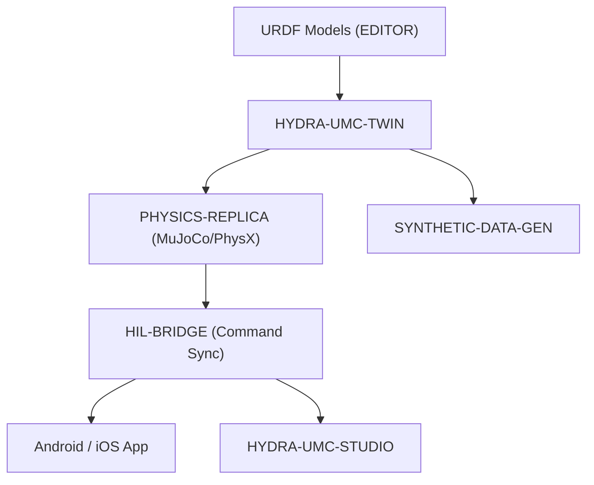

<p align="center">
  
</p>

# ♊ HYDRA-UMC-TWIN

<p align="center"><a href="README.md">🇺🇸 English</a> | <a href="README_spa.md">🇪🇸 Español</a> | <a href="README_fra.md">🇫🇷 Français</a> | <a href="README_ita.md">🇮🇹 Italiano</a> | <a href="README_deu.md">🇩🇪 Deutsch</a> | 🇨🇳 <b>简体中文</b> | <a href="README_jpn.md">🇯🇵 日本語</a></p>

### 🌐 基于物理的数字孪生与高保真仿真引擎

<p align="left">
  
  
  
  
  
</p>

---

## 1. 🛠️ 技术概述

**HYDRA-UMC-TWIN** 是本生态系统的虚拟核心。它提供整个微工厂的高保真、
基于物理的复制品，可用于安全测试、训练以及对机器人集群的实时监控。

它使用 Rust 和 Bevy 引擎构建，直接消费来自 EDITOR 的 URDF 模型，并模拟
惯性、摩擦力和电机扭矩等真实物理属性，以确保"在孪生系统中可行，在实际
车间中同样可行"。

### 关键特性：
* 🧩 **家族就绪检查（v0）：** 真实的 `family-status` 子命令读取 3 个真实子项目各自真实的 `hydra-umc.project.json`，报告其是否存在/版本/成熟度/角色——对于一个自身尚未运行任何引擎的集成中枢来说，这是诚实的。详见下方"诚实说明"。
* 🌐 **完整工厂仿真（计划中）：** 在统一的 3D 空间中复制机器人、工具和环境——依赖于先有真实的 Bevy 引擎集成。
* ⚡ **硬件在环（HIL）（计划中）：** 将应用程序和 Studio 连接到仿真器，就像连接到真实控制器一样。
* 📊 **磨损预测（计划中）：** 基于模拟的机械应力估算组件寿命。
* 🛡️ **安全验证（计划中）：** 在物理执行之前测试复杂轨迹和避碰。

**诚实说明——今天实际运行的内容：** 无参数调用时仍会打印身份/版本/角色，但现在新增了一个真实的 `family-status [--workspace 路径]` 子命令：从本地检出中读取 `HYDRA-UMC-PHYSICS-REPLICA`/`HYDRA-UMC-HIL-BRIDGE`/`HYDRA-UMC-SYNTHETIC-DATA-GEN` 各自真实的清单，并诚实地报告发现的内容。目前还没有任何 Bevy 应用、渲染、物理帧循环或 URDF 场景加载——具体已交付内容请参见 [`CHANGELOG.md`](CHANGELOG.md)，尚待完成的内容请参见下方路线图。

---

## 2. 🔄 孪生架构



---

## 3. 🧱 架构与设计决策

* **为什么本引擎没有 `hardware/`/`firmware/`/`os/` 文件夹。** 纯软件——没有自己的板卡，因此这些文件夹被直接省略而非留空（参见 `SONNET/5.PLAN_EJECUCION_32_PROYECTOS_NUEVOS.txt` 中的文件夹裁剪规则，这是一份私有规划文档）。
* **为什么 `Cargo.toml` 目前刻意不包含 Bevy 依赖。** Bevy 是一个较重的图形引擎——编译耗时长，需要并非总是可用的 GPU/图形工具链。v0 只添加了 `serde`/`serde_json`（用于读取子项目的清单）——真正的渲染工作仍在等待一个真实可用的 GPU/图形工具链出现后才能编译。
* **为什么 `docker-compose.yml` 在其 3 个子项目尚未拥有 Dockerfile 之前就已存在。** 现在决定并记录集成契约（哪个服务依赖哪个服务、每个服务需要哪些设备/卷挂载），避免这一形态日后被临时拼凑出来，尽管在每个子项目发布各自的 Dockerfile 之前，`docker compose up` 尚无法完全成功。
* **这如何融入生态系统的其余部分。** 作为 Digital Twin & Simulation 系列的集成父项目——HYDRA-UMC-PHYSICS-REPLICA 为其提供真实的物理求解器，HYDRA-UMC-HIL-BRIDGE 使真实应用程序能够像控制真实硬件一样控制它，而 HYDRA-UMC-SYNTHETIC-DATA-GEN 则通过其自身引擎渲染训练数据集。
* **为何 `family-status` 读取每个子项目自身的清单，而不是一份手工维护的列表。** `hydra-umc.project.json` 已经是整个生态系统仪表盘和更新器都信任的唯一真相来源——在这里再维护第二份列表，只要某个子项目的真实成熟度发生变化而没人记得同步更新，就会立刻产生偏差。
* **为何缺少某个兄弟项目的本地检出会得到一个真实、诚实的"未找到"，而非一个崩溃。** 一个集成中枢真的无法预先知道开发者是否在本地检出了全部 3 个子项目——`manifest.rs` 对每一种真实的失败情形（仓库缺失、清单缺失、JSON 格式错误）都返回 `None`，让 `family-status` 清楚地报告出来，而不是直接崩溃。

---

## 📂 目录结构

纯软件引擎，没有自己的硬件设计——因此本项目不携带 `hardware/`、
`firmware/` 或 `os/` 文件夹（参见 `SONNET/5.PLAN_EJECUCION_32_PROYECTOS_NUEVOS.txt` 中的文件夹裁剪规则）。

```text
HYDRA-UMC-TWIN/
├── src/
│   ├── manifest.rs       # 真实的、具防御性的兄弟项目自身清单读取器
│   ├── family.rs          # 对 3 个真实子项目的真实家族就绪检查
│   └── main.rs              # 入口点 + 真实的 `family-status` 子命令
├── docs/                # 文档与物理调参
├── build/               # 构建笔记/产物（cargo 自身的输出位于 target/，已被 gitignore）
├── images/              # 媒体与图表
├── scripts/             # 实用脚本
├── Cargo.toml           # 包元数据、依赖项（serde/serde_json）、里程表版本号
├── bump_version.py      # 里程表式版本递增（由 build.sh/.bat 使用）
├── build.sh / build.bat # 递增版本号、`cargo test`，然后执行 `cargo build --release`
├── run.sh / run.bat     # 运行编译后的 release 二进制文件（转发参数）
└── docker-compose.yml   # 下方 3 个子项目的集成蓝图
```

---

## 🏗️ 构建与运行

需要 Rust 工具链（`cargo`/`rustc`，通过 [rustup](https://rustup.rs) 安装）
以及 Python 3.10+（仅供 `bump_version.py` 使用）。

```bash
# Linux / macOS
./build.sh   # 里程表式版本递增、`cargo test`（9 个测试），然后执行 `cargo build --release`
./run.sh     # 运行 target/release/hydra-umc-twin，打印名称 + 版本 + 角色
```

```bat
:: Windows
build.bat
run.bat
```

`build.sh`/`build.bat` 会按照生态系统的"里程表"规则（PATCH+1，超过 9
时进位到 MINOR）递增本项目自身的 `Cargo.toml` 版本号，运行真实的测试
套件，然后构建一个 release 二进制文件。

真实的 `family-status` 子命令会检查真实的本地检出：

```bash
./run.sh family-status
./run.sh family-status --workspace /path/to/some/other/checkout

# Windows
run.bat family-status
```

```text
Digital Twin family status (workspace: /path/to/GitHub):
  HYDRA-UMC-PHYSICS-REPLICA: v0.0.2, maturity=functional, role=library
  HYDRA-UMC-HIL-BRIDGE: v0.0.1, maturity=scaffolding, role=service
  HYDRA-UMC-SYNTHETIC-DATA-GEN: v0.0.4, maturity=functional, role=tool

All 3 children present.
```

默认使用本仓库自身的父目录——这正是本生态系统任何真实检出已经在使用的
布局。如果缺少任何真实子项目，将以 `1` 退出。

**重要提示：** `Cargo.toml` 目前刻意**不包含 Bevy 依赖**。Bevy 是一个
较重的图形引擎（编译耗时长，需要并非总是可用的 GPU/图形工具链）；v0 只
添加了 `serde`/`serde_json` 用于读取清单。真正的 `bevy` 依赖（以及物理
后端和面向 HIL-BRIDGE 的 gRPC/WebSocket 客户端）将在真正的渲染/引擎工作
开始时添加。

### 集成 3 个子项目（`docker-compose.yml`）

作为集成父项目，`docker-compose.yml` 记录了本引擎如何将其 3 个子项目
组合为一个技术栈：**PHYSICS-REPLICA**（求解器，每个物理帧被调用）、
**HIL-BRIDGE**（真实与虚拟指令同步）、**SYNTHETIC-DATA-GEN**（离线批量
数据集导出）。这 4 个项目在骨架阶段均尚未拥有 `Dockerfile`，因此今天
`docker compose up` 尚不可运行——该文件是已确认的拓扑结构/端口/依赖图
参考，每个项目自身的 `Dockerfile` 日后将据此添加（在各项目自身的
`SONNET/<project>/mejoras_futuras.txt` 中分别跟踪）。

---

## 🚀 路线图
* **第一阶段：** 数字孪生与实时硬件遥测的同步，延迟低于 10ms。
* **第二阶段：** 物理复制品与工业级仿真器（Isaac Sim）的集成，以及可变形体支持。
* **第三阶段：** 用于去中心化故障转移和早期传感器退化检测的节点自愈自动化恢复模式。
* **第四阶段：** 用于合成数据生成的照片级真实渲染，以及支持全尺寸车辆在环的 HIL Bridge。

---

## 🔗 相关项目

本项目是同一作者（JuanenRac / Electro Hobby 3D）打造的更大规模机器人生态
系统的一部分，涵盖固件、控制软件、AI 节点和车队工具。值得了解，因为某个
需求实际上可能是关于这些项目之一，而非本仓库。

### 项目族

**父项目：** 无——本项目本身就是 Digital Twin & Simulation 系列的集成父项目。

**子项目：**
- **[HYDRA-UMC-PHYSICS-REPLICA](https://github.com/JuanenRac/HYDRA-UMC-PHYSICS-REPLICA)** —— 为本渲染器提供输入的刚体/接触仿真。
- **[HYDRA-UMC-HIL-BRIDGE](https://github.com/JuanenRac/HYDRA-UMC-HIL-BRIDGE)** —— 本孪生系统据以驱动真实 I/O 的硬件在环链路。
- **[HYDRA-UMC-SYNTHETIC-DATA-GEN](https://github.com/JuanenRac/HYDRA-UMC-SYNTHETIC-DATA-GEN)** —— 通过本孪生系统自身引擎渲染训练数据集。

### 直接相关（项目族之外）

- **[HYDRA-UMC-EDITOR-URDF](https://github.com/JuanenRac/HYDRA-UMC-EDITOR-URDF)** —— 消费在此编写的 URDF 模型。
- **[HYDRA-UMC-SUITE](https://github.com/JuanenRac/HYDRA-UMC-SUITE)** —— 通过 HIL-BRIDGE，像控制真实硬件一样控制本孪生系统。
- **[HYDRA-UMC-ANDROID-CONTROL](https://github.com/JuanenRac/HYDRA-UMC-ANDROID-CONTROL)** —— 通过 HIL-BRIDGE，像控制真实硬件一样控制本孪生系统。
- **[HYDRA-UMC-IOS-CONTROL](https://github.com/JuanenRac/HYDRA-UMC-IOS-CONTROL)** —— 通过 HIL-BRIDGE，像控制真实硬件一样控制本孪生系统。

### 生态系统的其余部分

**HYDRA-UMC 平台** —— 多机器人微工厂单元
- **[HYDRA-UMC](https://github.com/JuanenRac/HYDRA-UMC)** —— 协调最多 8 条机械臂的 CM5 + STM32H745 主板。
- **[HYDRA-UMC-SERVER](https://github.com/JuanenRac/HYDRA-UMC-SERVER)** —— 每个控制客户端所对接的 Express/WebSocket 后端。
- **[HYDRA-UMC-STUDIO](https://github.com/JuanenRac/HYDRA-UMC-STUDIO)** —— 基于 Web 的控制仪表盘，多机器人 3D 可视化。
- **[HYDRA-UMC-ANDROID-CONTROL](https://github.com/JuanenRac/HYDRA-UMC-ANDROID-CONTROL)** —— 通过 Wi-Fi/蓝牙的 Android 控制应用。
- **[HYDRA-UMC-IOS-CONTROL](https://github.com/JuanenRac/HYDRA-UMC-IOS-CONTROL)** —— 基于 Flutter 构建的 iOS/iPadOS 控制应用。
- **[HYDRA-UMC-SUITE](https://github.com/JuanenRac/HYDRA-UMC-SUITE)** —— 桌面端集群指挥中心（Python/PySide6）。
- **[HYDRA-UMC-EDITOR-URDF](https://github.com/JuanenRac/HYDRA-UMC-EDITOR-URDF)** —— 用于机器人目录的桌面端 URDF 模型编辑器。
- **[HYDRA-UMC-DSI](https://github.com/JuanenRac/HYDRA-UMC-DSI)** —— 机载 DSI 触摸屏的原生触控 UI。

**URTC 平台** —— 每台 HYDRA-UMC 机械臂搭载的工具头控制器
- **[URTC](https://github.com/JuanenRac/URTC)** —— CAN 总线工具头控制器，25 种工具配置。
- **[URTC-FLASHER](https://github.com/JuanenRac/URTC-FLASHER)** —— 桌面端 CAN-OTA + SWD/JTAG 刷写工具。
- **[URTC-TESTER](https://github.com/JuanenRac/URTC-TESTER)** —— 桌面端实时 CAN 总线诊断工具。
- **[URTC-WEB-STUDIO](https://github.com/JuanenRac/URTC-WEB-STUDIO)** —— 通过 Web Serial API 的浏览器端替代方案。

**🎥 视觉 AI 节点（Hailo-8）**
- [HYDRA-UMC-VISION-NODE](https://github.com/JuanenRac/HYDRA-UMC-VISION-NODE)
- [HYDRA-UMC-VISION-STREAMER](https://github.com/JuanenRac/HYDRA-UMC-VISION-STREAMER)
- [HYDRA-UMC-DETECTION-HEF](https://github.com/JuanenRac/HYDRA-UMC-DETECTION-HEF)
- [HYDRA-UMC-SAFETY-ZONES](https://github.com/JuanenRac/HYDRA-UMC-SAFETY-ZONES)
- [HYDRA-UMC-VISUAL-SERVOING-API](https://github.com/JuanenRac/HYDRA-UMC-VISUAL-SERVOING-API)

**🧠 认知 AI 节点（Hailo-10）**
- [HYDRA-UMC-COGNITIVE-NODE](https://github.com/JuanenRac/HYDRA-UMC-COGNITIVE-NODE)
- [HYDRA-UMC-VLA-ENGINE](https://github.com/JuanenRac/HYDRA-UMC-VLA-ENGINE)
- [HYDRA-UMC-VOICE-UI](https://github.com/JuanenRac/HYDRA-UMC-VOICE-UI)
- [HYDRA-UMC-SEMANTIC-PLANNER](https://github.com/JuanenRac/HYDRA-UMC-SEMANTIC-PLANNER)
- [HYDRA-UMC-DOCS-QA](https://github.com/JuanenRac/HYDRA-UMC-DOCS-QA)

**🐝 编排与集群**
- [HYDRA-UMC-ORCHESTRATOR](https://github.com/JuanenRac/HYDRA-UMC-ORCHESTRATOR)
- [HYDRA-UMC-SWARM-SYNC](https://github.com/JuanenRac/HYDRA-UMC-SWARM-SYNC)
- [HYDRA-UMC-PATH-PLANNER-3D](https://github.com/JuanenRac/HYDRA-UMC-PATH-PLANNER-3D)
- [HYDRA-UMC-JOB-DISPATCHER](https://github.com/JuanenRac/HYDRA-UMC-JOB-DISPATCHER)
- [HYDRA-UMC-NODE-HEALING](https://github.com/JuanenRac/HYDRA-UMC-NODE-HEALING)

**📊 数据与分析**
- [HYDRA-UMC-DATALAKE](https://github.com/JuanenRac/HYDRA-UMC-DATALAKE)
- [HYDRA-UMC-TELEMETRY-COLLECTOR](https://github.com/JuanenRac/HYDRA-UMC-TELEMETRY-COLLECTOR)
- [HYDRA-UMC-ANOMALY-DETECTOR](https://github.com/JuanenRac/HYDRA-UMC-ANOMALY-DETECTOR)
- [HYDRA-UMC-PRODUCTION-REPORTS](https://github.com/JuanenRac/HYDRA-UMC-PRODUCTION-REPORTS)

**🏭 工业网关**
- [HYDRA-UMC-GATEWAY-INDUSTRIAL](https://github.com/JuanenRac/HYDRA-UMC-GATEWAY-INDUSTRIAL)
- [HYDRA-UMC-OPCUA-SERVER](https://github.com/JuanenRac/HYDRA-UMC-OPCUA-SERVER)
- [HYDRA-UMC-MQTT-BROKER](https://github.com/JuanenRac/HYDRA-UMC-MQTT-BROKER)
- [HYDRA-UMC-MTCONNECT-ADAPTER](https://github.com/JuanenRac/HYDRA-UMC-MTCONNECT-ADAPTER)

**🛠️ 配套工具**
- [URTC-SMART-RACK](https://github.com/JuanenRac/URTC-SMART-RACK)
- [URTC-VISION-TOOL](https://github.com/JuanenRac/URTC-VISION-TOOL)
- [HYDRA-UMC-WATCH](https://github.com/JuanenRac/HYDRA-UMC-WATCH)
- [HYDRA-UMC-TOOL-CLI](https://github.com/JuanenRac/HYDRA-UMC-TOOL-CLI)
- [HYDRA-UMC-DASHBOARD-AI](https://github.com/JuanenRac/HYDRA-UMC-DASHBOARD-AI)


## 👤 作者
**JuanenRac**（Electro Hobby 3D）
📧 electrohobby3d@gmail.com

## 📜 许可证
GPL-3.0 —— 详见 LICENSE。
