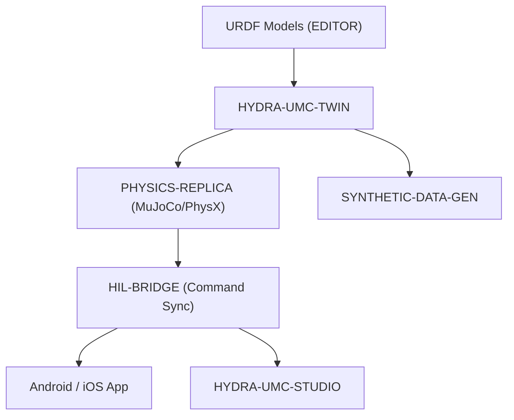

<p align="center">
  
</p>

# ♊ HYDRA-UMC-TWIN

<p align="center"><a href="README.md">🇺🇸 English</a> | <a href="README_spa.md">🇪🇸 Español</a> | <a href="README_fra.md">🇫🇷 Français</a> | <a href="README_ita.md">🇮🇹 Italiano</a> | <a href="README_deu.md">🇩🇪 Deutsch</a> | 🇨🇳 <b>简体中文</b> | <a href="README_jpn.md">🇯🇵 日本語</a></p>

### 🌐 基于物理的数字孪生与高保真仿真引擎

<p align="left">
  
  
  
  
  
</p>

---

## 1. 🛠️ 技术概述

**HYDRA-UMC-TWIN** 是本生态系统的虚拟核心。它提供整个微工厂的高保真、
基于物理的复制品，可用于安全测试、训练以及对机器人集群的实时监控。

它使用 Rust 和 Bevy 引擎构建，直接消费来自 EDITOR 的 URDF 模型，并模拟
惯性、摩擦力和电机扭矩等真实物理属性，以确保"在孪生系统中可行，在实际
车间中同样可行"。

### 关键特性：
* 🧩 **家族就绪检查（v0）：** 真实的 `family-status` 子命令读取 3 个真实子项目各自真实的 `hydra-umc.project.json`，报告其是否存在/版本/成熟度/角色——对于一个自身尚未运行任何引擎的集成中枢来说，这是诚实的。详见下方"诚实说明"。
* 🔒 **真实 v0 —— 状态同步契约：** `family-sync` 会先用一份真实、可测试的契约筛选每个子项目——最低成熟度（`functional`）和一个兼容的最高主版本号——然后才会将其视为可同步，对不成熟或版本不兼容的子项目给出真实理由并予以拒绝，而不是对着一个未经验证的状态形态直接同步。
* 🔌 **HTTP JSON API（v0）：** `serve [--addr ADDR] [--port PORT] [--workspace 路径]`（默认 `127.0.0.1:8111`）通过一个真实的阻塞式 `tiny_http` 服务器，把同样的 family-status/family-sync 逻辑以 `GET /family-status`、`GET /family-sync`、`GET /stats` 的形式对外提供——与部署到 CM5 上的 `systemd/hydra-umc-twin.service` 单元运行的是同一个二进制文件（仅限回环地址）。完整契约见 [`docs/CLI_REFERENCE.md`](docs/CLI_REFERENCE.md)。
* 🌐 **完整工厂仿真（计划中）：** 在统一的 3D 空间中复制机器人、工具和环境——依赖于先有真实的 Bevy 引擎集成。
* ⚡ **硬件在环（HIL）（计划中）：** 将应用程序和 Studio 连接到仿真器，就像连接到真实控制器一样。
* 📊 **磨损预测（计划中）：** 基于模拟的机械应力估算组件寿命。
* 🛡️ **安全验证（计划中）：** 在物理执行之前测试复杂轨迹和避碰。

**诚实说明——今天实际运行的内容：** 无参数调用时仍会打印身份/版本/角色，但现在有三个真实的子命令。`family-status [--workspace 路径]` 从本地检出中读取 `HYDRA-UMC-PHYSICS-REPLICA`/`HYDRA-UMC-HIL-BRIDGE`/`HYDRA-UMC-SYNTHETIC-DATA-GEN` 各自真实的清单，并诚实地报告发现的内容。`family-sync [--workspace 路径]` 更进一步：它会让每个已存在的子项目通过一份真实的状态同步契约（最低成熟度 `functional`、兼容的最高主版本号），并为每个子项目报告 `READY`、`REJECTED (immature)`、`REJECTED (incompatible version)` 或 `MISSING`。`serve` 则把两者都以真实的 HTTP JSON 形式对外提供，而不再局限于一次性的 CLI 调用。目前还没有任何 Bevy 应用、渲染、物理帧循环、URDF 场景加载，也没有任何真实的网络同步传输层——具体已交付内容请参见 [`CHANGELOG.md`](CHANGELOG.md)，每个命令/端点请参见 [`docs/CLI_REFERENCE.md`](docs/CLI_REFERENCE.md)，尚待完成的内容请参见下方路线图。

---

## 2. 🔄 孪生架构



---

## 3. 🧱 架构与设计决策

* **为什么本引擎没有 `hardware/`/`firmware/`/`os/` 文件夹。** 这是没有自有板卡的纯软件；源代码文件夹仅在实现需要时才包含。
* **为什么 `Cargo.toml` 目前刻意不包含 Bevy 依赖。** Bevy 是一个较重的图形引擎——编译耗时长，需要并非总是可用的 GPU/图形工具链。v0 只添加了 `serde`/`serde_json`（用于读取子项目的清单）——真正的渲染工作仍在等待一个真实可用的 GPU/图形工具链出现后才能编译。
* **为什么 `docker-compose.yml` 在其 3 个子项目尚未拥有 Dockerfile 之前就已存在。** 现在决定并记录集成契约（哪个服务依赖哪个服务、每个服务需要哪些设备/卷挂载），避免这一形态日后被临时拼凑出来，尽管在每个子项目发布各自的 Dockerfile 之前，`docker compose up` 尚无法完全成功。
* **这如何融入生态系统的其余部分。** 作为 数字孪生与仿真 系列的集成父项目——HYDRA-UMC-PHYSICS-REPLICA 为其提供真实的物理求解器，HYDRA-UMC-HIL-BRIDGE 使真实应用程序能够像控制真实硬件一样控制它，而 HYDRA-UMC-SYNTHETIC-DATA-GEN 则通过其自身引擎渲染训练数据集。
* **为何 `family-status` 读取每个子项目自身的清单，而不是一份手工维护的列表。** `hydra-umc.project.json` 已经是整个生态系统仪表盘和更新器都信任的唯一真相来源——在这里再维护第二份列表，只要某个子项目的真实成熟度发生变化而没人记得同步更新，就会立刻产生偏差。
* **为何缺少某个兄弟项目的本地检出会得到一个真实、诚实的「未找到」，而非一个崩溃。** 一个集成中枢真的无法预先知道开发者是否在本地检出了全部 3 个子项目——`manifest.rs` 对每一种真实的失败情形（仓库缺失、清单缺失、JSON 格式错误）都返回 `None`，让 `family-status` 清楚地报告出来，而不是直接崩溃。
* **为何 `family-sync` 同时按成熟度和版本上限筛选，而不仅仅是"是否存在"。** `family-status` 已经回答了"这个子项目是否被检出，它对自己有什么声明"——但一个已检出、成熟度为 `scaffolding` 的子项目还没有真正值得同步的状态，而一个已经超出本 Twin 已验证的最高主版本号的子项目，可能已经以本 Twin 尚不了解的方式改变了自己的状态形态。这两者都是拒绝同步的真实理由，且都不同于「缺失」，所以 `contract.rs` 会分别检查并报告它们，而不是把一切都合并成一个笼统的「未就绪」。
* **为何 `contract::assess()` 中成熟度检查先于版本兼容性检查。** 一个不成熟子项目的版本号还不是一个有意义的信号——先检查成熟度，意味着报告出的拒绝理由总会指出真正失败的那个最根本的关卡，而不会让一个版本不匹配掩盖了「这个子项目还不是真的」这个更基础的问题。

---

## 📂 目录结构

纯软件引擎，没有自己的硬件设计——因此本项目不携带 `hardware/`、
`firmware/` 或 `os/` 文件夹（遵循仓库结构策略）。

```text
HYDRA-UMC-TWIN/
├── src/
│   ├── manifest.rs       # 真实的、具防御性的兄弟项目自身清单读取器
│   ├── family.rs         # 真实的就绪检查 + 综合同步结果
│   ├── contract.rs       # 真实的状态同步契约（成熟度 + 版本上限）
│   ├── server.rs         # 简洁的 JSON/HTTP 接口(tiny_http,阻塞式,无异步运行时)
│   └── main.rs           # 入口点 + 真实的 `family-status`/`family-sync` 子命令
├── docs/                # 文档与物理调参
├── build/               # 构建笔记/产物（cargo 自身的输出位于 target/，已被 gitignore）
├── images/              # 媒体与图表
├── systemd/
│   └── hydra-umc-twin.service # 本地 CM5 family-status/sync API 的 systemd 单元
├── tools/
│   ├── build_test.py    # 不递增版本号的构建检查
│   └── ci_validate.py   # CI 使用的清单/CHANGELOG/文档校验
├── Cargo.toml           # 包元数据、依赖项（serde/serde_json）、里程表版本号
├── bump_version.py      # 里程表式版本递增（由 build.sh/.bat 使用）
├── build.sh / build.bat # 递增版本号、`cargo test`，然后执行 `cargo build --release`
├── build-test.sh / build-test.bat # 不递增版本号的构建检查
├── run.sh / run.bat     # 运行编译后的 release 二进制文件（转发参数）
└── docker-compose.yml   # 下方 3 个子项目的集成蓝图
```

---

## 🏗️ 构建与运行

需要 Rust 工具链（`cargo`/`rustc`，通过 [rustup](https://rustup.rs) 安装）
以及 Python 3.10+（仅供 `bump_version.py` 使用）。

```bash
# Linux / macOS
./build.sh   # 里程表式版本递增、`cargo test`（29 个测试），然后执行 `cargo build --release`
./run.sh     # 运行 target/release/hydra-umc-twin，打印名称 + 版本 + 角色
```

```bat
:: Windows
build.bat
run.bat
```

`build.sh`/`build.bat` 会按照生态系统的"里程表"规则（PATCH+1，超过 9
时进位到 MINOR）递增本项目自身的 `Cargo.toml` 版本号，运行真实的测试
套件，然后构建一个 release 二进制文件。

真实的 `family-status` 子命令会检查真实的本地检出：

```bash
./run.sh family-status
./run.sh family-status --workspace /path/to/some/other/checkout

# Windows
run.bat family-status
```

```text
Digital Twin family status (workspace: /path/to/GitHub):
  HYDRA-UMC-PHYSICS-REPLICA: v0.0.3, maturity=established, role=library
  HYDRA-UMC-HIL-BRIDGE: v0.0.5, maturity=established, role=service
  HYDRA-UMC-SYNTHETIC-DATA-GEN: v0.0.6, maturity=established, role=tool

All 3 children present.
```

默认使用本仓库自身的父目录——这正是本生态系统任何真实检出已经在使用的
布局。如果缺少任何真实子项目，将以 `1` 退出。

真实的 `family-sync` 子命令更进一步——它还会针对每个已存在的子项目检查
真实的状态同步契约（最低成熟度、兼容的最高主版本号）：

```bash
./run.sh family-sync --workspace /path/to/some/checkout
```

```text
Digital Twin family sync contract (workspace: /path/to/some/checkout):
  HYDRA-UMC-PHYSICS-REPLICA: READY (v0.0.3, maturity=functional)
  HYDRA-UMC-HIL-BRIDGE: REJECTED (incompatible version) - HYDRA-UMC-HIL-BRIDGE reports major version 1 - this Twin's sync contract is only verified up to major 0 (incompatible simulator version)
  HYDRA-UMC-SYNTHETIC-DATA-GEN: MISSING (not checked out)

Not every child is sync-ready - see the lines above.
```

仅当所有预期子项目都是 `READY` 时才以 `0` 退出；任何 `MISSING`/`REJECTED`
子项目都会导致以 `1` 退出。

**重要提示：** `Cargo.toml` 目前刻意**不包含 Bevy 依赖**。Bevy 是一个
较重的图形引擎（编译耗时长，需要并非总是可用的 GPU/图形工具链）；v0 只
添加了 `serde`/`serde_json` 用于读取清单。真正的 `bevy` 依赖（以及物理
后端和面向 HIL-BRIDGE 的 gRPC/WebSocket 客户端）将在真正的渲染/引擎工作
开始时添加。

### 集成 3 个子项目（`docker-compose.yml`）

作为集成父项目，`docker-compose.yml` 记录了本引擎如何将其 3 个子项目
组合为一个技术栈：**PHYSICS-REPLICA**（求解器，每个物理帧被调用）、
**HIL-BRIDGE**（真实与虚拟指令同步）、**SYNTHETIC-DATA-GEN**（离线批量
数据集导出）。这 4 个项目在骨架阶段均尚未拥有 `Dockerfile`，因此今天
`docker compose up` 尚不可运行——该文件是已确认的拓扑结构/端口/依赖图
参考，未来的 `Dockerfile` 将据此添加。

---

## 🚀 路线图
* **第一阶段：** 数字孪生与实时硬件遥测的同步，延迟低于 10ms。
* **第二阶段：** 物理复制品与工业级仿真器（Isaac Sim）的集成，以及可变形体支持。
* **第三阶段：** 用于去中心化故障转移和早期传感器退化检测的节点自愈自动化恢复模式。
* **第四阶段：** 用于合成数据生成的照片级真实渲染，以及支持全尺寸车辆在环的 HIL Bridge。

---

## 🔗 相关项目

本项目是同一作者(JuanenRac / Electro Hobby 3D)打造的 HYDRA-UMC 机器人生态系统的一部分。值得了解,因为某个请求实际上可能是关于这些项目之一,而非本仓库本身。

**子项目** —— 每一个都接入本孪生体自身的仿真/渲染引擎
- **[HYDRA-UMC-PHYSICS-REPLICA](https://github.com/JuanenRac/HYDRA-UMC-PHYSICS-REPLICA)** —— 面向真实 URDF 子集的真实正向运动学与关节限位校验。
- **[HYDRA-UMC-HIL-BRIDGE](https://github.com/JuanenRac/HYDRA-UMC-HIL-BRIDGE)** —— 在仿真与真实硬件之间路由指令的真实硬件在环安全联锁。
- **[HYDRA-UMC-SYNTHETIC-DATA-GEN](https://github.com/JuanenRac/HYDRA-UMC-SYNTHETIC-DATA-GEN)** —— 具备 YOLO/COCO 标注导出功能的真实程序化 2D 场景生成器。

**直接相关**
- **[HYDRA-UMC-EDITOR-URDF](https://github.com/JuanenRac/HYDRA-UMC-EDITOR-URDF)** —— 将完成的模型推送到 STUDIO 自身目录的桌面版图形化 URDF 创建/编辑工具;本孪生体所消费的 URDF 模型正是用它创建的。
- **[HYDRA-UMC-SUITE](https://github.com/JuanenRac/HYDRA-UMC-SUITE)** —— 面向多台服务器的桌面(PySide6)集群指挥中心,打包为独立可执行文件;通过 HIL-BRIDGE 将本孪生体当作真实硬件来控制。
- **[HYDRA-UMC-ANDROID-CONTROL](https://github.com/JuanenRac/HYDRA-UMC-ANDROID-CONTROL)** —— 具有生物识别登录和配对 Wear OS 伴侣应用的原生 Android 控制应用;通过 HIL-BRIDGE 将本孪生体当作真实硬件来控制。
- **[HYDRA-UMC-IOS-CONTROL](https://github.com/JuanenRac/HYDRA-UMC-IOS-CONTROL)** —— 具有实时 WebSocket 同步的 iOS/iPadOS 控制应用(Flutter);通过 HIL-BRIDGE 将本孪生体当作真实硬件来控制。

**生态系统中的其他项目**

*核心硬件与平台*
- **[HYDRA-UMC](https://github.com/JuanenRac/HYDRA-UMC)** —— 机器人手臂的真实主板——CM5 主机 + 双核 STM32H745,通过 CAN-OTA/SPI-OTA 协调最多 8 条工具臂。
- **[HYDRA-UMC-OS](https://github.com/JuanenRac/HYDRA-UMC-OS)** —— 面向 CM5 的可复现 Raspberry Pi OS 产品层——只读代理、经过验证的配置/配置文件、WiFi 首次配网。
- **[HYDRA-UMC-SDK](https://github.com/JuanenRac/HYDRA-UMC-SDK)** —— 每个桥接都据此校验自身指令的共享 JSON-Schema 契约与安全门限边界。

*核心后端与客户端*
- **[HYDRA-UMC-SERVER](https://github.com/JuanenRac/HYDRA-UMC-SERVER)** —— 每个控制客户端真正通信的真实无头后端(REST/WebSocket)。
- **[HYDRA-UMC-STUDIO](https://github.com/JuanenRac/HYDRA-UMC-STUDIO)** —— 具有实时多机器人 3D 可视化的网页控制面板。
- **[HYDRA-UMC-DSI](https://github.com/JuanenRac/HYDRA-UMC-DSI)** —— 面向机载 7 英寸 DSI 触摸屏的原生触控界面,直接嵌入 CM5 本体。
- **[HYDRA-UMC-BRIDGE-AMR](https://github.com/JuanenRac/HYDRA-UMC-BRIDGE-AMR)** —— 通过真实的 VDA 5050 MQTT 发布者为 AGV/AMR 车队提供的协调边界。
- **[HYDRA-UMC-BRIDGE-CNC](https://github.com/JuanenRac/HYDRA-UMC-BRIDGE-CNC)** —— 具备真实 GRBL 状态/控制字节访问能力的高层 CNC 单元协调器。
- **[HYDRA-UMC-BRIDGE-DROIDS](https://github.com/JuanenRac/HYDRA-UMC-BRIDGE-DROIDS)** —— 面向足式/人形机器人的协调边界,具备真实的 Boston Dynamics Spot 指令发送器。
- **[HYDRA-UMC-BRIDGE-LASER](https://github.com/JuanenRac/HYDRA-UMC-BRIDGE-LASER)** —— 读取 3 项真实钥匙/外壳/联锁 GPIO 安全信号的激光单元安全协调器。
- **[HYDRA-UMC-BRIDGE-OPENPNP](https://github.com/JuanenRac/HYDRA-UMC-BRIDGE-OPENPNP)** —— 面向 OpenPnP 贴片机板级流程的安全高层协调器。
- **[HYDRA-UMC-BRIDGE-PRINTER3D](https://github.com/JuanenRac/HYDRA-UMC-BRIDGE-PRINTER3D)** —— 面向 Moonraker/Klipper 3D 打印机的安全协调边界,具备真实的受控作业指令。
- **[HYDRA-UMC-BRIDGE-ROS2](https://github.com/JuanenRac/HYDRA-UMC-BRIDGE-ROS2)** —— 具备真实的惰性导入 rclpy ROS 2 传输层的安全协调器。
- **[HYDRA-UMC-BRIDGE-UAV](https://github.com/JuanenRac/HYDRA-UMC-BRIDGE-UAV)** —— 面向搭载摄像头的无人机的协调边界,具备真实的 MAVLink 指令发送器。

*URTC 工具平台*
- **[URTC](https://github.com/JuanenRac/URTC)** —— 面向实体 Universal Robot Tool Controller 板卡的固件,通过 CAN 总线支持 25 种以上工具配置。
- **[URTC-FLASHER](https://github.com/JuanenRac/URTC-FLASHER)** —— 面向 URTC 板卡的桌面图形烧录工具,支持 CAN-OTA 以及全芯片 SWD/JTAG。
- **[URTC-TESTER](https://github.com/JuanenRac/URTC-TESTER)** —— 面向 URTC 板卡的桌面实时 CAN 总线诊断工具,每种工具配置对应一个面板。
- **[URTC-WEB-STUDIO](https://github.com/JuanenRac/URTC-WEB-STUDIO)** —— 通过 Web Serial API 实现的浏览器版 URTC-TESTER 替代方案,无需本地安装。

*视觉 AI 节点(Hailo-8)*
- **[HYDRA-UMC-VISION-NODE](https://github.com/JuanenRac/HYDRA-UMC-VISION-NODE)** —— 面向 Hailo-8 视觉流水线的集成中枢,具备逐阶段的真实硬件就绪检测。
- **[HYDRA-UMC-DETECTION-HEF](https://github.com/JuanenRac/HYDRA-UMC-DETECTION-HEF)** —— 具备 Hailo 架构/校验和安全加载验证的真实编译模型注册表。
- **[HYDRA-UMC-VISION-STREAMER](https://github.com/JuanenRac/HYDRA-UMC-VISION-STREAMER)** —— 具备真实 HailoRT 集成边界的真实 GStreamer 流水线 + MediaMTX 配置生成器。
- **[HYDRA-UMC-VISUAL-SERVOING-API](https://github.com/JuanenRac/HYDRA-UMC-VISUAL-SERVOING-API)** —— 具备真实 Position-Based Visual Servoing 修正律,并依据上游区域状态进行安全门控。
- **[HYDRA-UMC-SAFETY-ZONES](https://github.com/JuanenRac/HYDRA-UMC-SAFETY-ZONES)** —— 具备校准新鲜度强制检查的真实区域入侵检测与 E-STOP 请求。

*认知 AI 节点(Hailo-10)*
- **[HYDRA-UMC-COGNITIVE-NODE](https://github.com/JuanenRac/HYDRA-UMC-COGNITIVE-NODE)** —— 面向 Hailo-10 认知流水线(LLM/VLA/语音编排)的集成中枢。
- **[HYDRA-UMC-VLA-ENGINE](https://github.com/JuanenRac/HYDRA-UMC-VLA-ENGINE)** —— 面向 Vision-Language-Action 模型的真实动作 token 编解码与轨迹生成。
- **[HYDRA-UMC-VOICE-UI](https://github.com/JuanenRac/HYDRA-UMC-VOICE-UI)** —— 具备受限、需确认的 Watch 中继的真实语音前端(VAD + 意图解析)。
- **[HYDRA-UMC-SEMANTIC-PLANNER](https://github.com/JuanenRac/HYDRA-UMC-SEMANTIC-PLANNER)** —— 基于真实规则的任务分解,以及针对 MCU 错误码的语义化错误恢复。
- **[HYDRA-UMC-DOCS-QA](https://github.com/JuanenRac/HYDRA-UMC-DOCS-QA)** —— 面向本生态系统自身 Markdown 文档的真实纯标准库 TF-IDF 文档检索。

*编排与集群*
- **[HYDRA-UMC-ORCHESTRATOR](https://github.com/JuanenRac/HYDRA-UMC-ORCHESTRATOR)** —— 具备真实 gRPC/Protobuf 健康报告契约与任务状态机的集成中枢。
- **[HYDRA-UMC-JOB-DISPATCHER](https://github.com/JuanenRac/HYDRA-UMC-JOB-DISPATCHER)** —— 基于真实 HTTP API 的真实优先级任务队列,支持去重。
- **[HYDRA-UMC-NODE-HEALING](https://github.com/JuanenRac/HYDRA-UMC-NODE-HEALING)** —— 具备重试/退避与身份不匹配检测的真实基于 gRPC 的车队健康看门狗。
- **[HYDRA-UMC-PATH-PLANNER-3D](https://github.com/JuanenRac/HYDRA-UMC-PATH-PLANNER-3D)** —— 具备真实障碍物/工作空间碰撞校验的真实基于 RRT 的三维路径规划器。
- **[HYDRA-UMC-SWARM-SYNC](https://github.com/JuanenRac/HYDRA-UMC-SWARM-SYNC)** —— 经过多单元收敛属性测试的真实 CRDT LWW-Element-Map 状态同步。

*数据与分析*
- **[HYDRA-UMC-DATALAKE](https://github.com/JuanenRac/HYDRA-UMC-DATALAKE)** —— 具备真实数据摄入/查询 HTTP API 的真实 sqlite3 时序数据存储。
- **[HYDRA-UMC-ANOMALY-DETECTOR](https://github.com/JuanenRac/HYDRA-UMC-ANOMALY-DETECTOR)** —— 具备漂移监测能力的真实 FFT + 统计基线异常检测器。
- **[HYDRA-UMC-PRODUCTION-REPORTS](https://github.com/JuanenRac/HYDRA-UMC-PRODUCTION-REPORTS)** —— 基于 DATALAKE 历史数据的真实 OEE/可用率计算,支持可复现的 CSV 导出。
- **[HYDRA-UMC-TELEMETRY-COLLECTOR](https://github.com/JuanenRac/HYDRA-UMC-TELEMETRY-COLLECTOR)** —— 面向 DATALAKE 的真实 CAN/WebSocket 数据摄入管道,支持序列去重。

*工业网关*
- **[HYDRA-UMC-GATEWAY-INDUSTRIAL](https://github.com/JuanenRac/HYDRA-UMC-GATEWAY-INDUSTRIAL)** —— 中继至工业协议的集成中枢,具备真实的指令白名单/背压控制层。
- **[HYDRA-UMC-OPCUA-SERVER](https://github.com/JuanenRac/HYDRA-UMC-OPCUA-SERVER)** —— 经真实二进制协议客户端会话验证的真实 OPC-UA 地址空间。
- **[HYDRA-UMC-MQTT-BROKER](https://github.com/JuanenRac/HYDRA-UMC-MQTT-BROKER)** —— 具备可选按客户端认证与主题 ACL 的真实 MQTT 代理。
- **[HYDRA-UMC-MTCONNECT-ADAPTER](https://github.com/JuanenRac/HYDRA-UMC-MTCONNECT-ADAPTER)** —— 具备降级模式输出的真实 MTConnect `/probe` 与 `/current` XML 端点。

*辅助工具与生态系统运维*
- **[HYDRA-UMC-DASHBOARD-AI](https://github.com/JuanenRac/HYDRA-UMC-DASHBOARD-AI)** —— 基于 DATALAKE/ANOMALY-DETECTOR 的智能摘要与异常高亮面板,具备诚实的统计回退机制。
- **[HYDRA-UMC-TOOL-CLI](https://github.com/JuanenRac/HYDRA-UMC-TOOL-CLI)** —— 具备真实、稳定退出码契约的车队 CLI,是 HYDRA-UMC-SERVER 自身 API 的真实在线客户端。
- **[HYDRA-UMC-WATCH](https://github.com/JuanenRac/HYDRA-UMC-WATCH)** —— 具备真实触觉提醒与配对手机语音中继功能的 WearOS 伴侣应用。
- **[URTC-SMART-RACK](https://github.com/JuanenRac/URTC-SMART-RACK)** —— 面向板卡安装机架的固件,具备真实的工具 ID 解码与 Smart Idle 预热逻辑。
- **[URTC-VISION-TOOL](https://github.com/JuanenRac/URTC-VISION-TOOL)** —— 面向热成像/RGB 检测工具头的固件及真实 Python 视觉伴侣程序。
- **[HYDRA-UMC-UPDATER](https://github.com/JuanenRac/HYDRA-UMC-UPDATER)** —— 发现、克隆并更新本生态系统中每个仓库的管理类桌面工具。
- **[HYDRA-UMC-OS-REBUILDER](https://github.com/JuanenRac/HYDRA-UMC-OS-REBUILDER)** —— 构建即刻可烧录、预装生态系统最新版本的 CM5 镜像的 Windows/Linux 桌面工具,具备类似 Raspberry Pi Imager 风格的首次启动 Wi-Fi/用户/SSH 配置。


---

## 📚 文档与社区

- **[docs/CLI_REFERENCE.md](docs/CLI_REFERENCE.md)** — 每一个 `family-status`/`family-sync`/`serve` 调用、从真实构建的发布版二进制文件中获取的真实输出、退出码表，以及 `GET /family-status`/`GET /family-sync`/`GET /stats` HTTP JSON 契约。
- **[CONTRIBUTING.md](CONTRIBUTING.md)** —— 提交 Pull Request 所需的技术栈和编码规范。
- **[CODE_OF_CONDUCT.md](CODE_OF_CONDUCT.md)** —— 本社区所期望的行为准则。
- **[SECURITY.md](SECURITY.md)** —— 如何报告漏洞，以及本项目真实的安全关注重点。
- **[SUPPORT.md](SUPPORT.md)** —— 在哪里提问和报告缺陷。
- **[LICENSE.md](LICENSE.md)** —— 本项目自身的许可证。

## 👤 作者
**JuanenRac** (Electro Hobby 3D)
📧 electrohobby3d@gmail.com
📺 [youtube.com/@electrohobby3d](https://youtube.com/@electrohobby3d)

## 📜 许可证
GPL-3.0 —— 详见 LICENSE。
